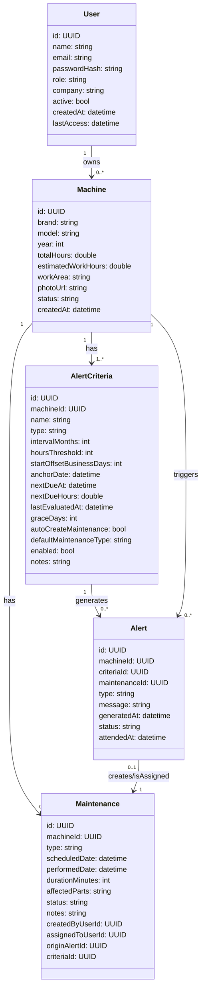

```mermaid

%% =========================
%% FleetMan - Entidades (v0.algo)
%% =========================

classDiagram

class User {
  id: UUID
  name: string
  email: string
  passwordHash: string
  role: string
  company: string
  active: bool
  createdAt: datetime
  lastAccess: datetime
}

class Machine {
  id: UUID
  brand: string
  model: string
  year: int
  totalHours: double
  estimatedWorkHours: double
  workArea: string
  photoUrl: string
  status: string
  createdAt: datetime
}

class AlertCriteria {
  id: UUID
  machineId: UUID
  name: string
  type: string
  intervalMonths: int
  hoursThreshold: int
  startOffsetBusinessDays: int
  anchorDate: datetime
  nextDueAt: datetime
  nextDueHours: double
  lastEvaluatedAt: datetime
  graceDays: int
  autoCreateMaintenance: bool
  defaultMaintenanceType: string
  enabled: bool
  notes: string
}

class Maintenance {
  id: UUID
  machineId: UUID
  type: string
  scheduledDate: datetime
  performedDate: datetime
  durationMinutes: int
  affectedParts: string
  status: string
  notes: string
  createdByUserId: UUID
  assignedToUserId: UUID
  originAlertId: UUID
  criteriaId: UUID
}

class Alert {
  id: UUID
  machineId: UUID
  criteriaId: UUID
  maintenanceId: UUID
  type: string
  message: string
  generatedAt: datetime
  status: string
  attendedAt: datetime
}

User "1" --> "0..*" Machine : owns
Machine "1" --> "1..*" AlertCriteria : has
AlertCriteria "1" --> "0..*" Alert : generates
Machine "1" --> "0..*" Alert : triggers
Machine "1" --> "0..*" Maintenance : has
Alert "0..1" --> "1" Maintenance : creates/isAssigned


```
