# Diagramas Gantt de Sprints

**⚠️ Importante - Escala de Tiempo:**
Los diagramas Gantt de este proyecto utilizan una **escala de tiempo basada en horas productivas**, no en tiempo calendario real:

- **1 día en el diagrama = 5 horas productivas de trabajo** (jornada laboral deseada)
- **0.5 días = 2.5 horas**, **0.8 días = 4 horas**, etc.
- Las fechas mostradas son **referencias de calendario**, pero la duración visual representa **esfuerzo en horas** (deseadas y estimadas)

**Ejemplo:**
- Una tarea de "1.6d" significa **8 horas de trabajo** (8hs ÷ 5hs/día = 1.6 días)
- Si una tarea comienza el lunes y dura "1.6d", visualmente ocupa desde lunes hasta martes en el diagrama
- En la realidad, podrían ser 8 horas distribuidas como mejor convenga (2 días de 4hs, 1 día completo + medio día, etc.)

**Ventajas de este enfoque:**
- ✅ Refleja el esfuerzo real estimado para cada tarea
- ✅ Permite visualizar la carga de trabajo proporcional
- ✅ Facilita la planificación basada en capacidad del equipo
- ✅ Las estimaciones originales (en horas) se mantienen visibles en los nombres de las tareas

## Sprint #0 (2025-10-12 → 2025-10-18)

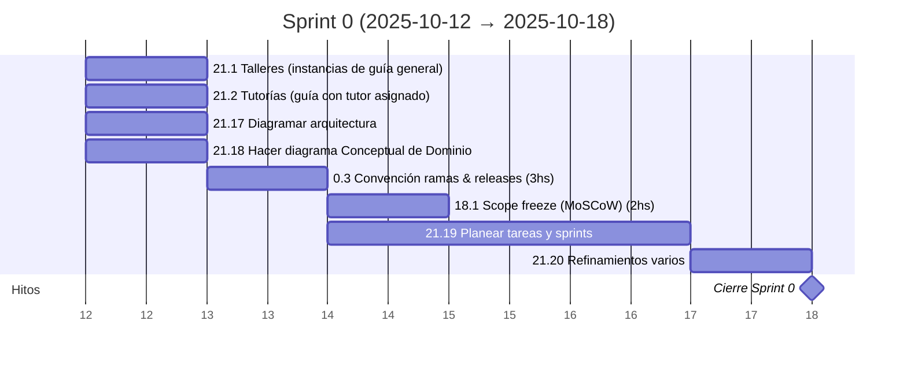

---

## Sprint #1 (2025-10-19 → 2025-10-25)

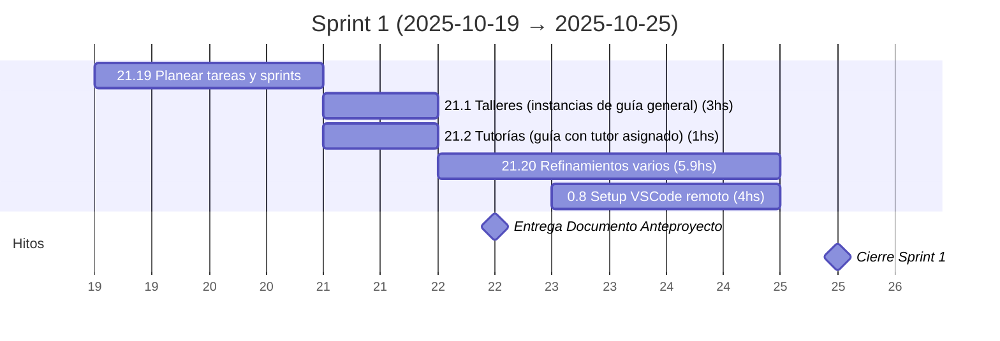

---

## Sprint #2 (2025-10-26 → 2025-11-01)

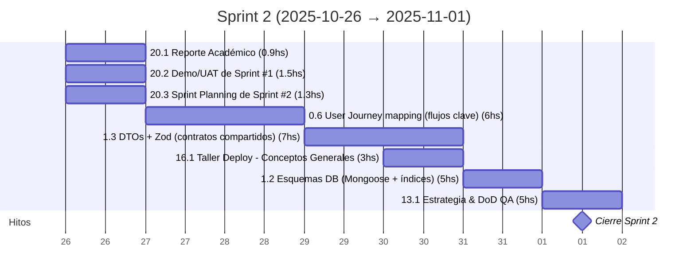

---

## Sprint #3 (2025-11-02 → 2025-11-08)

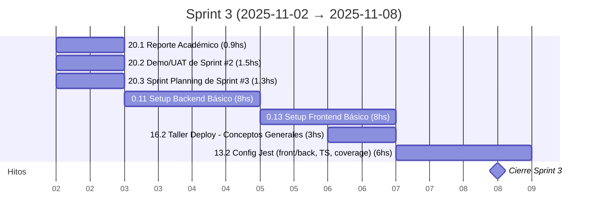

---

## Sprint #4 (2025-11-09 → 2025-11-15)

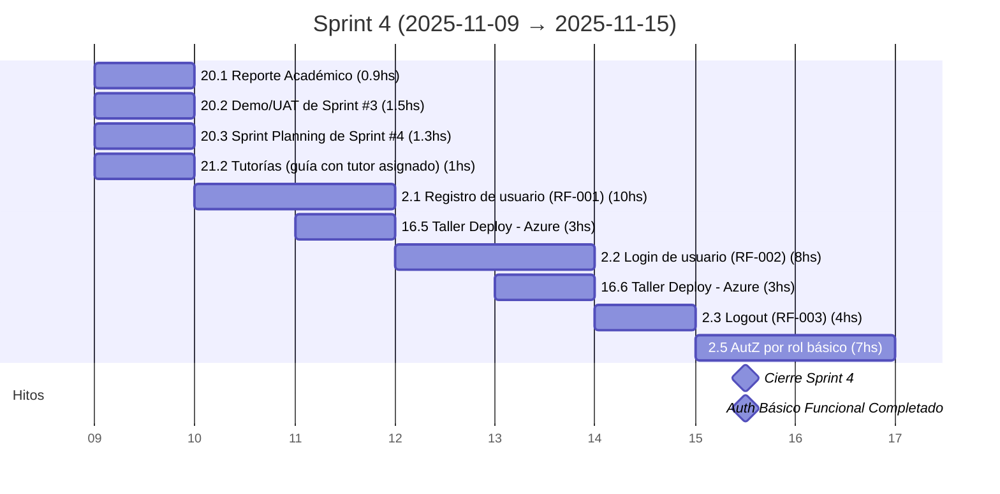

---

## Sprint #5 (2025-11-16 → 2025-11-22)

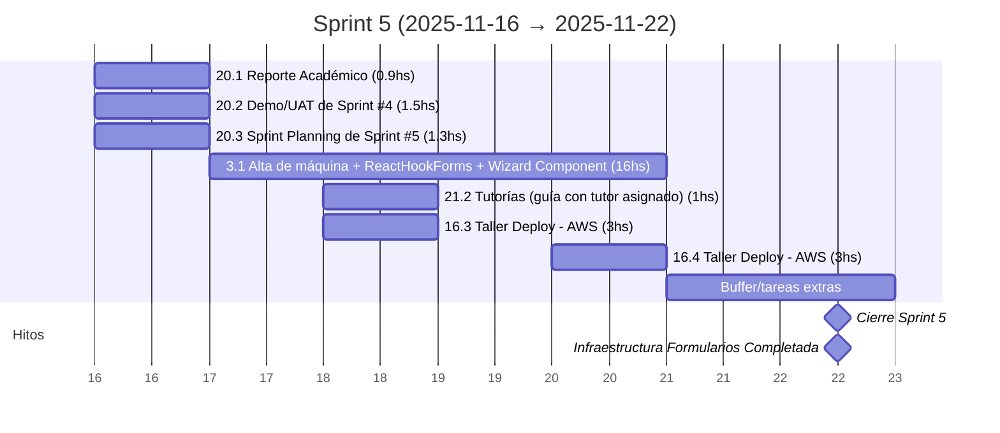

---

## Sprint #6 (2025-11-23 → 2025-11-29)

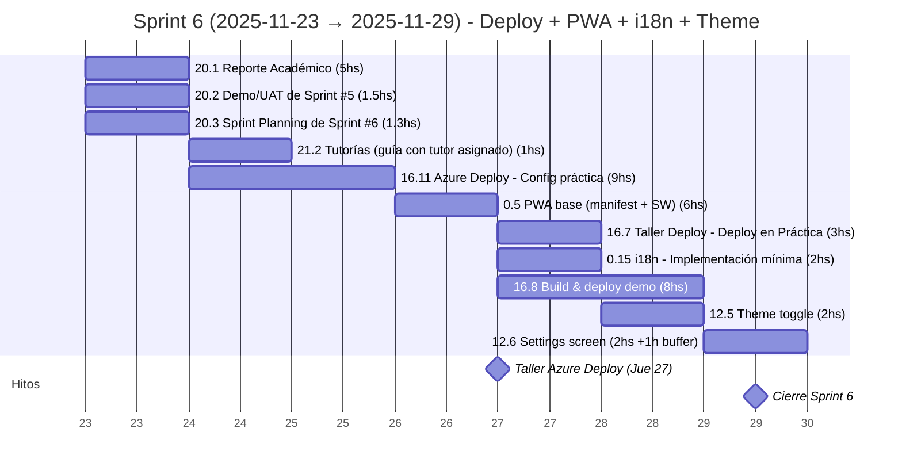

- **Notas del Sprint #6:**
- **Estado:** Sprint planificado con **40.8hs** estimadas vs 35hs objetivo (buffer -5.8hs)
- **Taller clave:** Jueves 27 nov — Taller universitario de Azure Deploy, sincronizar tarea 16.11 con este evento
- **Recomendación:** Priorizar deploy + PWA + i18n + theme + settings; mantener 1.2/1.4 como tareas just-in-time o mover trabajo adicional a Sprint #7 si se necesita más capacidad
- **Milestone crítico:** Dejar app deployada y accesible para validación con cliente

---

## Sprint #7 (2025-11-30 → 2025-12-06)

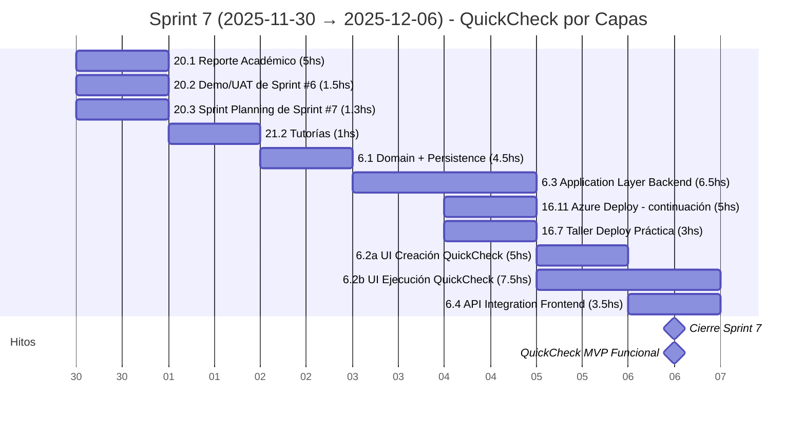

---

## Sprint #8 (2025-12-07 → 2025-12-13)

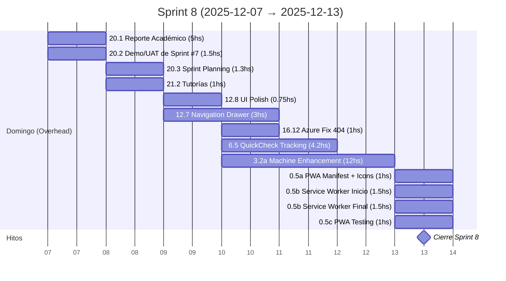

**Notas de distribución:**
- **Domingo:** Overhead académico y gestión (8.8hs)
- **Miércoles:** Quick wins UI - animaciones, reorder inputs, navigation drawer base, PWA manifest (4.75hs)
- **Jueves:** Machine Enhancement Day - navigation drawer responsive + machine enhancements completos (16hs - día extendido)
- **Viernes:** Critical fixes - Azure routing, QuickCheck tracking, service worker inicio (6.7hs)
- **Sábado:** PWA completion - service worker final + testing multi-dispositivo + buffer (2.5hs+)
- **Total desarrollo:** ~29hs (distribución flexible según avance real)

---

## Sprint #9 (2025-12-14 → 2025-12-20)

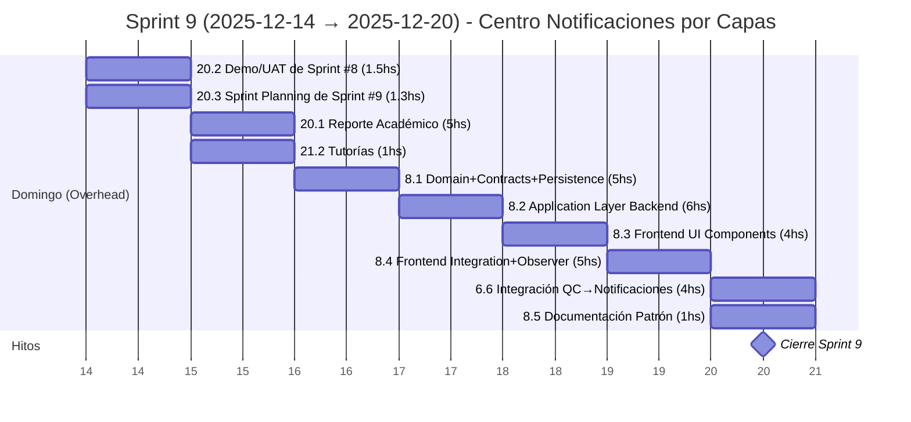

**Notas del Sprint #9:**
- **Enfoque:** Sistema completo de notificaciones con arquitectura por capas (Domain → Application → UI → Integration)
- **Arquitectura:** Notification como subdocumento en User (no entidad independiente)
- **Orden secuencial:** Backend primero (Lun-Mar) → Frontend después (Mié-Jue) → Integración real (Vie) → Documentación (Sáb)
- **Observer Pattern:** Implementado con TanStack Query cache subscription (polling 30s automático)
- **Primera integración:** QuickCheck FAIL → Notificación → Toast automático
- **Buffer:** +1.2hs (33.8hs planificadas vs 35hs capacidad)
- **Distribución:**
  - Lunes: 8.1 Backend base (Domain + Persistence + Contracts)
  - Martes: 8.2 Application Layer (Use Cases + Controllers + API REST)
  - Miércoles: 8.3 Frontend UI (Badge + Bandeja + Toast components)
  - Jueves: 8.4 Frontend Integration (Services + TanStack Query + Observer)
  - Viernes: 6.6 Integración real con QuickCheck + Testing e2e
  - Sábado: 8.5 Documentación patrón + Buffer 1.2hs

---

## Sprint #10 (2025-12-21 → 2025-12-27)

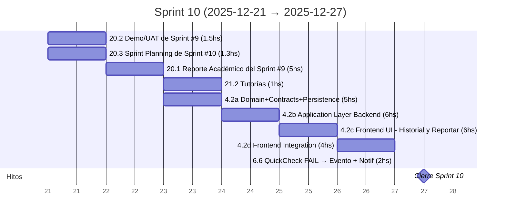

---

## Sprint #11 (2025-12-28 → 2026-01-03)

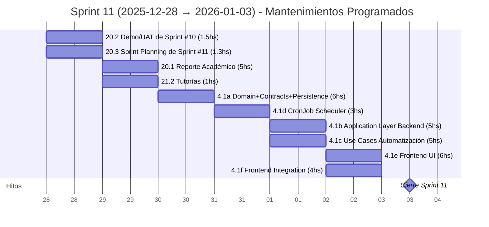

---

## Sprint #12 (2026-01-04 → 2026-01-10)

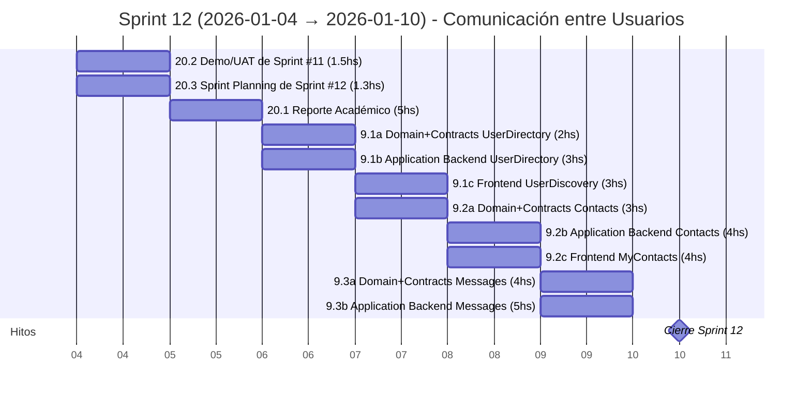

---

## Sprint #13 (2026-01-11 → 2026-01-17)

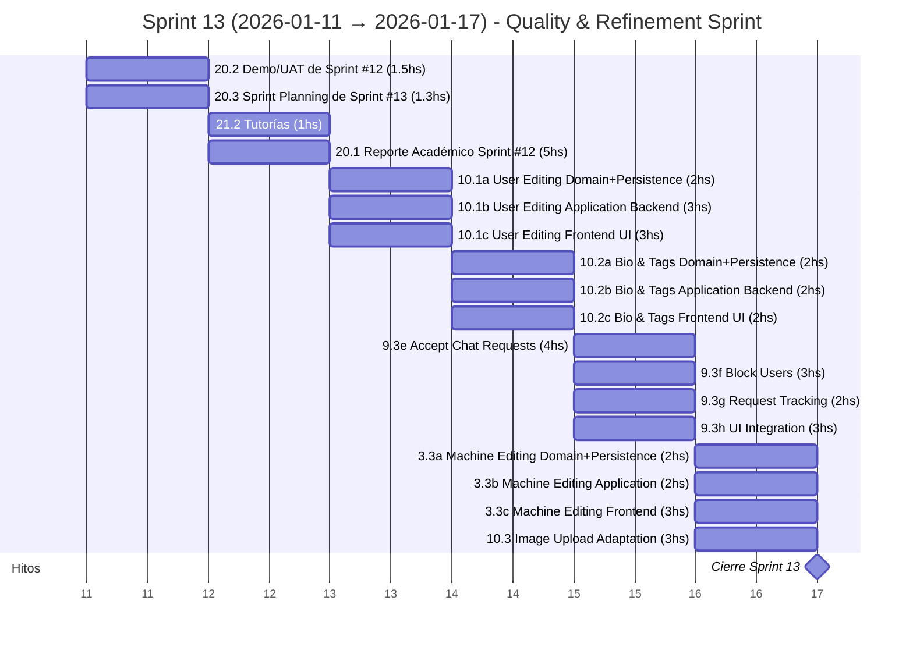

---

## Sprint #14 (2026-01-18 → 2026-01-24)

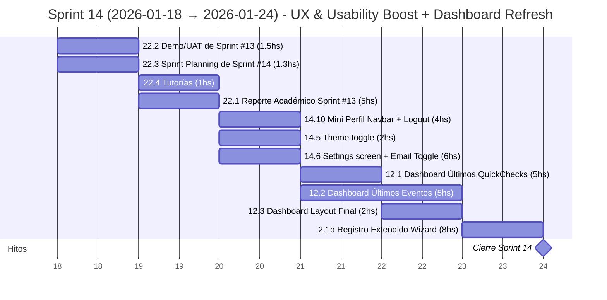

---

## Sprint #15 (2026-01-25 → 2026-01-31)

---

## Sprint #16 (2026-02-01 → 2026-02-07)

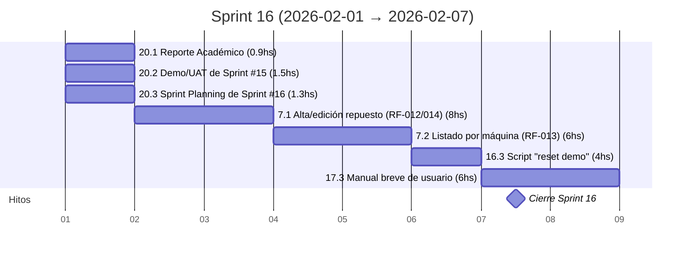

---

## Sprint #17 (2026-02-08 → 2026-02-14)

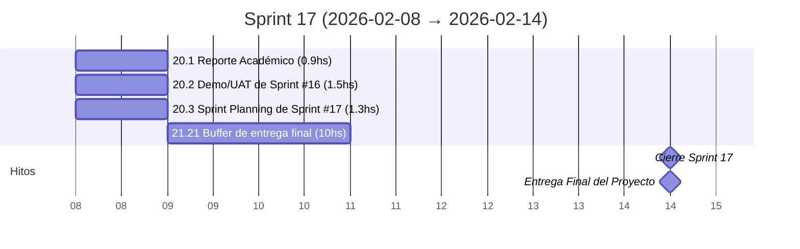

---

## Eventos Académicos Post-MVP (2026-02-08 → 2026-04-30)

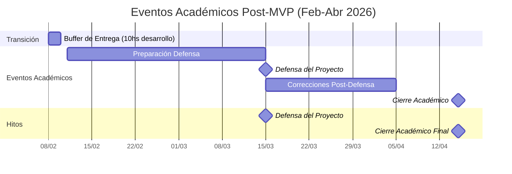

---

## Resumen General

- **Total de sprints:** 17 (Sprint #0 a Sprint #17)
- **Duración del desarrollo:** 12 de octubre 2025 - 14 de febrero 2026
- **Duración por sprint:** 7 días (domingo a sábado)
- **Estimación de trabajo:** 5 horas por día laboral
- **Hitos principales de desarrollo:**
  - Sprint 0: Configuración inicial y documentación del anteproyecto
  - Sprint 1: Entrega del Documento Anteproyecto (22 oct)
  - Sprint 2-3: Configuración base de desarrollo
  - Sprint 4: PWA y UX (movido desde posición anterior del Sprint #11)
  - Sprints 5-11: Desarrollo del MVP core
  - Sprints 12-17: Testing, refinamiento y funcionalidades adicionales
- **Eventos académicos principales:**
  - Primera Instancia: Noviembre 2025
  - Segunda Instancia: Diciembre 2025
  - Entrega Final: Febrero 2026
  - Defensa del Proyecto: Marzo 2026
  - Cierre Académico: Abril 2026

**Notas:**
- Cada sprint incluye actividades de gestión dominicales (Reporte, Demo/UAT, Planning)
- Los sprints navideños (10-11) pueden tener productividad reducida
- Las funcionalidades marcadas como `[NiceToHave]` pueden ajustarse según el progreso
- El Sprint 14 es especialmente denso con poco buffer disponible
- **Cambio importante:** El Sprint #4 ahora se enfoca en PWA/UX (anteriormente era Sprint #11), estableciendo las bases de UX antes del desarrollo de funcionalidades de dominio
- **Sprint #17:** Buffer final para refinamientos, documentación y verificaciones de calidad antes de la entrega académica
