# Diagramas Gantt de Sprints
<!--  -->
**⚠️ Importante - Escala de Tiempo:**
Los diagramas Gantt de este proyecto utilizan una **escala de tiempo basada en horas productivas**, no en tiempo calendario real:

- **1 día en el diagrama = 5 horas productivas de trabajo** (jornada laboral deseada)
- **0.5 días = 2.5 horas**, **0.8 días = 4 horas**, etc.
- Las fechas mostradas son **referencias de calendario**, pero la duración visual representa **esfuerzo en horas** (deseadas y estimadas)

**Ejemplo:**
- Una tarea de "1.6d" significa **8 horas de trabajo** (8hs ÷ 5hs/día = 1.6 días)
- Si una tarea comienza el lunes y dura "1.6d", visualmente ocupa desde lunes hasta martes en el diagrama
- En la realidad, podrían ser 8 horas distribuidas como mejor convenga (2 días de 4hs, 1 día completo + medio día, etc.)

**Ventajas de este enfoque:**
- ✅ Refleja el esfuerzo real estimado para cada tarea
- ✅ Permite visualizar la carga de trabajo proporcional
- ✅ Facilita la planificación basada en capacidad del equipo
- ✅ Las estimaciones originales (en horas) se mantienen visibles en los nombres de las tareas

## Sprint #0 (2025-10-12 → 2025-10-18)

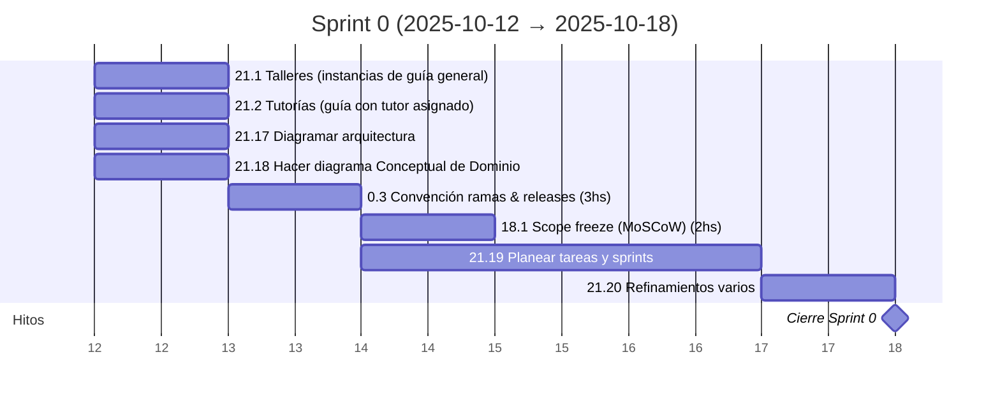

---

## Sprint #1 (2025-10-19 → 2025-10-25)

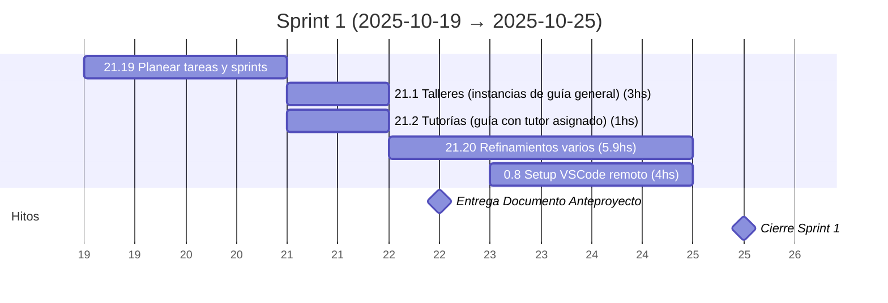

---

## Sprint #2 (2025-10-26 → 2025-11-01)

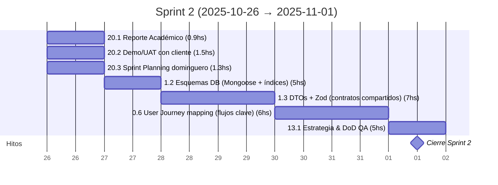

---

## Sprint #3 (2025-11-02 → 2025-11-08)

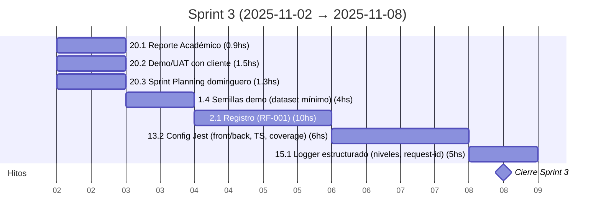

---

## Sprint #4 (2025-11-09 → 2025-11-15)

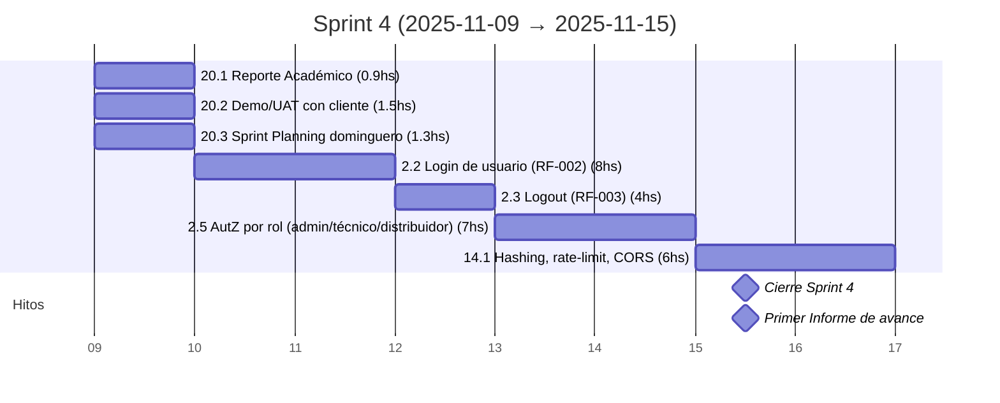

---

## Sprint #5 (2025-11-16 → 2025-11-22)

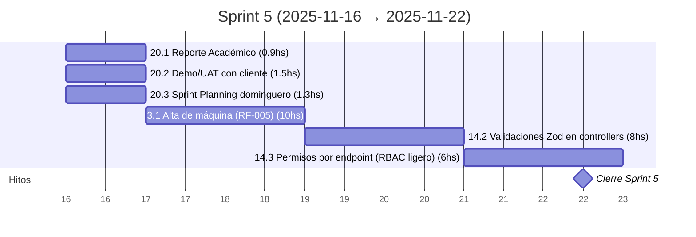

---

## Sprint #6 (2025-11-23 → 2025-11-29)

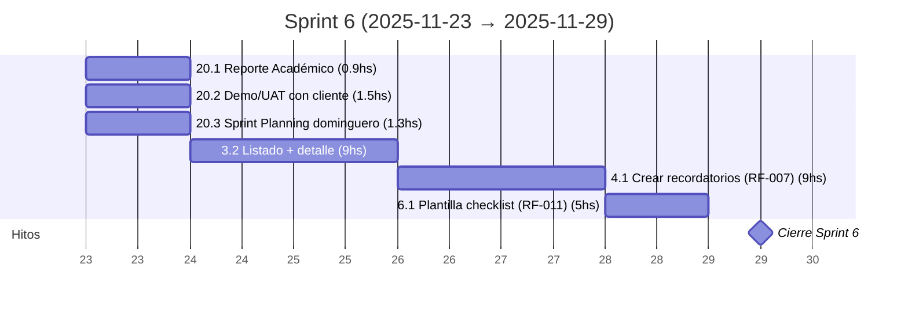

---

## Sprint #7 (2025-11-30 → 2025-12-06)

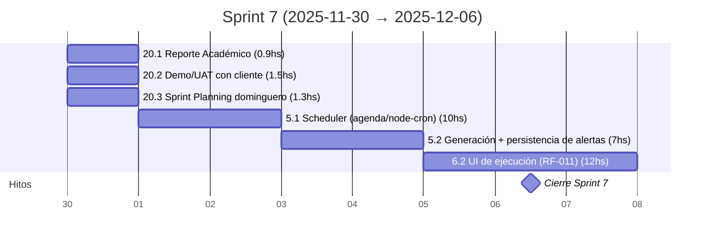

---

## Sprint #8 (2025-12-07 → 2025-12-13)

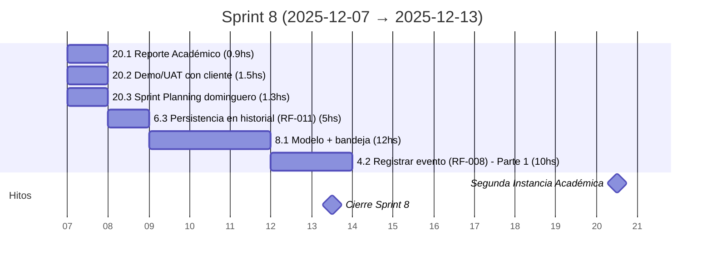

---

## Sprint #9 (2025-12-14 → 2025-12-20)

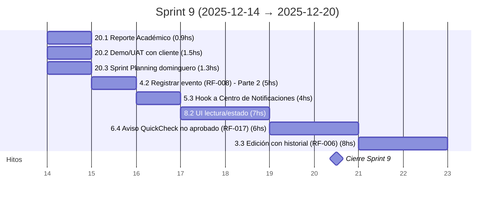

---

## Sprint #10 (2025-12-21 → 2025-12-27)

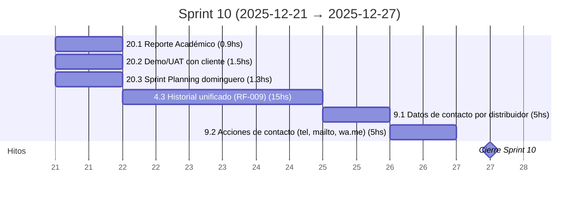

---

## Sprint #11 (2025-12-28 → 2026-01-03)

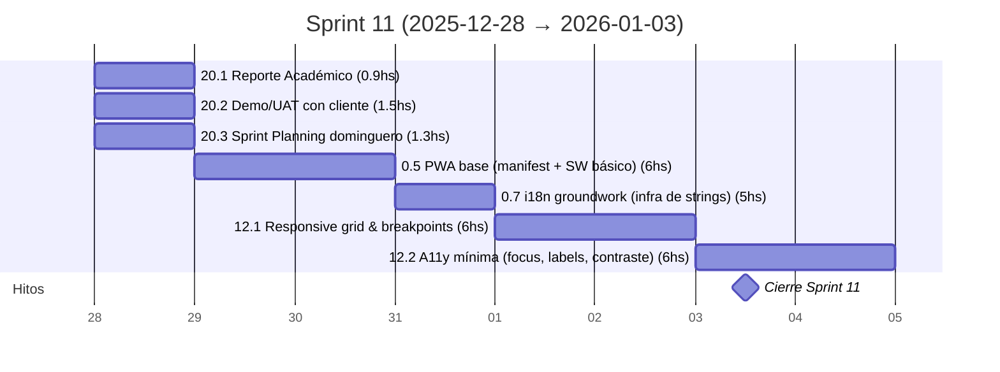

---

## Sprint #12 (2026-01-04 → 2026-01-10)

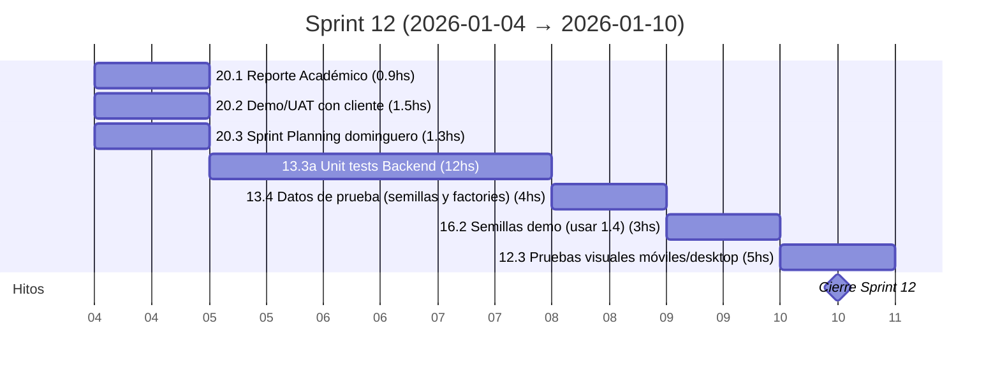

---

## Sprint #13 (2026-01-11 → 2026-01-17)

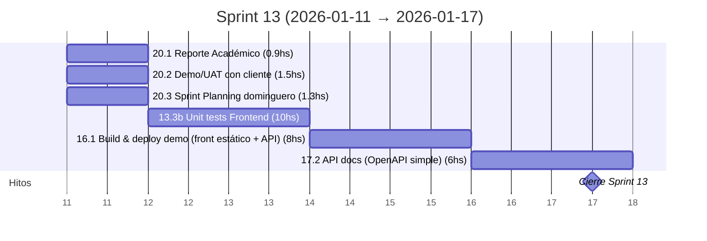

---

## Sprint #14 (2026-01-18 → 2026-01-24)

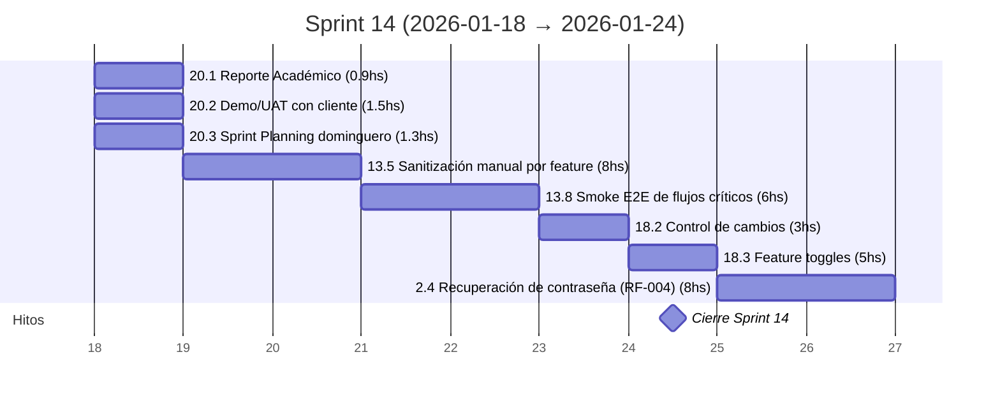

---

## Sprint #15 (2026-01-25 → 2026-01-31)

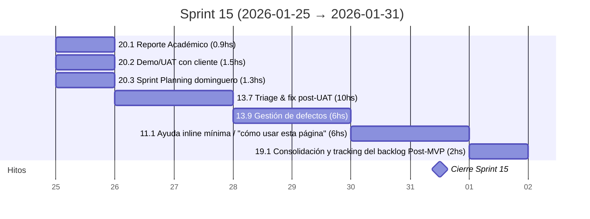

---

## Sprint #16 (2026-02-01 → 2026-02-07)

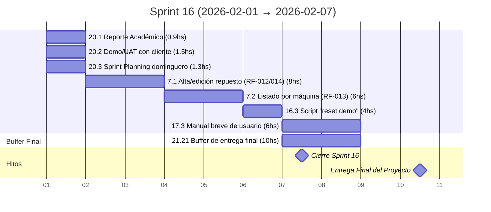

---

## Eventos Académicos Post-MVP (2026-02-08 → 2026-04-30)

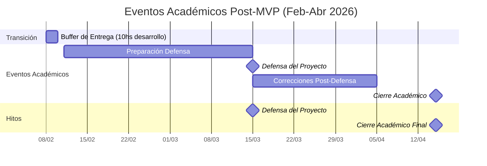

---

## Resumen General

- **Total de sprints:** 16
- **Duración del desarrollo:** 12 de octubre 2025 - 7 de febrero 2026
- **Duración por sprint:** 7 días (domingo a sábado)
- **Estimación de trabajo:** 5 horas por día laboral
- **Hitos principales de desarrollo:**
  - Sprint 0: Configuración inicial y documentación del anteproyecto
  - Sprint 1: Entrega del Documento Anteproyecto (22 oct)
  - Sprints 2-11: Desarrollo del MVP
  - Sprints 12-16: Testing, refinamiento y funcionalidades adicionales
- **Eventos académicos principales:**
  - Primera Instancia: Noviembre 2025
  - Segunda Instancia: Diciembre 2025
  - Entrega Final: Febrero 2026
  - Defensa del Proyecto: Marzo 2026
  - Cierre Académico: Abril 2026

**Notas:**
- Cada sprint incluye actividades de gestión dominicales (Reporte, Demo/UAT, Planning)
- Los sprints navideños (10-11) pueden tener productividad reducida
- Las funcionalidades marcadas como `[NiceToHave]` pueden ajustarse según el progreso
- El Sprint 14 es especialmente denso con poco buffer disponible
- **Buffer de 3 días (8-10 feb):** Período estratégico para refinamientos finales, documentación y verificaciones de calidad antes de la entrega académica
