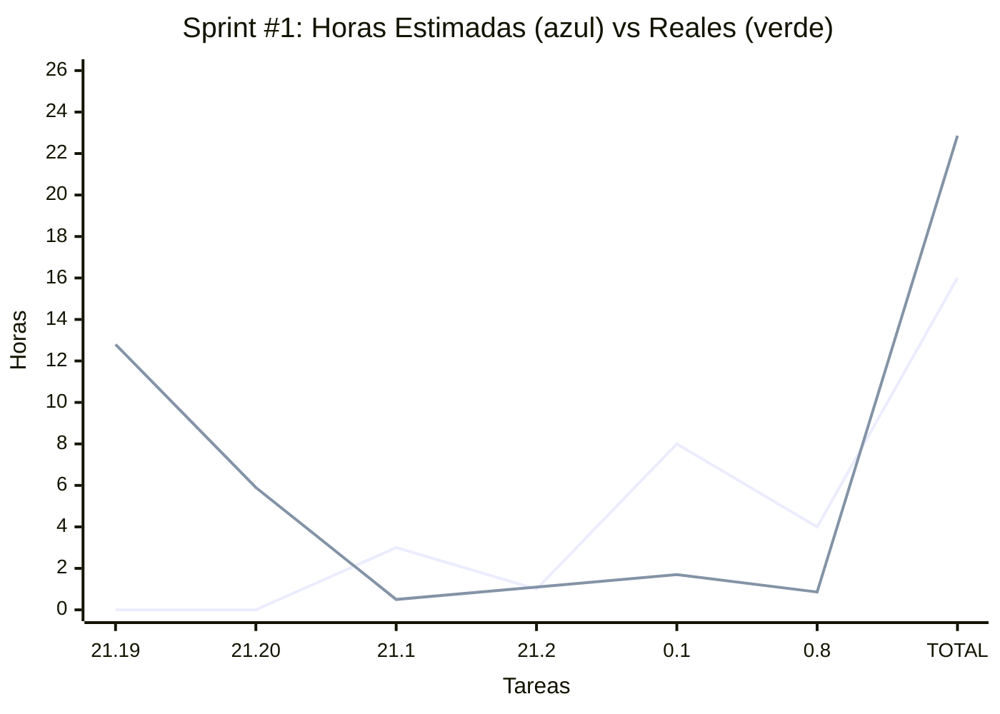
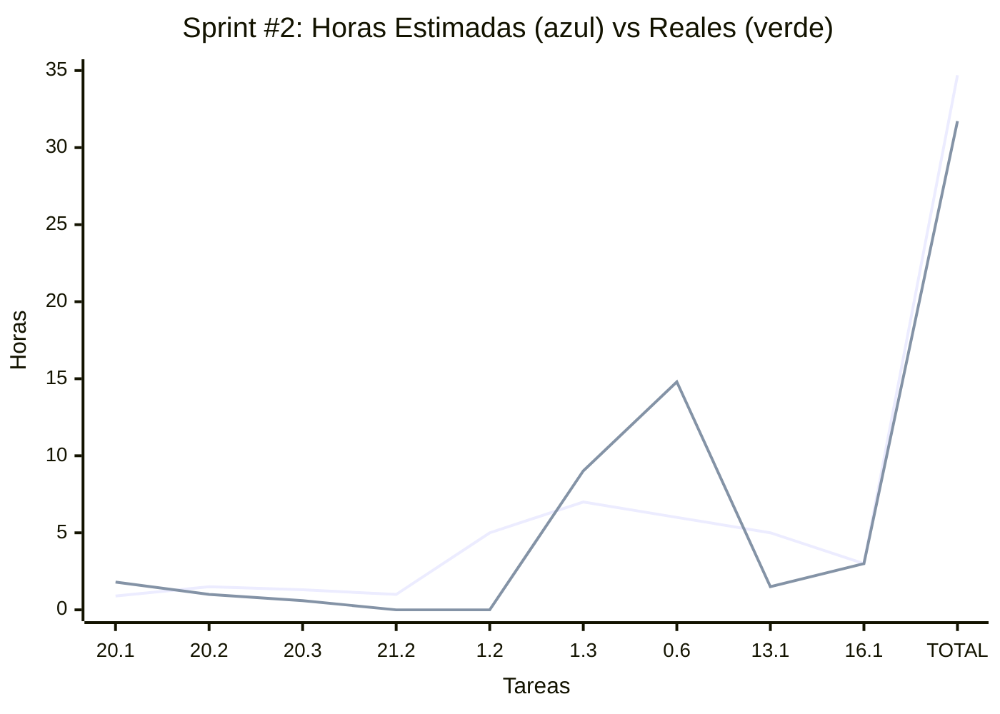
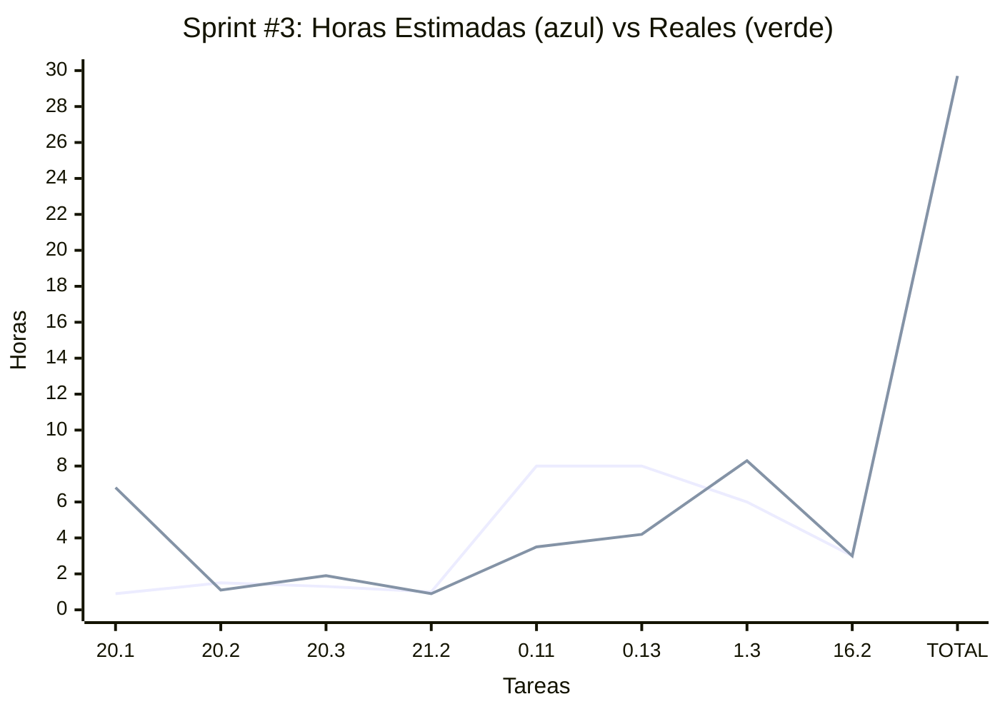
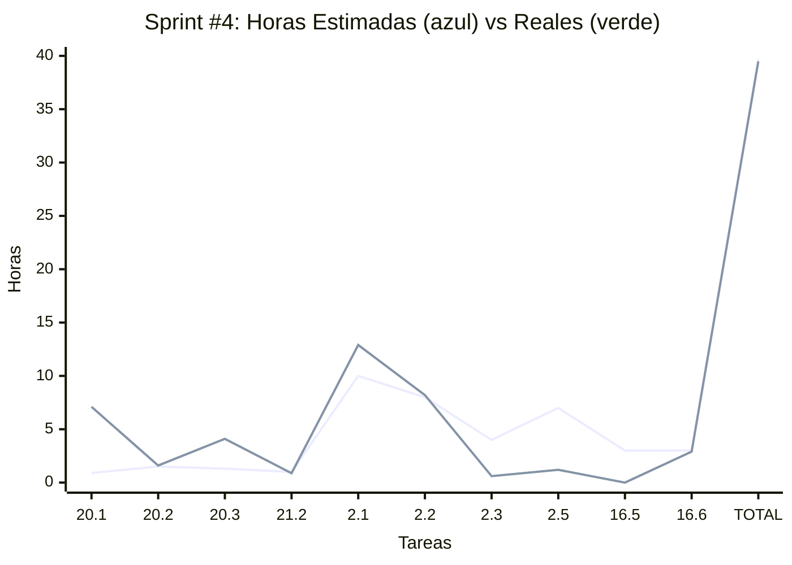
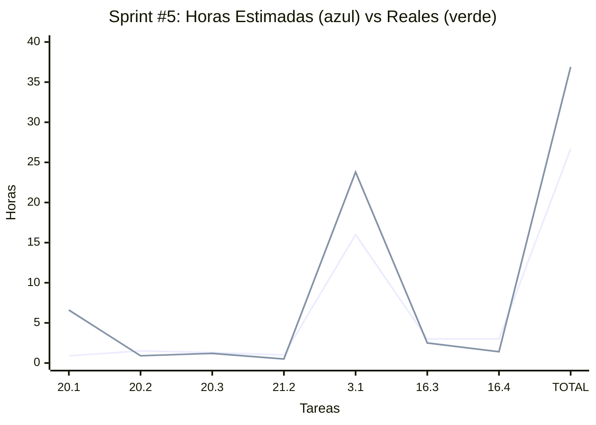
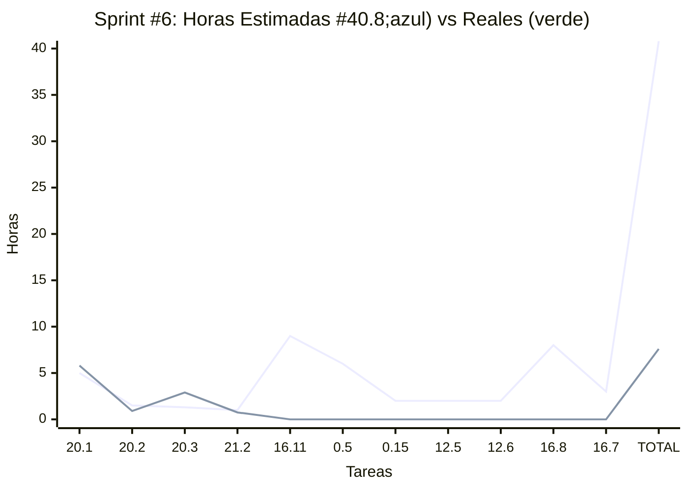

# Planes de Sprints

### **Sprint #0**: dom 12 oct → sáb 18 oct 2025

**Objetivo:** Finalizar y entregar documento de Anteproyecto.

| Categoría | Tarea | Orden | Horas Estimadas | Horas Reales |
|-----------:|:-------|:---------------:|:---------------:|:------------:|
| Capacitación | 21.1 Talleres (instancias de guía general) | 1 | No est. | 2 |
| Capacitación | 21.2 Tutorías (guía con tutor asignado) | 2 | No est. | 0.7 |
| Documentación | 21.17 Diagramar arquitectura | 3 | No est. | 3.2 |
| Documentación | 21.18 Hacer diagrama Conceptual de Dominio | 4 | No est. | 4 |
| Gestión | 21.19 Planear tareas y sprints | 5 | No est. | 5.7 |
| Documentación | 21.20 Refinamientos varios | 6 | No est. | 3 |
| Gestión | 18.1 Scope freeze (MoSCoW) | 7 | 2 | 0.5 |
| Desarrollo | 0.3 Convención ramas & releases (main/dev/feature, Conventional Commits) | 8 | 3 | 0.9 |

| Total Horas Estimadas (sin buffer) | Total Horas Reales |
|:---:|:----------:|
| **No est.** hs | **16**hs |

Buffer reservado: **No est.** hs
Total con buffer: **No est.** hs

Distribución por categoría:
| Gestión | Desarrollo | QA | Capacitación | Documentación |
|:-------:|:----------:|:--:|:------------:|:-------------:|
| **No est.** hs | **No est.** hs | **0**hs | **No est.** hs | **No est.** hs |

**Nota:** Las estimaciones no están disponibles para este sprint ya que corresponde a tareas del anteproyecto que se definieron y ejecutaron mientras el sprint estaba en curso. Las tareas incluyen actividades académicas de talleres, tutorías y documentación final del anteproyecto.

**Riesgos:** Sprint retrospectivo sin estimaciones previas; tareas ya completadas o en progreso.

### **Sprint #1**: dom 19 oct → sáb 25 oct 2025

**Objetivo:** Configurar entornos y herramientas de desarrollo (dependencias, monorepo, editor online).

| Categoría | Tarea | Orden | Horas Estimadas | Horas Reales |
|-----------:|:-------|:---------------:|:---------------:|:------------:|
| Gestión | 21.19 Planear tareas y sprints | 1 | No est. | 12.8 |
| Documentación | 21.20 Refinamientos varios | 2 | No est. | 5.9 |
| Capacitación | 21.1 Talleres (instancias de guía general) | 3 | 3 | 0.5 |
| Capacitación | 21.2 Tutorías (guía con tutor asignado) | 4 | 1 | 1,1 |
| Desarrollo | 0.1 Repos & monorepo (front React+Vite, back Node/TS, shared/DTO/Zod) | 5 | 8 | 1.7 |
| Desarrollo | 0.8 Setup VSCode remoto (GitHub Codespaces/Gitpod) | 6 | 4 | 0.86 |

| Total Horas Estimadas (sin buffer) | Total Horas Reales |
|:---:|:----------:|
| **16**hs | **22.86**hs |

Buffer reservado: **16**hs
Total con buffer: **32**hs

Distribución por categoría:
| Gestión | Desarrollo | QA | Capacitación | Documentación |
|:-------:|:----------:|:--:|:------------:|:-------------:|
| **16.7**hs | **2.56**hs | **0**hs | **1.6**hs | **0**hs |

**Nota:** A mitad del sprint (miércoles 22 oct) se entrega el Documento Anteproyecto. Las tareas 21.19 y 21.20 están relacionadas con esta entrega. No se realiza planning, ni demo, ni reporte académico ya que la etapa de desarrollo comienza post entrega.

**Riesgos:** Sprint denso enfocado en configuración inicial. La configuración del monorepo y entornos es crítica para el resto del proyecto. La entrega del anteproyecto puede requerir ajustes de última hora.

### **Sprint #2**: dom 26 oct → sáb 1 nov 2025

**Objetivo:** Lograr un User Journey refinado y aprobado por el cliente. Crear entidades (clases) básicas.

| Categoría | Tarea | Orden | Horas Estimadas | Horas Reales |
|-----------:|:-------|:---------------:|:---------------:|:------------:|
| Documentación | 20.1 Reporte Académico (dominical) | 1 | 0.9 | 1.8 |
| Gestión | 20.2 Demo/UAT con cliente (dominical) | 2 | 1.5 | 1 |
| Gestión | 20.3 Sprint Planning dominguero (dominical) | 3 | 1.3 | 0.6 |
| Capacitación | 21.2 Tutorías (guía con tutor asignado) | 4 | 1 | 0 |
| Desarrollo | 1.2 Esquemas DB (Mongoose + índices clave) | 5 | 5 | 0 |
| Desarrollo | 1.3 DTOs + Zod (contratos compartidos) | 6 | 7 | 9.02 |
| Desarrollo | 0.6 User Journey mapping | 7 | 6 | 14.8 |
| QA | 13.1 Estrategia & DoD QA | 8 | 5 | 1.5 |
| Capacitación | 16.1 Taller Deploy - Conceptos Generales (miérc 30 Oct) | 9 | 3 | 3 |

| Total Horas Estimadas (sin buffer) | Total Horas Reales |
|:---:|:----------:|
| **34.7**hs | **31.72**hs |

Buffer reservado: **0.3**hs
Total con buffer: **35**hs

Distribución por categoría:
| Gestión | Desarrollo | QA | Capacitación | Documentación |
|:-------:|:----------:|:--:|:------------:|:-------------:|
| **2.5**hs | **23.82**hs | **1.5**hs | **3**hs | **0.9**hs |

**Riesgos:** El design system puede requerir iteraciones con feedback del cliente.

### **Sprint #3**: dom 2 nov → sáb 8 nov 2025

**Objetivo:** Establecer la infraestructura básica de backend y frontend necesaria para el desarrollo posterior de funcionalidades de dominio.

| Categoría | Tarea | Orden | Horas Estimadas | Horas Reales |
|-----------:|:-------|:---------------:|:---------------:|:------------:|
| Documentación | 20.1 Reporte Académico (dominical) | 1 | 0.9 | 6.8 |
| Gestión | 20.2 Demo/UAT con cliente (dominical) | 2 | 1.5 | 1.1 |
| Gestión | 20.3 Sprint Planning dominguero (dominical) | 3 | 1.3 | 1.9 |
| Capacitación | 21.2 Tutorías (guía con tutor asignado) | 4 | 1 | 0.9 |
| Desarrollo | 0.11 Setup Backend Básico | 5 | 8 | 3.5 |
| Desarrollo | 0.13 Setup Frontend Básico | 6 | 8 | 4.2 |
| Desarrollo | 1.3 DTOs + Zod (contratos compartidos) - continuación | 7 | 6 | 8.3 |
| Capacitación | 16.2 Taller Deploy - Conceptos Generales (miérc 6 Nov) | 8 | 3 | 3 |

| Total Horas Estimadas (sin buffer) | Total Horas Reales |
|:---:|:----------:|
| **29.7**hs | **29.7**hs |

Buffer reservado: **5.3**hs
Total con buffer: **35**hs

Distribución por categoría:
| Gestión | Desarrollo | QA | Capacitación | Documentación |
|:-------:|:----------:|:--:|:------------:|:-------------:|
| **8.9**hs | **16.0**hs | **0**hs | **3.9**hs | **0.9**hs |

### **Sprint #4**: dom 9 nov → sáb 15 nov 2025

**Objetivo:** 🎯 Auth Básico Funcional - Registro, login, autologin, session JWT y logout.

| Categoría | Tarea | Orden | Horas Estimadas | Horas Reales |
|-----------:|:-------|:---------------:|:---------------:|:------------:|
| Documentación | 20.1 Reporte Académico (dominical) | 1 | 0.9 | 7.1 |
| Gestión | 20.2 Demo/UAT con cliente (dominical) | 2 | 1.5 | 1.6 |
| Gestión | 20.3 Sprint Planning dominguero (dominical) | 3 | 1.3 | 4.1 |
| Capacitación | 21.2 Tutorías (guía con tutor asignado) | 4 | 1 | 0.88 |
| Desarrollo | 2.1 Registro de usuario (RF-001) | 5 | 10 | 12.9 |
| Desarrollo | 2.2 Login de usuario (RF-002) | 6 | 8 | 8.2 |
| Desarrollo | 2.3 Logout (RF-003) | 7 | 4 | 0.6 |
| Desarrollo | 2.5 AutZ por rol básico | 8 | 7 | 1.2 |
| Capacitación | 16.5 Taller Deploy - Azure (mar 11 Nov) | 9 | 3 |0|
| Capacitación | 16.6 Taller Deploy - Azure (jue 13 Nov) | 10 | 3 | 2.9 |

| Total Horas Estimadas (sin buffer) | Total Horas Reales |
|:---:|:----------:|
| **39.7**hs | **39.48**hs |

Buffer reservado: **-4.7**hs
Total con buffer: **35**hs

Distribución por categoría:
| Gestión | Desarrollo | QA | Capacitación | Documentación |
|:-------:|:----------:|:--:|:------------:|:-------------:|
| **11.9**hs | **22.9**hs | **0**hs | **3.78**hs | **0.9**hs |

### **Sprint #5**: dom 16 nov → sáb 22 nov 2025

**Objetivo:** 🎯 Mejoras en Formularios y registro de máquina - ReactHookForms + Wizard Component + Alta máquinas.

| Categoría | Tarea | Orden | Horas Estimadas | Horas Reales |
|-----------:|:-------|:---------------:|:---------------:|:------------:|
| Documentación | 20.1 Reporte Académico (dominical) | 1 | 0.9 | 6.6 |
| Gestión | 20.2 Demo/UAT con cliente (dominical) | 2 | 1.5 | 0.9 |
| Gestión | 20.3 Sprint Planning dominguero (dominical) | 3 | 1.3 | 1.2 |
| Capacitación | 21.2 Tutorías (guía con tutor asignado) | 4 | 1 | 0.5 |
| Desarrollo | 3.1 Alta de máquina (RF-005) + ReactHookForms + Wizard Component | 5 | 16 | 23.8 |
| Capacitación | 16.3 Taller Deploy - AWS (mar 18 Nov) | 6 | 3 | 2.5 |
| Capacitación | 16.4 Taller Deploy - AWS (jue 20 Nov) | 7 | 3 | 1.4 |

| Total Horas Estimadas (sin buffer) | Total Horas Reales |
|:---:|:----------:|
| **26.7**hs | **36.9**hs |

Buffer reservado: **8.3**hs
Total con buffer: **35**hs

Distribución por categoría:
| Gestión | Desarrollo | QA | Capacitación | Documentación |
|:-------:|:----------:|:--:|:------------:|:-------------:|
| **2.8**hs | **23.8**hs | **0**hs | **6**hs | **0.9**hs |

### **Sprint #6**: dom 23 nov → sáb 29 nov 2025

**Objetivo:** 🚀 Deploy Azure + PWA + i18n + Theme + Settings — Disponibilizar demo deployada y pulir UX con internacionalización y tema.

| Categoría | Tarea | Orden | Horas Estimadas | Horas Reales |
|-----------:|:-------|:---------------:|:---------------:|:------------:|
| Documentación | 20.1 Reporte Académico (dominical) | 1 | 5 | 5.8 |
| Gestión | 20.2 Demo/UAT con cliente (dominical) | 2 | 1.5 | 0.9 |
| Gestión | 20.3 Sprint Planning dominguero (dominical) | 3 | 1.3 | 2.9 |
| Capacitación | 21.2 Tutorías (guía con tutor asignado) | 4 | 1 | 0.75 |
| Desarrollo | 16.11 Azure Deploy - Config práctica (Azure App Service) | 5 | 9 | |
| Desarrollo | 0.5 PWA base (manifest + SW básico) | 6 | 6 | |
| Desarrollo | 0.15 i18n - Implementación mínima (strings + en/es) | 7 | 2 | |
| Desarrollo | 12.5 Theme toggle (UI + persistencia) | 8 | 2 | |
| Desarrollo | 12.6 Settings screen (pantalla de ajustes: tema + idioma + prefs) | 9 | 2 | |
| Desarrollo | 16.8 Build & deploy demo (front estático + API) | 10 | 8 | |
| Capacitación | 16.7 Taller Deploy - Deploy en Práctica (miérc 27 Nov) | 11 | 3 | |

| Total Horas Estimadas (sin buffer) | Total Horas Reales |
|:---:|:----------:|
| **40.8**hs | **7.6**hs |

Buffer reservado: **-5.8**hs
Total con buffer: **35**hs

Distribución por categoría:
| Documentación | Desarrollo | QA | Capacitación | Gestión |
|:-------:|:----------:|:--:|:------------:|:-------------:|
| **5**hs | **29**hs | **0**hs | **4**hs | **2.8**hs |

- **Opción A (Deploy First):** Priorizar 16.8, 16.11, 0.5 PWA, 0.15 i18n, 12.5 Theme, 12.6 Settings (~31hs) y mantener 1.2/1.4 como tareas just-in-time o mover tareas adicionales a Sprint #7.
- **Opción B (Máquinas + Deploy):** Si se decide mantener trabajo en máquinas, considerar mover parte del deploy a una mini-iteración posterior.
- **Contexto taller Azure:** El jueves 27 nov hay taller de deploy universitario — sincronizar 16.11 con este evento.
- **Nota:** Este sprint queda con **40.8hs** estimadas (buffer -5.8hs). Recomendaciones:
- **Opción A (Deploy First):** Priorizar 16.8, 16.11, 0.5 PWA, 0.15 i18n, 12.5 Theme, 12.6 Settings (~32hs) y mantener 1.2/1.4 como tareas just-in-time o mover tareas adicionales a Sprint #7.
- **Opción B (Máquinas + Deploy):** Si se decide mantener trabajo en máquinas, considerar mover parte del deploy a una mini-iteración posterior.
- **Contexto taller Azure:** El jueves 27 nov hay taller de deploy universitario — sincronizar 16.11 con este evento.
- **Opción A (Deploy First):** Priorizar 16.8, 16.11, 0.5 PWA, 0.15 i18n, 12.5 Theme, 12.6 Settings (~31hs) y mantener 1.2/1.4 como tareas just-in-time o mover tareas adicionales a Sprint #7.
- **Opción B (Máquinas + Deploy):** Si se decide mantener trabajo en máquinas, considerar mover parte del deploy a una mini-iteración posterior.
- **Contexto taller Azure:** El jueves 27 nov hay taller de deploy universitario — sincronizar 16.11 con este evento.

### **Sprint #7**: dom 30 nov → sáb 6 dic 2025

**Objetivo:** 📋 Full QuickCheck - Sistema completo de inspecciones rápidas end-to-end.

| Categoría | Tarea | Orden | Horas Estimadas | Horas Reales |
|-----------:|:-------|:---------------:|:---------------:|:------------:|
| Documentación | 20.1 Reporte Académico (dominical) | 1 | 5 | |
| Gestión | 20.2 Demo/UAT con cliente (dominical) | 2 | 1.5 | |
| Gestión | 20.3 Sprint Planning dominguero (dominical) | 3 | 1.3 | |
| Capacitación | 21.2 Tutorías (guía con tutor asignado) | 4 | 1 | |
| Desarrollo | 3.2 Listado + detalle | 5 | 9 | |
| Desarrollo | 4.1 Crear recordatorios (RF-007) | 6 | 9 | |
| Desarrollo | 6.1 Plantilla checklist (RF-011) | 7 | 5 | |
| Capacitación | 16.7 Taller Deploy - Deploy en Práctica (miérc 4 Dic) | 8 | 3 | |

| Total Horas Estimadas (sin buffer) | Total Horas Reales |
|:---:|:----------:|
| **34.8**hs | **0**hs |

Buffer reservado: **0.2**hs
Total con buffer: **35**hs

Distribución por categoría:
| Documentación | Desarrollo | QA | Capacitación | Gestión |
|:-------:|:----------:|:--:|:------------:|:-------------:|
| **5**hs | **23**hs | **0**hs | **4**hs | **2.8**hs |

### **Sprint #8**: dom 7 dic → sáb 13 dic 2025

**Objetivo:** ⚙️ PWA + Testing + Cronjobs - Infraestructura crítica y testing de lo implementado.

| Categoría | Tarea | Orden | Horas Estimadas | Horas Reales |
|-----------:|:-------|:---------------:|:---------------:|:------------:|
| Documentación | 20.1 Reporte Académico (dominical) | 1 | 5 | |
| Gestión | 20.2 Demo/UAT con cliente (dominical) | 2 | 1.5 | |
| Gestión | 20.3 Sprint Planning dominguero (dominical) | 3 | 1.3 | |
| Capacitación | 21.2 Tutorías (guía con tutor asignado) | 4 | 1 | |
| Desarrollo | 5.1 Scheduler (agenda/node-cron) | 5 | 10 | |
| Desarrollo | 5.2 Generación + persistencia de alertas | 6 | 7 | |
| Desarrollo | 6.2 UI de ejecución (RF-011) | 7 | 12 | |

| Total Horas Estimadas (sin buffer) | Total Horas Reales |
|:---:|:----------:|
| **37.8**hs | **0**hs |

Buffer reservado: **-2.8**hs
Total con buffer: **35**hs

Distribución por categoría:
| Documentación | Desarrollo | QA | Capacitación | Gestión |
|:-------:|:----------:|:--:|:------------:|:-------------:|
| **5**hs | **29**hs | **0**hs | **1**hs | **2.8**hs |

### **Sprint #9**: dom 14 dic → sáb 20 dic 2025

**Objetivo:** 🔔 Full Notificaciones - Sistema completo front y back de notificaciones.

| Categoría | Tarea | Orden | Horas Estimadas | Horas Reales |
|-----------:|:-------|:---------------:|:---------------:|:------------:|
| Documentación | 20.1 Reporte Académico (dominical) | 1 | 5 | |
| Gestión | 20.2 Demo/UAT con cliente (dominical) | 2 | 1.5 | |
| Gestión | 20.3 Sprint Planning dominguero (dominical) | 3 | 1.3 | |
| Capacitación | 21.2 Tutorías (guía con tutor asignado) | 4 | 1 | |
| Desarrollo | 6.3 Persistencia en historial (RF-011) | 5 | 5 | |
| Desarrollo | 8.1 Modelo + bandeja | 6 | 12 | |
| Desarrollo | 4.2 Registrar evento (RF-008) - Parte 1 | 7 | 10 | |

| Total Horas Estimadas (sin buffer) | Total Horas Reales |
|:---:|:----------:|
| **35.8**hs | **0**hs |

Buffer reservado: **-0.8**hs
Total con buffer: **35**hs

Distribución por categoría:
| Documentación | Desarrollo | QA | Capacitación | Gestión |
|:-------:|:----------:|:--:|:------------:|:-------------:|
| **5**hs | **27**hs | **0**hs | **1**hs | **2.8**hs |

**Riesgos:** Integración entre notificaciones y eventos puede ser compleja.

### **Sprint #10**: dom 21 dic → sáb 27 dic 2025

**Objetivo:** 📅 Reporte Eventos + Eventos Automáticos - Sistema eventos básico sin features no solicitadas.

| Categoría | Tarea | Orden | Horas Estimadas | Horas Reales |
|-----------:|:-------|:---------------:|:---------------:|:------------:|
| Documentación | 20.1 Reporte Académico (dominical) | 1 | 5 | |
| Gestión | 20.2 Demo/UAT con cliente (dominical) | 2 | 1.5 | |
| Gestión | 20.3 Sprint Planning dominguero (dominical) | 3 | 1.3 | |
| Capacitación | 21.2 Tutorías (guía con tutor asignado) | 4 | 1 | |
| Desarrollo | 4.2 Registrar evento (RF-008) - Parte 2 | 5 | 5 | |
| Desarrollo | 5.3 Hook a Centro de Notificaciones | 6 | 4 | |
| Desarrollo | 8.2 UI lectura/estado | 7 | 7 | |
| Desarrollo | 6.4 Aviso QuickCheck no aprobado (RF-017) | 8 | 6 | |
| Desarrollo | 3.3 Edición con historial (RF-006) | 9 | 8 | |

| Total Horas Estimadas (sin buffer) | Total Horas Reales |
|:---:|:----------:|
| **38.8**hs | **0**hs |

Buffer reservado: **-3.8**hs
Total con buffer: **35**hs

Distribución por categoría:
| Documentación | Desarrollo | QA | Capacitación | Gestión |
|:-------:|:----------:|:--:|:------------:|:-------------:|
| **5**hs | **30**hs | **0**hs | **1**hs | **2.8**hs |

**Riesgos:** Sprint denso con múltiples integraciones críticas. Período navideño puede afectar productividad.

### **Sprint #11**: dom 28 dic → sáb 3 ene 2026

**Objetivo:** ⚙️ Full Mantenimiento - Feature completa sin cosas no solicitadas.

| Categoría | Tarea | Orden | Horas Estimadas | Horas Reales |
|-----------:|:-------|:---------------:|:---------------:|:------------:|
| Documentación | 20.1 Reporte Académico (dominical) | 1 | 5 | |
| Gestión | 20.2 Demo/UAT con cliente (dominical) | 2 | 1.5 | |
| Gestión | 20.3 Sprint Planning dominguero (dominical) | 3 | 1.3 | |
| Capacitación | 21.2 Tutorías (guía con tutor asignado) | 4 | 1 | |
| Desarrollo | 4.3 Historial unificado (RF-009) | 5 | 15 | |
| Desarrollo | 9.1 Datos de contacto por distribuidor | 6 | 5 | |
| Desarrollo | 9.2 Acciones de contacto (tel:, mailto:, wa.me) | 7 | 5 | |

| Total Horas Estimadas (sin buffer) | Total Horas Reales |
|:---:|:----------:|
| **33.8**hs | **0**hs |

Buffer reservado: **1.2**hs
Total con buffer: **35**hs

Distribución por categoría:
| Documentación | Desarrollo | QA | Capacitación | Gestión |
|:-------:|:----------:|:--:|:------------:|:-------------:|
| **5**hs | **25**hs | **0**hs | **1**hs | **2.8**hs |

**Riesgos:** Período de fiestas navideñas puede impactar disponibilidad.

### **Sprint #12**: dom 4 ene → sáb 10 ene 2026

**Objetivo:** 💬 Full Comunicaciones - Listado usuarios + gestión contactos + chat sencillo.

| Categoría | Tarea | Orden | Horas Estimadas | Horas Reales |
|-----------:|:-------|:---------------:|:---------------:|:------------:|
| Documentación | 20.1 Reporte Académico (dominical) | 1 | 5 | |
| Gestión | 20.2 Demo/UAT con cliente (dominical) | 2 | 1.5 | |
| Gestión | 20.3 Sprint Planning dominguero (dominical) | 3 | 1.3 | |
| Capacitación | 21.2 Tutorías (guía con tutor asignado) | 4 | 1 | |
| QA | 13.3a Unit tests Backend | 5 | 12 | |
| QA | 13.4 Datos de prueba (semillas y factories) | 6 | 4 | |
| Desarrollo | 16.2 Semillas demo (usar 1.4) | 7 | 3 | |
| QA | 12.3 Pruebas visuales móviles/desktop | 8 | 5 | |

| Total Horas Estimadas (sin buffer) | Total Horas Reales |
|:---:|:----------:|
| **32.8**hs | **0**hs |

Buffer reservado: **2.2**hs
Total con buffer: **35**hs

Distribución por categoría:
| Documentación | Desarrollo | QA | Capacitación | Gestión |
|:-------:|:----------:|:--:|:------------:|:-------------:|
| **5**hs | **3**hs | **21**hs | **1**hs | **2.8**hs |

### **Sprint #13**: dom 11 ene → sáb 17 ene 2026

**Objetivo:** 🧪 Smoke Tests + Buffer - Testing, refinamientos y mejoras necesarias.

| Categoría | Tarea | Orden | Horas Estimadas | Horas Reales |
|-----------:|:-------|:---------------:|:---------------:|:------------:|
| Documentación | 20.1 Reporte Académico (dominical) | 1 | 5 | |
| Gestión | 20.2 Demo/UAT con cliente (dominical) | 2 | 1.5 | |
| Gestión | 20.3 Sprint Planning dominguero (dominical) | 3 | 1.3 | |
| Capacitación | 21.2 Tutorías (guía con tutor asignado) | 4 | 1 | |
| QA | 13.3b Unit tests Frontend | 5 | 10 | |
| Desarrollo | 16.1 Build & deploy demo (front estático + API) | 6 | 8 | |
| Documentación | 17.2 API docs (OpenAPI simple) | 7 | 6 | |

| Total Horas Estimadas (sin buffer) | Total Horas Reales |
|:---:|:----------:|
| **32.8**hs | **0**hs |

Buffer reservado: **2.2**hs
Total con buffer: **35**hs

Distribución por categoría:
| Documentación | Desarrollo | QA | Capacitación | Gestión |
|:-------:|:----------:|:--:|:------------:|:-------------:|
| **5**hs | **8**hs | **10**hs | **1**hs | **2.8**hs |

### **Sprint #14**: dom 18 ene → sáb 24 ene 2026

**Objetivo:** 🔧 Feature Básica Repuestos - Módulo repuestos básico funcional.

| Categoría | Tarea | Orden | Horas Estimadas | Horas Reales |
|-----------:|:-------|:---------------:|:---------------:|:------------:|
| Documentación | 20.1 Reporte Académico (dominical) | 1 | 5 | |
| Gestión | 20.2 Demo/UAT con cliente (dominical) | 2 | 1.5 | |
| Gestión | 20.3 Sprint Planning dominguero (dominical) | 3 | 1.3 | |
| Capacitación | 21.2 Tutorías (guía con tutor asignado) | 4 | 1 | |
| QA | 13.5 Sanitización manual por feature | 5 | 8 | |
| QA | 13.8 Smoke E2E de flujos críticos | 6 | 6 | |
| Gestión | 18.2 Control de cambios | 7 | 3 | |
| Desarrollo | 18.3 Feature toggles | 8 | 5 | |
| Desarrollo | 2.4 Recuperación de contraseña (RF-004) [NiceToHave] | 9 | 8 | |

| Total Horas Estimadas (sin buffer) | Total Horas Reales |
|:---:|:----------:|
| **38.8**hs | **0**hs |

Buffer reservado: **-3.8**hs
Total con buffer: **35**hs

Distribución por categoría:
| Documentación | Desarrollo | QA | Capacitación | Gestión |
|:-------:|:----------:|:--:|:------------:|:-------------:|
| **5**hs | **13**hs | **14**hs | **1**hs | **2.8**hs |

**Riesgos:** Sprint muy denso con poco buffer disponible.

### **Sprint #15**: dom 25 ene → sáb 31 ene 2026

**Objetivo:** 🎁 Full Nice-to-Have + UX - Recuperación password + búsqueda + ayuda + mejoras UX.

| Categoría | Tarea | Orden | Horas Estimadas | Horas Reales |
|-----------:|:-------|:---------------:|:---------------:|:------------:|
| Documentación | 20.1 Reporte Académico (dominical) | 1 | 5 | |
| Gestión | 20.2 Demo/UAT con cliente (dominical) | 2 | 1.5 | |
| Gestión | 20.3 Sprint Planning dominguero (dominical) | 3 | 1.3 | |
| Capacitación | 21.2 Tutorías (guía con tutor asignado) | 4 | 1 | |
| QA | 13.7 Triage & fix post-UAT | 5 | 10 | |
| QA | 13.9 Gestión de defectos | 6 | 6 | |
| Desarrollo | 11.1 Ayuda inline mínima / "cómo usar esta página" [NiceToHave] | 7 | 6 | |
| Gestión | 19.1 Consolidación y tracking del backlog Post-MVP | 8 | 2 | |

| Total Horas Estimadas (sin buffer) | Total Horas Reales |
|:---:|:----------:|
| **32.8**hs | **0**hs |

Buffer reservado: **2.2**hs
Total con buffer: **35**hs

Distribución por categoría:
| Documentación | Desarrollo | QA | Capacitación | Gestión |
|:-------:|:----------:|:--:|:------------:|:-------------:|
| **5**hs | **6**hs | **16**hs | **1**hs | **2.8**hs |

### **Sprint #16**: dom 1 feb → sáb 7 feb 2026

**Objetivo:** ✨ Último Sprint Desarrollo - Full pulida, nada de features nuevas, documentación.

| Categoría | Tarea | Orden | Horas Estimadas | Horas Reales |
|-----------:|:-------|:---------------:|:---------------:|:------------:|
| Documentación | 20.1 Reporte Académico (dominical) | 1 | 5 | |
| Gestión | 20.2 Demo/UAT con cliente (dominical) | 2 | 1.5 | |
| Gestión | 20.3 Sprint Planning dominguero (dominical) | 3 | 1.3 | |
| Capacitación | 21.2 Tutorías (guía con tutor asignado) | 4 | 1 | |
| Desarrollo | 7.1 Alta/edición repuesto (RF-012/014) [NiceToHave] | 5 | 8 | |
| Desarrollo | 7.2 Listado por máquina (RF-013) [NiceToHave] | 6 | 6 | |
| Desarrollo | 16.3 Script "reset demo" [NiceToHave] | 7 | 4 | |
| Documentación | 17.3 Manual breve de usuario [NiceToHave] | 8 | 6 | |

| Total Horas Estimadas (sin buffer) | Total Horas Reales |
|:---:|:----------:|
| **32.8**hs | **0**hs |

Buffer reservado: **2.2**hs
Total con buffer: **35**hs

Distribución por categoría:
| Documentación | Desarrollo | QA | Capacitación | Gestión |
|:-------:|:----------:|:--:|:------------:|:-------------:|
| **5**hs | **18**hs | **0**hs | **1**hs | **2.8**hs |

**Nota:** Este sprint incluye principalmente funcionalidades NiceToHave y puede ajustarse según el estado del proyecto.

### **Sprint #17**: dom 8 feb → sáb 14 feb 2026

**Objetivo:** Buffer final de entrega - refinamientos, documentación y verificaciones finales para la entrega académica.

| Categoría | Tarea | Orden | Horas Estimadas | Horas Reales |
|-----------:|:-------|:---------------:|:---------------:|:------------:|
| Documentación | 20.1 Reporte Académico (dominical) | 1 | 5 | |
| Gestión | 20.2 Demo/UAT con cliente (dominical) | 2 | 1.5 | |
| Gestión | 20.3 Sprint Planning dominguero (dominical) | 3 | 1.3 | |
| Capacitación | 21.2 Tutorías (guía con tutor asignado) | 4 | 1 | |
| Gestión | 21.21 Buffer de entrega final | 5 | 10 | |

| Total Horas Estimadas (sin buffer) | Total Horas Reales |
|:---:|:----------:|
| **18.8**hs | **0**hs |

Buffer reservado: **16.2**hs
Total con buffer: **35**hs

Distribución por categoría:
| Documentación | Desarrollo | QA | Capacitación | Gestión |
|:-------:|:----------:|:--:|:------------:|:-------------:|
| **5**hs | **0**hs | **0**hs | **1**hs | **12.8**hs |

**Nota:** Sprint de cierre con amplio buffer para refinamientos finales y preparación de entrega académica.

