# Planes de Sprints

### **Sprint #0**: dom 12 oct → sáb 18 oct 2025

**Objetivo:** Finalizar y entregar documento de Anteproyecto.

| Categoría | Tarea | Orden | Horas Estimadas | Horas Reales |
|-----------:|:-------|:---------------:|:---------------:|:------------:|
| Capacitación | 21.1 Talleres (instancias de guía general) | 1 | No est. | 2 |
| Capacitación | 21.2 Tutorías (guía con tutor asignado) | 2 | No est. | 0.7 |
| Documentación | 21.17 Diagramar arquitectura | 3 | No est. | 3.2 |
| Documentación | 21.18 Hacer diagrama Conceptual de Dominio | 4 | No est. | 4 |
| Gestión | 21.19 Planear tareas y sprints | 5 | No est. | 5.7 |
| Documentación | 21.20 Refinamientos varios | 6 | No est. | 3 |
| Gestión | 18.1 Scope freeze (MoSCoW) | 7 | 2 | 0.5 |
| Desarrollo | 0.3 Convención ramas & releases (main/dev/feature, Conventional Commits) | 8 | 3 | 0.9 |

| Total Horas Estimadas (sin buffer) | Total Horas Reales | Consumo |
|:---:|:----------:|:-------:|
| **No est.** hs | **16**hs | **N/A** |

Buffer reservado: **No est.** hs
Total con buffer: **No est.** hs

Distribución por categoría:
| Gestión | Desarrollo | QA | Capacitación | Documentación |
|:-------:|:----------:|:--:|:------------:|:-------------:|
| **No est.** hs | **No est.** hs | **0**hs | **No est.** hs | **No est.** hs |

**Nota:** Las estimaciones no están disponibles para este sprint ya que corresponde a tareas del anteproyecto que se definieron y ejecutaron mientras el sprint estaba en curso. Las tareas incluyen actividades académicas de talleres, tutorías y documentación final del anteproyecto.

**Riesgos:** Sprint retrospectivo sin estimaciones previas; tareas ya completadas o en progreso.

### **Sprint #1**: dom 19 oct → sáb 25 oct 2025

**Objetivo:** Configurar entornos y herramientas de desarrollo (dependencias, monorepo, editor online).

| Categoría | Tarea | Orden | Horas Estimadas | Horas Reales |
|-----------:|:-------|:---------------:|:---------------:|:------------:|
| Gestión | 21.19 Planear tareas y sprints | 1 | No est. | 12.8 |
| Documentación | 21.20 Refinamientos varios | 2 | No est. | 5.9 |
| Capacitación | 21.1 Talleres (instancias de guía general) | 3 | 3 | 0.5 |
| Capacitación | 21.2 Tutorías (guía con tutor asignado) | 4 | 1 | 1,1 |
| Desarrollo | 0.1 Repos & monorepo (front React+Vite, back Node/TS, shared/DTO/Zod) | 5 | 8 | 1.7 |
| Desarrollo | 0.8 Setup VSCode remoto (GitHub Codespaces/Gitpod) | 6 | 4 | 0.86 |

| Total Horas Estimadas (sin buffer) | Total Horas Reales | Consumo |
|:---:|:----------:|:-------:|
| **16**hs | **22.86**hs | **142.9%** |

Buffer reservado: **16**hs
Total con buffer: **32**hs

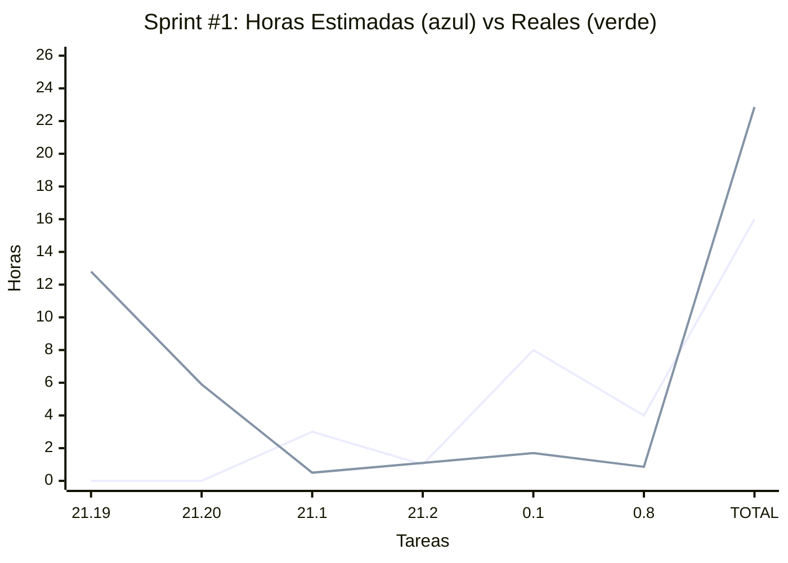

Distribución por categoría:
| Gestión | Desarrollo | QA | Capacitación | Documentación |
|:-------:|:----------:|:--:|:------------:|:-------------:|
| **16.7**hs | **2.56**hs | **0**hs | **1.6**hs | **0**hs |

**Nota:** A mitad del sprint (miércoles 22 oct) se entrega el Documento Anteproyecto. Las tareas 21.19 y 21.20 están relacionadas con esta entrega. No se realiza planning, ni demo, ni reporte académico ya que la etapa de desarrollo comienza post entrega.

**Riesgos:** Sprint denso enfocado en configuración inicial. La configuración del monorepo y entornos es crítica para el resto del proyecto. La entrega del anteproyecto puede requerir ajustes de última hora.

### **Sprint #2**: dom 26 oct → sáb 1 nov 2025

**Objetivo:** Lograr un User Journey refinado y aprobado por el cliente. Crear entidades (clases) básicas.

| Categoría | Tarea | Orden | Horas Estimadas | Horas Reales |
|-----------:|:-------|:---------------:|:---------------:|:------------:|
| Documentación | 20.1 Reporte Académico del Sprint #1 | 1 | 0.9 | 1.8 |
| Gestión | 20.2 Demo/UAT de Sprint #1 | 2 | 1.5 | 1 |
| Gestión | 20.3 Sprint Planning de Sprint #2 | 3 | 1.3 | 0.6 |
| Capacitación | 21.2 Tutorías (guía con tutor asignado) | 4 | 1 | 0 |
| Desarrollo | 1.2 Esquemas DB (Mongoose + índices clave) | 5 | 5 | 0 |
| Desarrollo | 1.3 DTOs + Zod (contratos compartidos) | 6 | 7 | 9.02 |
| Desarrollo | 0.6 User Journey mapping | 7 | 6 | 14.8 |
| QA | 13.1 Estrategia & DoD QA | 8 | 5 | 1.5 |
| Capacitación | 16.1 Taller Deploy - Conceptos Generales (miérc 30 Oct) | 9 | 3 | 3 |

| Total Horas Estimadas (sin buffer) | Total Horas Reales | Consumo |
|:---:|:----------:|:-------:|
| **34.7**hs | **31.72**hs | **91.4%** |

Buffer reservado: **0.3**hs
Total con buffer: **35**hs

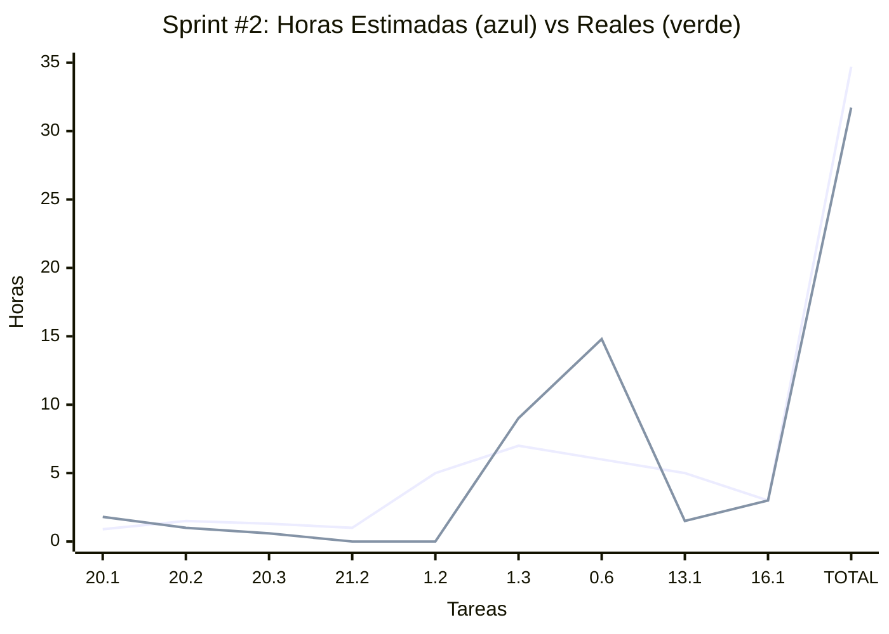

Distribución por categoría:
| Gestión | Desarrollo | QA | Capacitación | Documentación |
|:-------:|:----------:|:--:|:------------:|:-------------:|
| **2.5**hs | **23.82**hs | **1.5**hs | **3**hs | **0.9**hs |

**Riesgos:** El design system puede requerir iteraciones con feedback del cliente.

### **Sprint #3**: dom 2 nov → sáb 8 nov 2025

**Objetivo:** Establecer la infraestructura básica de backend y frontend necesaria para el desarrollo posterior de funcionalidades de dominio.

| Categoría | Tarea | Orden | Horas Estimadas | Horas Reales |
|-----------:|:-------|:---------------:|:---------------:|:------------:|
| Documentación | 20.1 Reporte Académico del Sprint #2 | 1 | 0.9 | 6.8 |
| Gestión | 20.2 Demo/UAT de Sprint #2 | 2 | 1.5 | 1.1 |
| Gestión | 20.3 Sprint Planning de Sprint #3 | 3 | 1.3 | 1.9 |
| Capacitación | 21.2 Tutorías (guía con tutor asignado) | 4 | 1 | 0.9 |
| Desarrollo | 0.11 Setup Backend Básico | 5 | 8 | 3.5 |
| Desarrollo | 0.13 Setup Frontend Básico | 6 | 8 | 4.2 |
| Desarrollo | 1.3 DTOs + Zod (contratos compartidos) - continuación | 7 | 6 | 8.3 |
| Capacitación | 16.2 Taller Deploy - Conceptos Generales (miérc 6 Nov) | 8 | 3 | 3 |

| Total Horas Estimadas (sin buffer) | Total Horas Reales | Consumo |
|:---:|:----------:|:-------:|
| **29.7**hs | **29.7**hs | **100.0%** |

Buffer reservado: **5.3**hs
Total con buffer: **35**hs

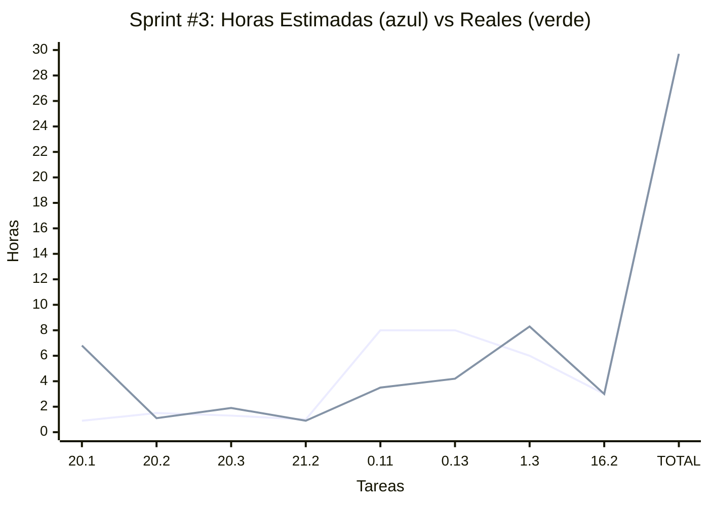

Distribución por categoría:
| Gestión | Desarrollo | QA | Capacitación | Documentación |
|:-------:|:----------:|:--:|:------------:|:-------------:|
| **8.9**hs | **16.0**hs | **0**hs | **3.9**hs | **0.9**hs |

### **Sprint #4**: dom 9 nov → sáb 15 nov 2025

**Objetivo:** 🎯 Auth Básico Funcional - Registro, login, autologin, session JWT y logout.

| Categoría | Tarea | Orden | Horas Estimadas | Horas Reales |
|-----------:|:-------|:---------------:|:---------------:|:------------:|
| Documentación | 20.1 Reporte Académico del Sprint #3 | 1 | 0.9 | 7.1 |
| Gestión | 20.2 Demo/UAT de Sprint #3 | 2 | 1.5 | 1.6 |
| Gestión | 20.3 Sprint Planning de Sprint #4 | 3 | 1.3 | 4.1 |
| Capacitación | 21.2 Tutorías (guía con tutor asignado) | 4 | 1 | 0.88 |
| Desarrollo | 2.1 Registro de usuario (RF-001) | 5 | 10 | 12.9 |
| Desarrollo | 2.2 Login de usuario (RF-002) | 6 | 8 | 8.2 |
| Desarrollo | 2.3 Logout (RF-003) | 7 | 4 | 0.6 |
| Desarrollo | 2.5 AutZ por rol básico | 8 | 7 | 1.2 |
| Capacitación | 16.5 Taller Deploy - Azure (mar 11 Nov) | 9 | 3 |0|
| Capacitación | 16.6 Taller Deploy - Azure (jue 13 Nov) | 10 | 3 | 2.9 |

| Total Horas Estimadas (sin buffer) | Total Horas Reales | Consumo |
|:---:|:----------:|:-------:|
| **39.7**hs | **39.48**hs | **99.4%** |

Buffer reservado: **-4.7**hs
Total con buffer: **35**hs

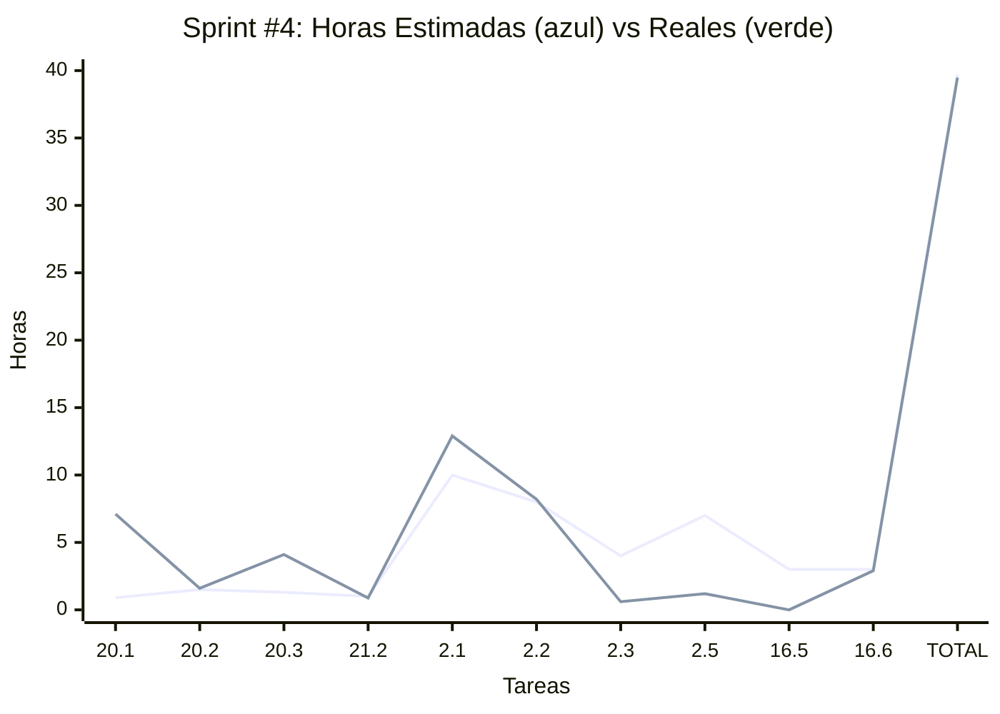
Distribución por categoría:
| Gestión | Desarrollo | QA | Capacitación | Documentación |
|:-------:|:----------:|:--:|:------------:|:-------------:|
| **11.9**hs | **22.9**hs | **0**hs | **3.78**hs | **0.9**hs |

### **Sprint #5**: dom 16 nov → sáb 22 nov 2025

**Objetivo:** 🎯 Mejoras en Formularios y registro de máquina - ReactHookForms + Wizard Component + Alta máquinas.

| Categoría | Tarea | Orden | Horas Estimadas | Horas Reales |
|-----------:|:-------|:---------------:|:---------------:|:------------:|
| Documentación | 20.1 Reporte Académico del Sprint #4 | 1 | 0.9 | 6.6 |
| Gestión | 20.2 Demo/UAT de Sprint #4 | 2 | 1.5 | 0.9 |
| Gestión | 20.3 Sprint Planning de Sprint #5 | 3 | 1.3 | 1.2 |
| Capacitación | 21.2 Tutorías (guía con tutor asignado) | 4 | 1 | 0.5 |
| Desarrollo | 3.1 Alta de máquina (RF-005) + ReactHookForms + Wizard Component | 5 | 16 | 23.8 |
| Capacitación | 16.3 Taller Deploy - AWS (mar 18 Nov) | 6 | 3 | 2.5 |
| Capacitación | 16.4 Taller Deploy - AWS (jue 20 Nov) | 7 | 3 | 1.4 |

| Total Horas Estimadas (sin buffer) | Total Horas Reales | Consumo |
|:---:|:----------:|:-------:|
| **26.7**hs | **36.9**hs | **138.2%** |

Buffer reservado: **8.3**hs
Total con buffer: **35**hs

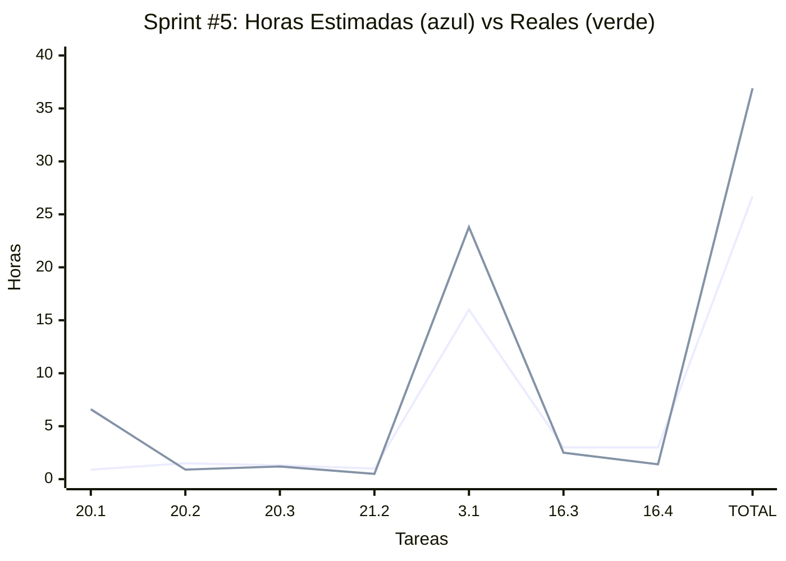
Distribución por categoría:
| Gestión | Desarrollo | QA | Capacitación | Documentación |
|:-------:|:----------:|:--:|:------------:|:-------------:|
| **2.8**hs | **23.8**hs | **0**hs | **6**hs | **0.9**hs |

### **Sprint #6**: dom 23 nov → sáb 29 nov 2025

**Objetivo:** 🚀 Deploy Azure + PWA + i18n + Theme + Settings — Disponibilizar demo deployada y pulir UX con internacionalización y tema.

| Categoría | Tarea | Orden | Horas Estimadas | Horas Reales |
|-----------:|:-------|:---------------:|:---------------:|:------------:|
| Documentación | 20.1 Reporte Académico del Sprint #5 | 1 | 5 | 5.8 |
| Gestión | 20.2 Demo/UAT de Sprint #5 | 2 | 1.5 | 0.9 |
| Gestión | 20.3 Sprint Planning de Sprint #6 | 3 | 1.3 | 2.9 |
| Capacitación | 21.2 Tutorías (guía con tutor asignado) | 4 | 1 | 0.75 |
| Desarrollo | 16.11 Azure Deploy - Config práctica (Azure App Service) | 5 | 9 | 19.7 |
| Desarrollo | 0.5 PWA base (manifest + SW básico) | 6 | 6 | |
| Desarrollo | 0.15 i18n - Implementación mínima (strings + en/es) | 7 | 2 | |
| Desarrollo | 12.5 Theme toggle (UI + persistencia) | 8 | 2 | |
| Desarrollo | 12.6 Settings screen (pantalla de ajustes: tema + idioma + prefs) | 9 | 2 | |
| Desarrollo | 16.8 Build & deploy demo (front estático + API) | 10 | 8 | 9.2 |
| Capacitación | 16.7 Taller Deploy - Deploy en Práctica (miérc 27 Nov) | 11 | 3 | 3.1 |

| Total Horas Estimadas (sin buffer) | Total Horas Reales | Consumo |
|:---:|:----------:|:-------:|
| **40.8**hs | **42.35**hs | **103.8%** |

Buffer reservado: **-5.8**hs
Total con buffer: **35**hs

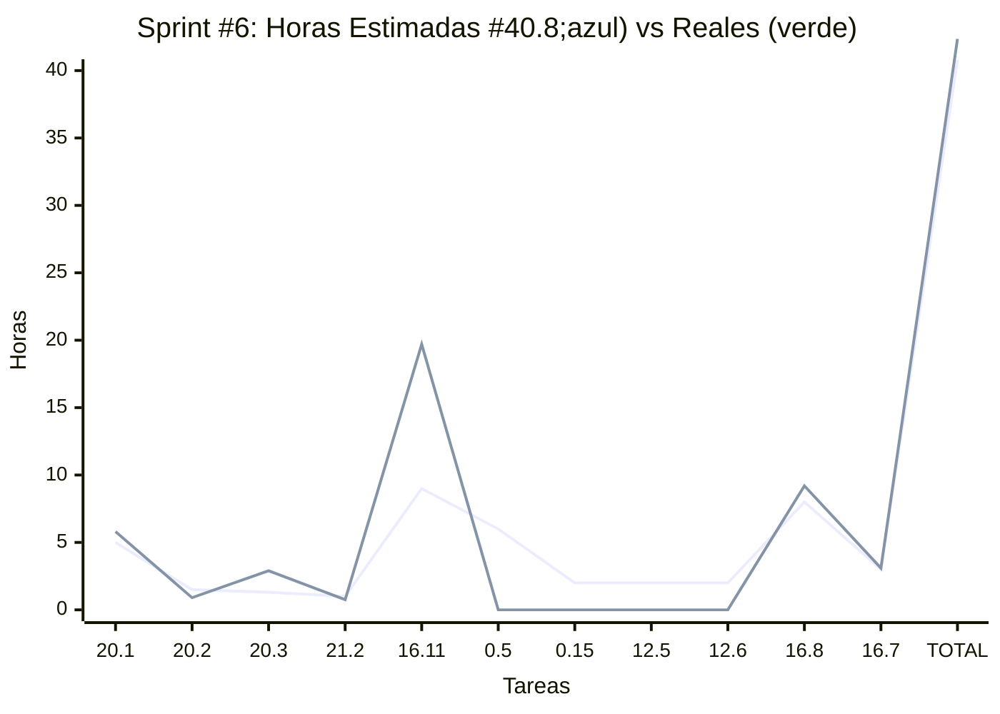

Distribución por categoría:
| Documentación | Desarrollo | QA | Capacitación | Gestión |
|:-------:|:----------:|:--:|:------------:|:-------------:|
| **5**hs | **29**hs | **0**hs | **4**hs | **2.8**hs |

### **Sprint #7**: dom 30 nov → sáb 6 dic 2025

**Objetivo:** 📋 QuickCheck MVP + Azure Deploy - Sistema completo de inspecciones rápidas por capas (Domain → Application → UI → Integration).

| Categoría | Tarea | Orden | Horas Estimadas | Horas Reales |
|-----------:|:-------|:---------------:|:---------------:|:------------:|
| Documentación | 20.1 Reporte Académico del Sprint #6 | 1 | 5 | 5.7 |
| Gestión | 20.2 Demo/UAT de Sprint #6 | 2 | 1.5 | 0 |
| Gestión | 20.3 Sprint Planning de Sprint #7 | 3 | 1.3 | 1.2 |
| Capacitación | 21.2 Tutorías (guía con tutor asignado) | 4 | 1 | 0.75 |
| Desarrollo | 16.11 Azure Deploy - Config práctica (continuación) | 5 | 5 | 4.7 |
| Desarrollo | 6.1 Domain + Persistence (RF-011) | 6 | 4.5 | 3.5 |
| Desarrollo | 6.3 Application Layer Backend (RF-011) | 7 | 6.5 | 2.9 |
| Desarrollo | 6.2a UI Creación de QuickCheck (RF-011) | 8 | 5 | 4.6 |
| Desarrollo | 6.2b UI Ejecución de QuickCheck (RF-011) | 9 | 7.5 | 3.5 |
| Desarrollo | 6.4 API Integration Frontend (RF-011) | 10 | 3.5 | 4.3 |
| Capacitación | 16.7 Taller Deploy - Deploy en Práctica (jue 4 Dic) | 11 | 3 | 2.5 |

| Total Horas Estimadas (sin buffer) | Total Horas Reales | Consumo |
|:---:|:----------:|:-------:|
| **43.5**hs | **33.65**hs | **77.4%** |

Buffer reservado: **-8.5**hs ⚠️
Total con buffer: **35**hs

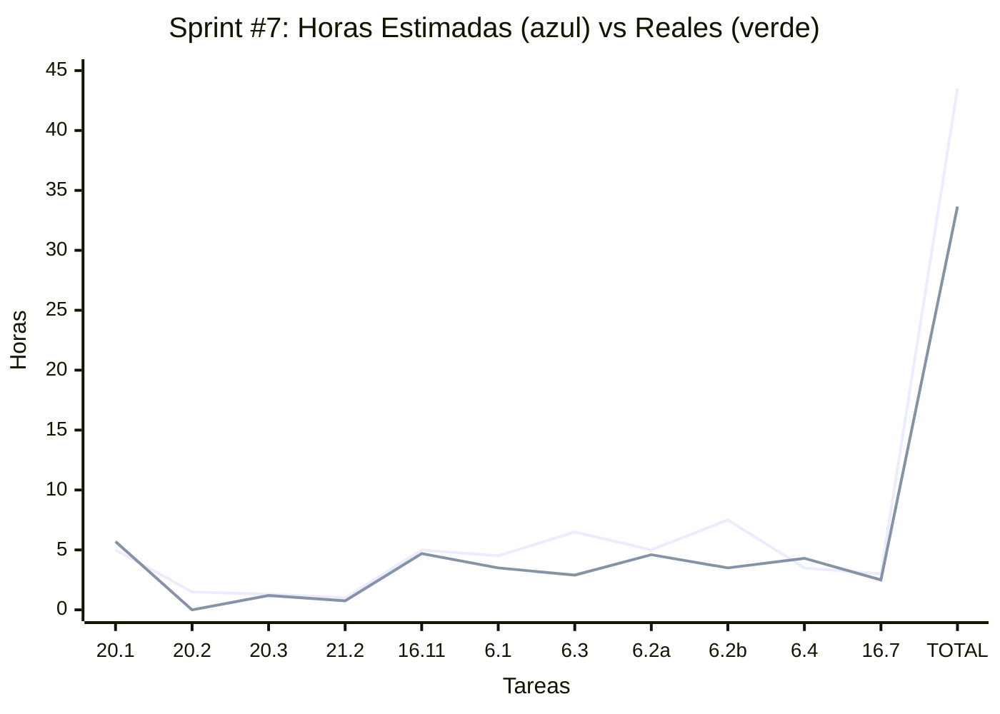

Distribución por categoría:
| Documentación | Desarrollo | QA | Capacitación | Gestión |
|:-------:|:----------:|:--:|:------------:|:-------------:|
| **5**hs | **32.5**hs | **0**hs | **4**hs | **2.8**hs |

**Estrategia de Implementación por Capas:**
1. **Capa Base (6.1):** Domain models + Persistence schemas + Contracts → Backend operativo para recibir datos
2. **Capa Application (6.3):** Use cases + Controllers + Routes → API REST funcional
3. **Capa Presentación (6.2a + 6.2b):** 
   - 6.2a: UI para crear templates (ToDo-like para items)
   - 6.2b: UI para ejecutar checklist (toggles ✅/❌ + scoring)
4. **Capa Integración (6.4):** Services + TanStack Query → Conectar front↔back

**Orden de Ejecución Propuesto:**
- **Miércoles 4 Dic:** 16.11 Azure Deploy (5hs) + 16.7 Taller (3hs)
- **Jueves 5 Dic:** 6.1 Domain+Persistence (4.5hs) + 6.3 Application inicio (2hs)
- **Viernes 6 Dic:** 6.3 Application fin (4.5hs) + 6.2a UI Creación inicio (3hs)
- **Sábado 7 Dic:** 6.2a fin (2hs) + 6.2b UI Ejecución (7.5hs) + 6.4 Integration (3.5hs) + Demo

**Simplificaciones Técnicas:**
- Templates con items tipo string simple (no Value Objects complejos)
- Persistencia directa sin eventos de dominio complejos
- UI básica sin validaciones exhaustivas
- Scoring simple: COUNT(FAIL) > 0 ? "FAIL" : "OK"

**Tareas movidas a Sprint #8:**
- 3.2 Listado + detalle de máquinas (9hs)
- 4.1 Crear recordatorios (9hs)
- 6.5 Aviso QuickCheck no aprobado (6hs - Should Have)

**Riesgos Críticos:**
- ⚠️ **Sprint muy sobrecargado** (43.5hs vs 35hs, buffer -8.5hs)
- ⚠️ **Requiere trabajo sábado** para completar 6.2b + 6.4 + Demo
- ⚠️ **Posible descope**: Si tiempo aprieta, mover 6.2a (CRUD templates) a Sprint #8 y usar template hardcoded
- ⚠️ **Dependencias**: Orden estricto de capas (no paralelizable)

### **Sprint #8**: dom 7 dic → sáb 13 dic 2025

**Objetivo:** 🎯 Machine Management Enhancement + PWA Base + QuickCheck Refinement - Mejoras críticas post-MVP QuickCheck y fundación PWA.

| Categoría | Tarea | Orden | Horas Estimadas | Horas Reales |
|-----------:|:-------|:---------------:|:---------------:|:------------:|
| Documentación | 20.1 Reporte Académico del Sprint #7 | 1 | 5 | 5.4 |
| Gestión | 20.2 Demo/UAT de Sprint #7 | 2 | 1.5 | 1.2 |
| Gestión | 20.3 Sprint Planning de Sprint #8 | 3 | 1.3 | 4.65 |
| Capacitación | 21.2 Tutorías (guía con tutor asignado) | 4 | 1 | 0 |
| Desarrollo | 12.8 UI Polish (animaciones + reorder inputs) | 5 | 0.75 | 0.1 |
| Desarrollo | 12.7 Navigation Drawer | 6 | 3 | 2.3 |
| Desarrollo | 16.12 Azure Static Web App - Fix 404 routing | 8 | 1 | 0.8 |
| Desarrollo | 6.5 QuickCheck User Tracking | 9 | 4.2 | 3.5 |
| Desarrollo | 3.2a Machine Enhancement (assignedTo, usageRate, fixes) | 10 | 12 | 10.1 |
| Desarrollo | 0.5a PWA Manifest + Icons | 11 | 1 | 1.7 |
| Desarrollo | 0.5b Service Worker Básico | 12 | 1.5 | 0.9 |
| Desarrollo | 0.5c PWA Testing Multi-dispositivo | 14 | 1 | 0.4 |

| Total Horas Estimadas (sin buffer) | Total Horas Reales | Consumo |
|:---:|:----------:|:-------:|
| **37.75**hs | **31.05**hs | **82.3%** |

Buffer reservado: **-2.75**hs (absorbido en machinePhotoUrl + SW + testing)
Total con buffer: **35**hs

Distribución por categoría:
| Documentación | Desarrollo | QA | Capacitación | Gestión |
|:-------:|:----------:|:--:|:------------:|:-------------:|
| **5**hs | **29**hs | **0**hs | **1**hs | **2.75**hs |

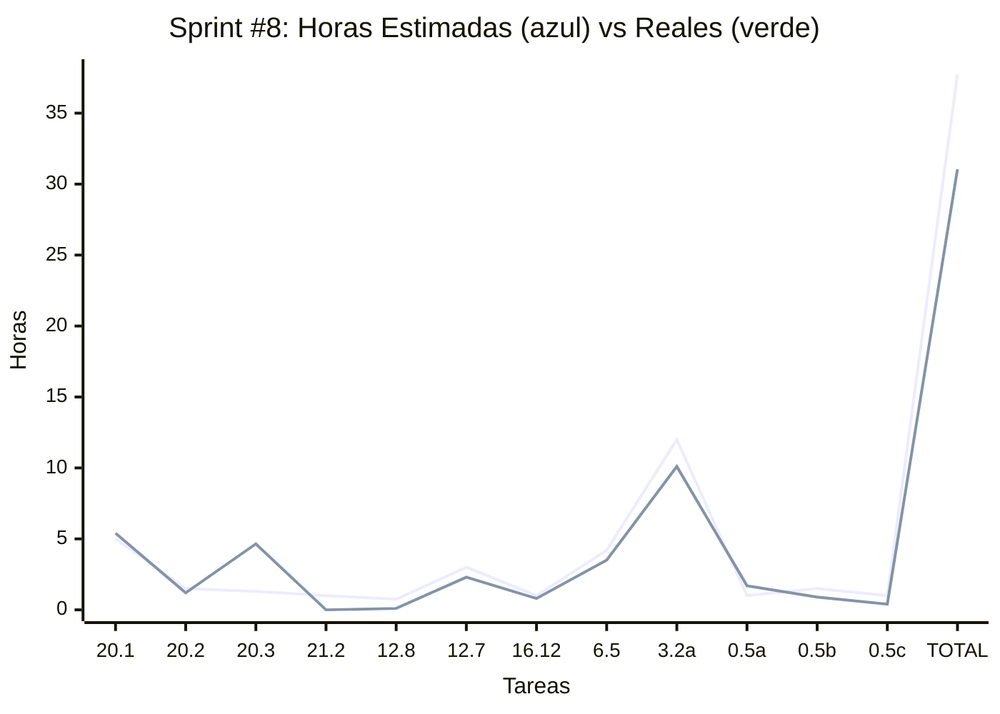

**Notas de Sprint:**
- **Orden optimizado simple → complejo**: UI Polish → Navigation → QC Tracking → Machine Enhancement → Azure Fix + PWA
- **Miércoles (Quick Wins)**: Animaciones, reorder inputs, navigation drawer base (3.75hs) - Calentamiento con tareas simples
- **Jueves (UX + Feature)**: Navigation drawer responsive + QuickCheck user tracking (8.2hs) - Consolidar UX y feature completa
- **Viernes (Core Enhancement)**: Machine Enhancement completo (12hs) - Día enfocado en la tarea más compleja con base limpia
- **Sábado (Infra + PWA)**: Azure fix crítico + PWA completo (5.5hs) - Infraestructura y testing final
- **Estrategia**: Tareas tempranas "limpian la base" (UI polish, navigation) para que Machine Enhancement se implemente sobre código mejorado
- **PWA Base completa:** Manifest, icons, service worker básico, testing multi-dispositivo
- **Machine Enhancement:** Agrupa 4 mejoras en una sola pasada (assignedTo, usageRate, powerSource fix, machinePhotoUrl básico)
- **Navigation Drawer:** Implementado en 2 partes (día 1: estructura base, día 2: responsive + integración)
- **QuickCheck Tracking:** Metadata del responsable para auditoría y trazabilidad
- **Azure Fix crítico:** Soluciona 404 en refresh de rutas SPA
- **Deferred a Sprint #9:** Sistema de fotos completo Cloudinary (17hs), Scheduler + Alertas (requiere decisión arquitectónica previa)

### **Sprint #9**: dom 14 dic → sáb 20 dic 2025

**Objetivo:** 🔔 Centro de Notificaciones Completo - Sistema completo front/back de bandeja de notificaciones multi-source con primera integración funcional.

| Categoría | Tarea | Orden | Horas Estimadas | Horas Reales |
|-----------:|:-------|:---------------:|:---------------:|:------------:|
| Documentación | 20.1 Reporte Académico del Sprint #8 | 1 | 5 | 5.3 |
| Gestión | 20.2 Demo/UAT de Sprint #8 | 2 | 1.5 | 1.45 |
| Gestión | 20.3 Sprint Planning de Sprint #9 | 3 | 1.3 | 2.15 |
| Capacitación | 21.2 Tutorías (guía con tutor asignado) | 4 | 1 | 1.1 |
| Desarrollo | 8.1 Domain+Contracts+Persistence | 5 | 5 | 4.1 |
| Desarrollo | 8.2 Application Layer Backend | 6 | 6 | 4.4 |
| Desarrollo | 8.3 Frontend UI Components | 7 | 4 | 4.3 |
| Desarrollo | 8.4 Frontend Integration+Observer | 8 | 5 | 7.7 |
| Desarrollo | 6.6 Integración QC→Notificaciones | 9 | 4 | 1.2 |
| Documentación | 8.5 Documentación Patrón | 10 | 1 | 0.8 |

| Total Horas Estimadas (sin buffer) | Total Horas Reales | Consumo |
|:---:|:----------:|:-------:|
| **33.8**hs | **32.5**hs | **96.2%** |

Buffer reservado: **+1.2**hs
Total con buffer: **35**hs

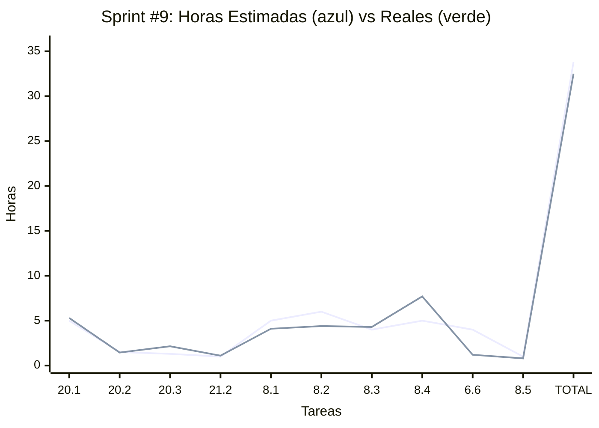

Distribución por categoría:
| Documentación | Desarrollo | QA | Capacitación | Gestión |
|:-------:|:----------:|:--:|:------------:|:-------------:|
| **5**hs | **27**hs | **0**hs | **1**hs | **2.8**hs |

**Riesgos:** Integración entre notificaciones y eventos puede ser compleja.

### **Sprint #10**: dom 21 dic → sáb 27 dic 2025

**Objetivo:** � Sistema de Eventos de Máquina - Historial completo con eventos manuales/automáticos + tipos dinámicos crowdsourcing + integración QuickCheck.

| Categoría | Tarea | Orden | Horas Estimadas | Horas Reales |
|-----------:|:-------|:---------------:|:---------------:|:------------:|
| Documentación | 20.1 Reporte Académico del Sprint #9 | 1 | 5 | 5.2 |
| Gestión | 20.2 Demo/UAT de Sprint #9 | 2 | 1.5 | 1.1 |
| Gestión | 20.3 Sprint Planning de Sprint #10 | 3 | 1.3 | 1.4 |
| Documentación | 20.4 Informe de avance (académico) | 4 | — | 1.2 |
| Capacitación | 21.2 Tutorías (guía con tutor asignado) | 5 | 1 | 0.6 |
| Desarrollo | 4.2a Domain+Contracts+Persistence MachineEvent | 6 | 5 | 4.1 |
| Desarrollo | 4.2b Application Layer Backend MachineEvent | 7 | 6 | 7.2 |
| Desarrollo | 4.2c Frontend UI - Historial y Reportar | 8 | 6 | 6.9 |
| Desarrollo | 4.2d Frontend Integration MachineEvent | 9 | 4 | 3.6 |
| Desarrollo | 6.6 QuickCheck FAIL → Evento + Notificación | 10 | 2 | 3.3 |

| Total Horas Estimadas (sin buffer) | Total Horas Reales | Consumo |
|:---:|:----------:|:-------:|
| **31.8**hs | **34.6**hs | **108.8%** |
Buffer reservado: **+3.2**hs
Total con buffer: **35**hs

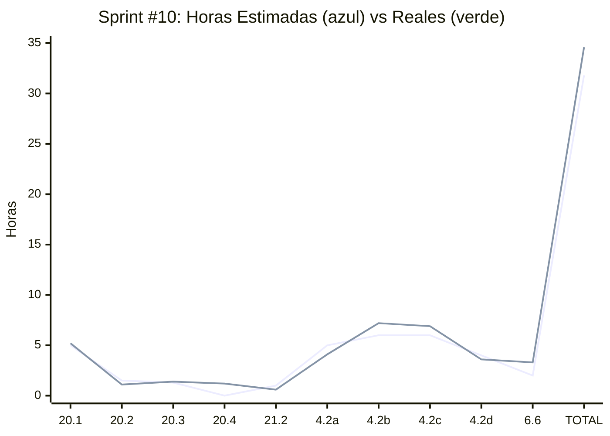

Distribución por categoría:
| Documentación | Desarrollo | QA | Capacitación | Gestión |
|:-------:|:----------:|:--:|:------------:|:-------------:|
| **5**hs (est) / **6.4**hs (real) | **23**hs (est) / **25.1**hs (real) | **0**hs | **1**hs (est) / **0.6**hs (real) | **2.8**hs (est) / **2.5**hs (real) |

**Notas del Sprint:**
- **Sprint enfocado 100% en sistema de eventos de máquina** siguiendo patrón exitoso de Notifications (Sprint #9)
- **Arquitectura doble entidad:**
  - `MachineEvent` subdocumento en Machine (instancias específicas)
  - `MachineEventType` colección independiente (catálogo global crowdsourcing)
- **Patrón crowdsourcing:** Usuarios crean tipos dinámicamente ("Mantenimiento", "Ruptura", etc.) sin enums hardcodeados
- **Sin category ni severity:** Estructura simplificada, typeId da flexibilidad total
- **Integración triple:** QuickCheck FAIL → MachineEventType creado → Evento guardado → Notificación enviada
- **Orden secuencial crítico:** Domain/Persistence → Application (incluye CRUD EventTypes) → UI (con autocomplete) → Integration → QuickCheck hook

**Fortalezas:**
- ✅ Entidades MachineEvent y MachineEventType **YA existen** (reducción de riesgo)
- ✅ Patrón probado del Sprint #9 aplicado exitosamente
- ✅ Crowdsourcing elimina necesidad de enums hardcodeados
- ✅ Autocomplete inteligente con crear on-the-fly (UX fluida)
- ✅ Metadata JSON flexible para casos especiales (QuickCheck score, items fallidos)

**Riesgos y Mitigaciones:**
- ⚠️ **Buffer negativo (-2.8hs):** Sprint apretado, requiere disciplina estricta
- ⚠️ **Navidad (jue 25 dic):** Día festivo reduce capacidad efectiva a ~29hs (5 días × 5.8hs/día promedio)
- ⚠️ **Crowdsourcing complejidad:** Autocomplete con crear tipo puede requerir debugging
- ✅ **Mitigación:** Simplificar metadata en 6.6 si tiempo aprieta (solo quickCheckId + score)
- ✅ **Descope opcional:** Si crítico, mover 6.6 a Sprint #11 (sistema funciona sin esta integración)

**Consideraciones técnicas:**
- **MachineEventType.normalizedName:** "mantenimiento" = "Mantenimiento" (evita duplicados)
- **MachineEventType.timesUsed:** Ordena autocomplete por popularidad
- **Machine.eventsHistory:** Subdocumento array con índices compuestos para performance
- **EventTypeAutocomplete:** Componente Combobox con `allowCreate={true}` (crear si no existe)
- **QuickCheck integration:** Crear tipo sistemático "QuickCheck Desaprobado" solo primera vez, reutilizar después
- **No notificaciones spam:** Eventos manuales NO generan notificación, solo eventos críticos del sistema

**Dependencias críticas:**
1. 4.2a debe completarse antes de 4.2b (schemas necesarios para repositories)
2. 4.2b debe completarse antes de 4.2c/4.2d (API necesaria para UI)
3. 4.2c y 4.2d pueden paralelizarse parcialmente (UI mockear primero)
4. 6.6 requiere 4.2b completo (CreateMachineEventUseCase + CreateEventTypeUseCase)

### **Sprint #11**: dom 28 dic → sáb 3 ene 2026

**Objetivo:** 🔧 Sistema de Mantenimientos Programados - Alarmas automáticas basadas en horas de uso con CronJob + integración con Eventos y Notificaciones.

| Categoría | Tarea | Orden | Horas Estimadas | Horas Reales |
|-----------:|:-------|:---------------:|:---------------:|:------------:|
| Documentación | 20.1 Reporte Académico del Sprint #10 | 1 | 5 | 4.9 |
| Gestión | 20.2 Demo/UAT de Sprint #10 | 2 | 1.5 | 1.2 |
| Gestión | 20.3 Sprint Planning de Sprint #11 | 3 | 1.3 | 1.2 |
| Capacitación | 21.2 Tutorías (guía con tutor asignado) | 4 | 1 | 1 |
| Desarrollo | 4.1a Domain+Contracts+Persistence MaintenanceAlarm | 5 | 6 | 5.3 |
| Desarrollo | 4.1b Application Layer Backend MaintenanceAlarm | 6 | 5 | 4.8 |
| Desarrollo | 4.1c Use Cases Automatización (actualizar horas + disparar) | 7 | 5 | 6.6 |
| Desarrollo | 4.1d CronJob Scheduler & Orquestación | 8 | 3 | 2.9 |
| Desarrollo | 4.1e Frontend UI MaintenanceAlarm | 9 | 6 | 7.9 |
| Desarrollo | 4.1f Frontend Integration MaintenanceAlarm | 10 | 4 | 7.2 |

| Total Horas Estimadas (sin buffer) | Total Horas Reales | Consumo |
|:---:|:----------:|:-------:|
| **37.8**hs | **43**hs | **113.8%** |

Buffer reservado: **-2.8**hs ⚠️
Total con buffer: **35**hs

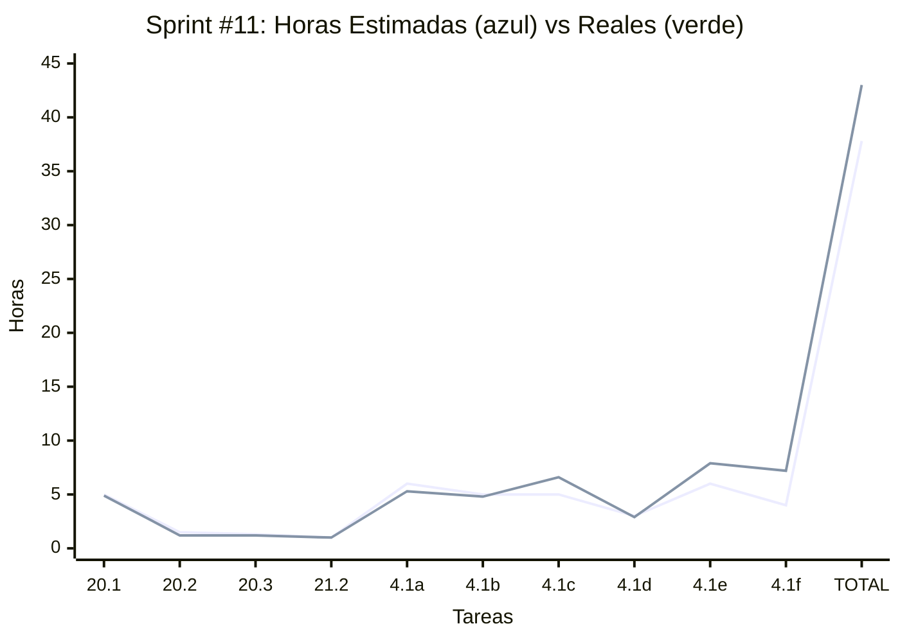

Distribución por categoría:
| Documentación | Desarrollo | QA | Capacitación | Gestión |
|:-------:|:----------:|:--:|:------------:|:-------------:|
| **4.9**hs | **34.7**hs | **0**hs | **1**hs | **2.4**hs |

**Notas del Sprint:**
- **Sprint enfocado 100% en mantenimientos programados** siguiendo patrón exitoso de Sprints #9 (Notifications) y #10 (Events)
- **Arquitectura subdocumento:** MaintenanceAlarm embedded en Machine (NO entidad independiente)
- **Separación lógica:** Use Cases (4.1c) = lógica de negocio pura, CronJob (4.1d) = orquestador/scheduler
- **Notificaciones al owner:** La lógica en 4.1c garantiza que SOLO machine.ownerId recibe notificación
- **Integración triple:** Alarma triggereada → MachineEvent creado → Notification enviada (sistemas ya implementados)
- **Orden secuencial:** Domain/Persistence → Application (CRUD) → Use Cases (automatización) → CronJob (scheduler) → UI → Integration

**Fortalezas:**
- ✅ Patrón subdocumento probado en Sprints #9 y #10
- ✅ Reutilización de MachineEvent y Notification (no reinventar rueda)
- ✅ usageSchedule ya implementado en Sprint #8 (3.2a)
- ✅ CronJob configurable para testing rápido en desarrollo
- ✅ Flujo completo automatizado sin intervención manual

**Riesgos y Mitigaciones:**
- ⚠️ **Buffer negativo (-1.8hs):** Sprint ajustado, requiere disciplina
- ⚠️ **Año Nuevo (mié 1 ene):** Día festivo reduce capacidad efectiva a ~30hs
- ⚠️ **CronJob complejidad:** Primera implementación de scheduled tasks, puede requerir debugging
- ⚠️ **Testing del Cron:** Difícil probar automatización en timeframes cortos
- ✅ **Mitigación:** Variable ENV para schedule flexible (10 min en dev, diario en prod)
- ✅ **Mitigación:** Script manual para simular ejecución del cron sin esperar
- ✅ **Descope opcional:** Si crítico, implementar CRUD manual (4.1a-4.1e) y defer CronJob (4.1c) a Sprint #12

**Consideraciones técnicas:**
- **machine.operatingHours:** Contador acumulado de horas totales de uso (sumar dailyHours cada día operativo)
- **usageSchedule.operatingDays:** Array de días ['MONDAY', 'TUESDAY', ...] para saber cuándo sumar horas
- **alarm.targetOperatingHours:** Umbral que dispara la alarma (ej: 500hs para cambio de aceite)
- **CronJob schedule:** ENV variable CRON_MAINTENANCE_SCHEDULE para configurar frecuencia
- **Idempotencia:** Cron debe ser tolerante a reinicios (no duplicar operaciones)
- **Event → Notification:** Flujo automático ya implementado en Sprint #10 (6.6)

**Dependencias críticas:**
1. 4.1a debe completarse antes de 4.1b (schemas necesarios para repositories)
2. 4.1b debe completarse antes de 4.1c (Use Cases CRUD necesarios)
3. 4.1c debe completarse antes de 4.1d (Use Cases de automatización necesarios para el cron)
4. 4.1d puede desarrollarse en paralelo con 4.1e (CronJob y UI son independientes)
5. 4.1e debe completarse antes de 4.1f (componentes necesarios para integration)
6. 4.1c requiere 3.2a completo (usageSchedule debe existir en Machine)
7. 4.1c requiere 4.2b completo (CreateMachineEventUseCase necesario para disparar eventos)
8. 4.1c requiere 8.2 completo (AddNotificationUseCase necesario para notificar al owner)

**Riesgos:** Período de fiestas navideñas (Año Nuevo) puede impactar disponibilidad. CronJob es funcionalidad nueva que requiere testing cuidadoso.

### **Sprint #12**: dom 4 ene → sáb 10 ene 2026

**Objetivo:** 💬 Comunicación entre Usuarios - Sistema de descubrimiento, gestión de contactos y mensajería básica 1-a-1.

| Categoría | Tarea | Orden | Horas Estimadas | Horas Reales |
|-----------:|:-------|:---------------:|:---------------:|:------------:|
| Gestión | 20.2 Demo/UAT de Sprint #11 | 1 | 1.5 | 1.2 |
| Gestión | 20.3 Sprint Planning de Sprint #12 | 2 | 1.3 | 2 |
| Documentación | 20.1 Reporte Académico del Sprint #11 | 3 | 5 | 5.1 |
| Desarrollo | 9.1a Domain+Contracts+Persistence UserDirectory | 4 | 2 | 2.1 |
| Desarrollo | 9.1b Application Layer Backend UserDirectory | 6 | 3 | 3 |
| Desarrollo | 9.1c Frontend UI+Integration UserDiscovery | 8 | 3 | 4.9 |
| Desarrollo | 9.2a Domain+Contracts+Persistence Contacts | 5 | 3 | 2.3 |
| Desarrollo | 9.2b Application Layer Backend Contacts | 7 | 4 | 3.4 |
| Desarrollo | 9.2c Frontend UI+Integration MyContacts | 9 | 4 | 5.2 |
| Desarrollo | 9.3a Domain+Contracts+Persistence Messages | 10 | 3 | 2.6 |
| Desarrollo | 9.3b Application Layer Backend Messages | 11 | 3 | 3.7 |

| Total Horas Estimadas (sin buffer) | Total Horas Reales | Consumo |
|:---:|:----------:|:-------:|
| **34.8**hs | **35.5**hs | **102.0%** |

Buffer reservado: **+0.2**hs
Total con buffer: **35**hs

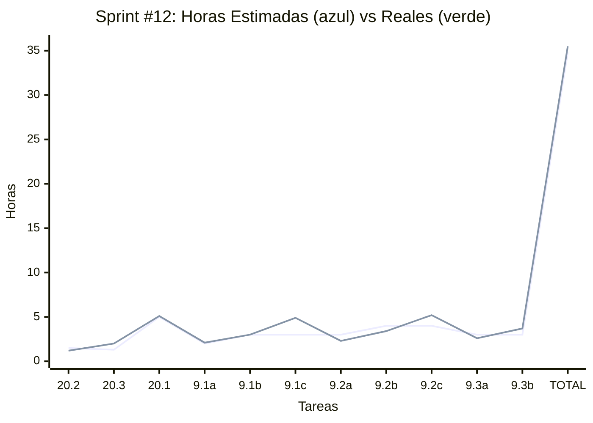

Distribución por categoría:
| Documentación | Desarrollo | QA | Capacitación | Gestión |
|:-------:|:----------:|:--:|:------------:|:-------------:|
| **5.1**hs | **27.2**hs | **0**hs | **0**hs | **3.2**hs |

**Notas del Sprint:**
- **Sprint enfocado en feature social básica** siguiendo patrón full-stack modular (Domain → Application → Presentation)
- **Arquitectura simplificada (refinamiento post-planning):** Message como única colección con participants[] ordenado, NO coleccción chats, NO ConversationList, NO unread badges
- **MVP ultra-simplificado:** Chat accesible SOLO desde contacto, sin "inbox" ni lista de conversaciones, polling SOLO cuando chat abierto
- **Descope de 9.3c y 9.3d:** Chat UI + Integration (7hs) movidas a Sprint #13 para ajustar capacidad
- **Orden secuencial lógico:**
  1. User Discovery completo (9.1a → 9.1b → diferido 9.1c)
  2. Contact Management completo (9.2a → 9.2b → 9.2c) - depende de 9.1b para verificar duplicados
  3. Messaging backend simplificado (9.3a → 9.3b) - base para Sprint #13
  4. Frontend integration (9.1c + 9.2c) - completa flujo de contactos
- **Eliminación de complejidad:** Sin wasRead/readAt, sin mark as read, sin GetConversationsList, sin unread count global

**Fortalezas:**
- ✅ Patrón subdocumento probado (Contact en User, como Notification/MaintenanceAlarm)
- ✅ Separación clara por capas (Domain/Application/Presentation) facilita testing
- ✅ Relación unidireccional de contactos simplifica MVP (sin aceptación mutua)
- ✅ Mensajería 1-a-1 ultra-simple: participants[] evita duplicados, un solo índice, cursor-based pagination
- ✅ Arquitectura escalable: Message como entidad independiente evita hot documents y límite 16MB

**Riesgos y Mitigaciones:**
- ⚠️ **Buffer ajustado (-0.8hs):** Sprint equilibrado tras refinamiento (reducción de 3hs en 9.3a+9.3b)
- ⚠️ **Messaging complejidad reducida:** Cursor-based pagination puede requerir ajuste UX (scroll behavior)
- ⚠️ **Dependencias encadenadas:** 9.2 depende de 9.1, 9.3 depende de 9.2
- ✅ **Mitigación:** Backend primero permite testing temprano con Postman/Swagger
- ✅ **Mitigación:** Descope de 9.3c y 9.3d a Sprint #13 reduce presión (completan MVP de mensajería)
- ✅ **Simplificación arquitectónica:** Eliminar ConversationList/unread reduce superficie de error

**Consideraciones técnicas (refinadas):**
- **Contact.userId:** Referencia a User, populate para enriquecer datos (nombre, empresa)
- **Message.participants[]:** Array ordenado [min(A,B), max(A,B)] para evitar duplicados A-B vs B-A
- **Message.índice:** {participants: 1, sentAt: -1} - UN SOLO ÍNDICE para queries eficientes
- **Validaciones:** Usuario no puede agregarse como contacto, límite 100 contactos, mensajes máx 500 chars
- **Polling:** Solo cuando ChatScreen montado (10s), NO polling global de conversaciones
- **Paginación:** Cursor-based con before=sentAt (NO skip/page), límite 50 mensajes por request
- **Caché:** Optimistic updates en agregar/eliminar contacto y enviar mensaje

**Dependencias críticas:**
1. 9.1a debe completarse antes de 9.1b (contratos necesarios para Use Cases)
2. 9.1b debe completarse antes de 9.1c (endpoint necesario para UI)
3. 9.2a debe completarse antes de 9.2b (schema Contact necesario)
4. 9.2b debe completarse antes de 9.1c (verificación de duplicados) y antes de 9.2c (endpoints CRUD)
5. 9.3a debe completarse antes de 9.3b (schema Message necesario)
6. 9.2b debe completarse antes de 9.3b (validar que usuarios sean contactos)
7. Todas las tareas dependen de 2.5 (User CRUD debe estar completo de Sprints anteriores)

**Riesgos:** Feature social nueva requiere considerar UX de interacción. Validar con cliente que relación unidireccional de contactos es aceptable para MVP.

### **Sprint #13**: dom 12 ene → sáb 18 ene 2026

**Objetivo:** 🧪 Quality & Refinement Sprint - Mejoras de calidad de vida, complementos al chat, ediciones de entidades, y enriquecimiento de perfiles de usuario.

| Categoría | Tarea | Orden | Horas Estimadas | Horas Reales |
|-----------:|:-------|:---------------:|:---------------:|:------------:|
| Documentación | 20.1 Reporte Académico del Sprint #12 | 1 | 5 | 5.3 |
| Gestión | 20.2 Demo/UAT de Sprint #12 | 2 | 1.5 | 1.2 |
| Gestión | 20.3 Sprint Planning de Sprint #13 | 3 | 1.3 | 2.5 |
| Capacitación | 21.2 Tutorías (guía con tutor asignado) | 4 | 1 | 1 |
| Desarrollo | 10.1a User Editing - Domain + Persistence | 5 | 2 | 0.9 |
| Desarrollo | 10.1b User Editing - Application Backend | 6 | 3 | 1.3 |
| Desarrollo | 10.1c User Editing - Frontend UI | 7 | 3 | 2.5 |
| Desarrollo | 10.2a Bio & Tags - Domain + Persistence | 8 | 2 | 0.5 |
| Desarrollo | 10.2b Bio & Tags - Application Backend | 9 | 2 | 1.25 |
| Desarrollo | 10.2c Bio & Tags - Frontend UI | 10 | 2 | 1.8 |
| Desarrollo | 9.3e Domain + Persistence - Chat Access Control | 11 | 4 | 3.7 |
| Desarrollo | 9.3f App Layer - Accept/Block Use Cases | 12 | 3 | 7.4 |
| Desarrollo | 9.3g Backend - Accept/Block Endpoints | 13 | 2 | 2 |
| Desarrollo | 9.3h Frontend - Accept/Block Chat UI | 14 | 3 | 6.9 |
| Desarrollo | 3.3a Machine Editing - Domain + Persistence (condicional) | 15 | 2 | 0.3 |
| Desarrollo | 3.3b Machine Editing - Application Backend (condicional) | 16 | 2 | 0.4|
| Desarrollo | 3.3c Machine Editing - Frontend UI (condicional) | 17 | 3 | 6.2 |
| Desarrollo | 10.3 Adaptación de Image Upload Component (condicional) | 18 | 3 | 4.1 |

| Total Horas Estimadas (sin buffer) | Total Horas Reales | Consumo |
|:---:|:----------:|:-------:|
| **33.8**hs | **49.25**hs | **145.7%** |

Buffer reservado: **+1.2**hs ✅
Total con buffer: **35**hs

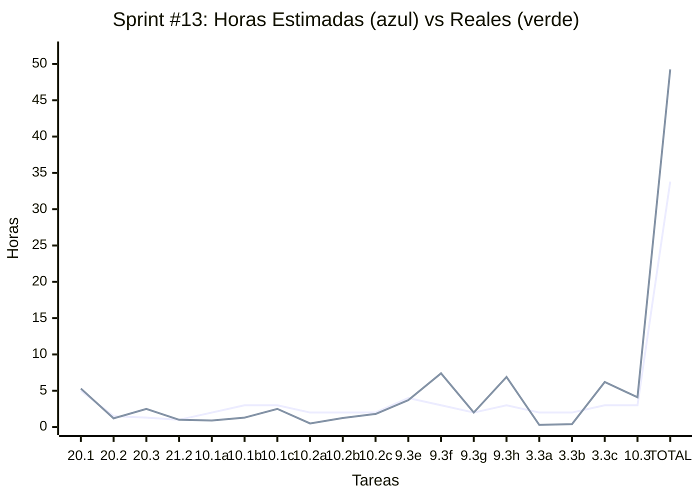

Distribución por categoría:
| Documentación | Desarrollo | QA | Capacitación | Gestión |
|:-------:|:----------:|:--:|:------------:|:-------------:|
| **5.3**hs | **39.25**hs | **0**hs | **1**hs | **3.7**hs |

**Notas del Sprint:**
- **Sprint de calidad y refinamiento** NO de nuevas features core, enfocado en mejorar UX y completar funcionalidades existentes
- **Estrategia conservadora con condicionales:** Tareas 10.1-10.2 + 9.3e-h garantizadas (26hs desarrollo + 8.8hs overhead = 34.8hs), tareas 3.3 y 10.3 condicionales según progreso
- **Orden de ejecución inteligente (victorias rápidas primero):**
  1. **User Editing (10.1a/b/c - 8hs):** Base simple, reutiliza formularios, dispone frontend para siguiente tarea
  2. **Bio & Tags (10.2a/b/c - 6hs):** Extiende 10.1, tareas simples, boost de moral
  3. **Chat Access Control (9.3e/f/g/h - 12hs):** Feature crítica BLOQUEANTE, 9.3c ya implementado
  4. **Machine Editing (3.3a/b/c - 7hs, condicional):** Si tiempo permite, hay cosas parcialmente implementadas
  5. **Image Component (10.3 - 3hs, condicional):** Quick win final, solo UI + API calls
- **Punto de decisión Day 4 EOD:** Si User Editing + Bio/Tags + Chat Access on track → agregar Machine Editing
- **Punto de decisión Day 5 EOD:** Si todo on track → agregar Image Component

**Fortalezas:**
- ✅ **User Editing:** Extiende 2.1 (registro), reutiliza ReactHookForm y validaciones existentes
- ✅ **Bio & Tags:** Extensión natural de User Editing, campos simples (textarea + chips)
- ✅ **Chat Access Control:** Completa feature crítica de Sprint #12, sin esto los chats no son usables (403 Forbidden)
- ✅ **Machine Editing:** Parte de la lógica puede estar implementada en 3.2a, solo falta exponer UI de edición
- ✅ **Image Component:** Ya existe en otro proyecto, solo requiere port + adaptación de props
- ✅ **Cloudinary configurado:** Tareas 0.5 y 3.6 ya completadas en Sprints anteriores

**Riesgos y Mitigaciones:**
- ⚠️ **Chat Access Control crítico:** Sin esto, usuarios reciben 403 al intentar abrir chat (UX bug grave)
- ⚠️ **Machine Editing condicional:** Si no se completa en Sprint #13, defer a Sprint #14
- ⚠️ **Image Component condicional:** Nice-to-have, no bloquea features core
- ✅ **Mitigación:** Orden simple→complejo asegura victorias tempranas y momentum
- ✅ **Mitigación:** Buffer positivo (+1.2hs) permite absorber pequeños overruns
- ✅ **Mitigación:** Tareas condicionales documentadas claramente, no se comprometen

**Consideraciones técnicas:**
- **10.1 User Editing:** PATCH /api/users/:userId, EditProfileForm reutiliza estructura de 2.1, autorización (usuario solo edita su perfil o admin), NO incluye cambio de contraseña (flujo separado en 2.4)
- **10.2 Bio & Tags:** Extender User con bio (max 300 chars) y tags (max 10 strings de max 20 chars), autocompletado opcional de tags, UI con textarea + chips componente
- **9.3e-h Chat Access Control:** AcceptChatRequest, BlockUser, RequestTracking (status: pending/accepted/rejected), UI badges/filters en ContactsList y ChatScreen
- **3.3 Machine Editing:** ReactHookForm reutilizando 3.1, UpdateMachineUseCase, historial de cambios opcional como subdocumento
- **10.3 Image Component:** Port ImageUploader existente, adaptar a User.avatarUrl y Machine.machinePhotoUrl, integrar en EditProfileForm (10.1c) y EditMachineForm (3.3c)

**Dependencias críticas:**
1. 10.1a → 10.1b → 10.1c (secuencial por capas)
2. 10.1a → 10.2a (bio/tags requieren User schema extendido)
3. 10.1b → 10.2b (extender Use Case existente)
4. 10.1c → 10.2c (extender formulario existente)
5. 9.3e-h dependen de 9.2 y 9.3a/b completos (Sprint #12)
6. 3.3 depende de 3.2 completo (máquinas registradas)
7. 10.3 depende de 0.5, 3.6, 10.1c, 3.3c (Cloudinary + formularios receptores)

**Riesgos:** Sprint en período post-navideño, posible fatiga del equipo. Mantener motivación con victorias tempranas.

### **Sprint #14**: dom 19 ene → sáb 25 ene 2026

**Objetivo:** 🎨 UX & Usability Boost + Dashboard Refresh - Mejoras de calidad de vida, dashboard simplificado con vistas clave, navegación mejorada, y extensiones al registro.

| Categoría | Tarea | Orden | Horas Estimadas | Horas Reales |
|-----------:|:-------|:---------------:|:---------------:|:------------:|
| Gestión | 22.2 Demo/UAT de Sprint #13 | 1 | 1.5 | |
| Gestión | 22.3 Sprint Planning de Sprint #14 | 2 | 1.3 | |
| Documentación | 22.1 Reporte Académico del Sprint #13 | 3 | 5 | |
| Capacitación | 22.4 Tutorías (guía con tutor asignado) | 4 | 1 | |
| Desarrollo | 14.10 Mini Perfil en Navbar + Logout Reubicado | 5 | 4 | |
| Desarrollo | 14.5 Theme toggle (UI + persistencia) | 6 | 2 | |
| Desarrollo | 14.6 Settings screen (tema + idioma + email notif) | 7 | 6 | |
| Desarrollo | 12.1 Dashboard - Últimos QuickChecks | 8 | 5 | |
| Desarrollo | 12.2 Dashboard - Últimos Eventos Reportados | 9 | 5 | |
| Desarrollo | 12.3 Dashboard Simplificado - Layout Final | 10 | 2 | |
| Desarrollo | 2.1b Registro Extendido - Wizard Opcional | 11 | 8 | |

| Total Horas Estimadas (sin buffer) | Total Horas Reales | Consumo |
|:---:|:----------:|:-------:|
| **40.8**hs | **0**hs | **0.0%** |

Buffer reservado: **-5.8**hs ⚠️
Total con buffer: **35**hs

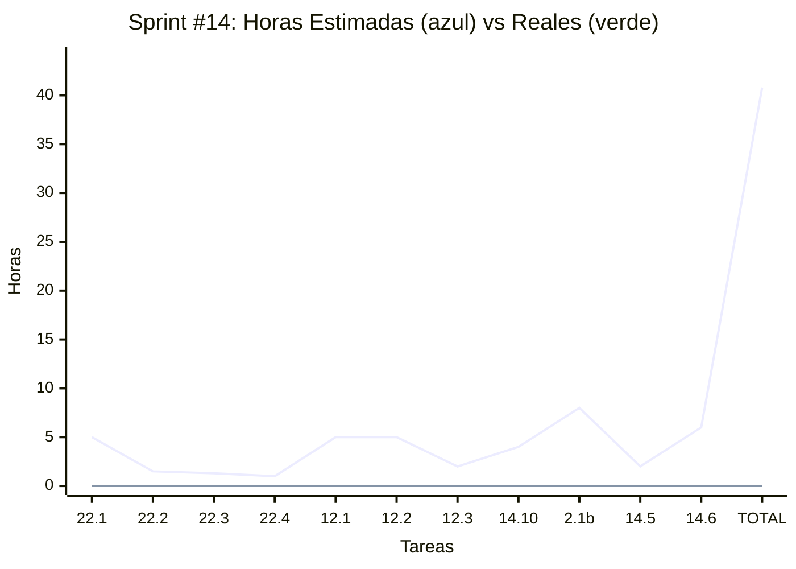

Distribución por categoría:
| Documentación | Desarrollo | QA | Capacitación | Gestión |
|:-------:|:----------:|:--:|:------------:|:-------------:|
| **5**hs | **32**hs | **0**hs | **1**hs | **2.8**hs |

**Notas del Sprint:**
- **Sprint enfocado en usabilidad y mejoras de calidad de vida** NO en nuevas features core, priorizando pulido de UX y navegación
- **Dashboard simplificado (12.1-12.3 - 12hs):** Reemplazo de dashboard actual con 2 widgets clave (últimos QuickChecks + últimos Eventos), layout responsive y limpio
- **Mini Perfil & UX (14.10 - 4hs):** Mejora navegación con dropdown de perfil en navbar, reubica logout a sidebar
- **Registro Extendido (2.1b - 8hs):** Wizard opcional de 5 pasos para onboarding completo (alternativo a registro rápido existente)
- **Theme & Settings (14.5-14.6 - 8hs):** Selector dark mode + pantalla de configuración (tema + idioma + **toggle de notificaciones por email**)
- **Estrategia de descope opcional:** Si sprint on track, agregar 3.4 QuickActions (12hs) o 7.1-7.2 Repuestos (14hs)

**Orden de ejecución (según orden de tabla):**
  1. **Overhead (22.2-22.4 - 3.8hs):** Demo, Planning, Tutorías
  2. **Mini Perfil & UX (14.10-14.6 - 12hs):** Navegación mejorada + Theme + Settings con email toggle
  3. **Dashboard completo (12.1-12.3 - 12hs):** Widgets QuickChecks + Eventos + Layout final
  4. **Registro Extendido (2.1b - 8hs):** Wizard opcional de onboarding
  5. **Reporte Académico (22.1 - 5hs):** Documentación final del sprint #13
  4. **Theme toggle (14.5 - 2hs):** Base para Settings screen, mejora accesibilidad (dark mode crítico)
  5. **Settings screen (14.6 - 4hs):** Centraliza configuraciones (tema + idioma), necesita 14.5 completado
  6. **Registro Extendido (2.1b - 8hs):** Nice-to-have, mejora onboarding para usuarios que quieren perfil completo desde inicio

**Punto de decisión Day 4 EOD:** 
- Si Dashboard (12.1-12.3) + Mini Perfil (14.10) + Theme/Settings (14.5-14.6) completados (22hs), evaluar:
  - **Opción A:** Continuar con 2.1b (8hs) según plan actual
  - **Opción B:** Descope 2.1b, agregar 3.4 QuickActions (12hs) → Feature más impactante pero más compleja
  - **Opción C:** Descope 2.1b, agregar 7.1-7.2 Repuestos (14hs) → Feature nueva de tracking

**Fortalezas:**
- ✅ **Dashboard widgets:** Endpoints simples (GET /quickchecks/recent, GET /machine-events/recent), componentes card reutilizables
- ✅ **Mini Perfil:** Dropdown component con React Aria, navegación programática ya implementada (14.4a)
- ✅ **Theme toggle:** Tailwind dark mode configurado (0.9), solo falta UI toggle y localStorage
- ✅ **Settings screen:** Ruta simple, formulario básico, integración con hooks de tema e i18n (0.15)
- ✅ **Registro Extendido:** Reutiliza 2.1 (registro básico), ReactHookForm y validaciones existentes, wizard pattern conocido

**Riesgos y Mitigaciones:**
- ⚠️ **Buffer negativo (-3.8hs):** Sprint denso sin margen de error, requiere ejecución disciplinada
- ⚠️ **2.1b wizard opcional:** Feature nice-to-have, puede descope sin afectar MVP core
- ⚠️ **3.4 QuickActions y 7.1-7.2 Repuestos fuera de plan:** Funcionalidades valiosas pero complejas, require más tiempo del disponible
- ✅ **Mitigación:** Orden estratégico Dashboard→UX→Settings→Registro asegura victorias tempranas
- ✅ **Mitigación:** Punto de decisión Day 4 permite pivot si necesario
- ✅ **Mitigación:** 2.1b es condicional, puede moverse a Sprint #15 si no hay tiempo

**Prioridades de Usabilidad (de mayor a menor impacto):**
1. **🌟 CRÍTICO - Dashboard simplificado (12.1-12.3):** Pantalla inicial que usuarios ven diariamente, impacto inmediato en percepción de valor
2. **🌟 CRÍTICO - Mini Perfil & Logout (14.10):** Mejora navegación y consistencia, problema actual de logout mal ubicado
3. **🔥 ALTO - Theme & Settings (14.5-14.6):** Accesibilidad (dark mode) + centralización de configuraciones, mejora calidad percibida
4. **📊 MEDIO - Registro Extendido (2.1b):** Mejora onboarding para usuarios power, no crítico (registro básico ya funciona)
5. **🚀 ALTO (descope) - QuickActions (3.4):** Botón flotante con acceso rápido a funciones comunes, mejora productividad (pero 12hs no caben)
6. **📦 BAJO (descope) - Repuestos (7.1-7.2):** Feature nueva de tracking, no es mejora de usabilidad sino funcionalidad adicional (14hs no caben)

**Consideraciones técnicas:**
- **12.1-12.2 Dashboard widgets:** Componentes QuickCheckCard y EventCard reutilizables, badges para status/severity, fecha relativa con date-fns
- **12.3 Dashboard layout:** Grid responsive (2 cols desktop, 1 col mobile), header con bienvenida, footer "Ver todos" con links
- **14.10 Mini Perfil:** Dropdown con React Aria, avatar placeholder (initials), opciones Ver/Editar Perfil + Logout, mover logout al final de 14.7 NavigationDrawer
- **2.1b Registro Extendido:** Wizard de 5 pasos (Datos básicos → Info profesional → Preferencias → Completar perfil → Confirmación), opción "Saltar" en cada paso, progress indicator
- **14.5 Theme toggle:** Hook useTheme con Zustand, persistencia localStorage, toggle button en navbar o settings
- **14.6 Settings screen:** Ruta /settings, formulario con Select para idioma (es/en) y toggle para tema, botón Guardar + Restaurar defaults

**Dependencias críticas:**
1. 12.1, 12.2, 12.3 pueden ejecutarse en paralelo (widgets independientes)
2. 14.5 → 14.6 (Settings screen necesita theme toggle implementado)
3. 14.4a (React Router) → 14.10 (navegación programática necesaria)
4. 14.7 (NavigationDrawer) → 14.10 (sidebar necesario para reubicar logout)
5. 2.1 (Registro básico) → 2.1b (extiende registro existente)
6. 0.15 (i18n) → 14.6 (Settings screen necesita hook de idioma)

**Consideraciones de UX:**
- **Dashboard:** Limitar a 5-10 items por widget, scroll si hay más, fecha relativa (ej: "hace 2 horas"), badges para status/severity
- **Mini Perfil:** Dropdown cierra al click fuera o ESC, hover states claros, iconos contextuales (👤 perfil, ✏️ editar, 🚪 logout)
- **Theme:** Transición suave entre temas, persistencia automática sin botón Guardar
- **Settings:** Feedback visual al guardar, confirmación de cambios, preview de tema en tiempo real
- **Wizard:** Progress bar clara, botón "Saltar" visible, datos se guardan parcialmente, opción "Completar después" desde perfil

**Notas adicionales:**
- 🎯 **Este sprint es sobre percepción de calidad y facilidad de uso**, NO sobre agregar features complejas
- 💡 **Dashboard simplificado es la prioridad #1**: Los usuarios deben ver valor inmediato al entrar a la app
- 🔧 **QuickActions (3.4) y Repuestos (7.1-7.2)** son valiosos pero NO caben en 35hs → Mover a Sprint #15-#16
- 📊 **Si se completa Dashboard + UX early:** Evaluar agregar 0.15 (i18n implementation) si Settings 14.6 necesita más soporte de idiomas

**Riesgos:** Sprint muy denso con buffer negativo, requiere disciplina en estimaciones y ejecución. Priorizar Dashboard y UX core, 2.1b es condicional.

### **Sprint #15**: dom 25 ene → sáb 31 ene 2026

**Objetivo:** 🎁 Full Nice-to-Have + UX - Recuperación password + búsqueda + ayuda + mejoras UX.

| Categoría | Tarea | Orden | Horas Estimadas | Horas Reales |
|-----------:|:-------|:---------------:|:---------------:|:------------:|
| Documentación | 20.1 Reporte Académico del Sprint #14 | 1 | 5 | |
| Gestión | 20.2 Demo/UAT de Sprint #14 | 2 | 1.5 | |
| Gestión | 20.3 Sprint Planning de Sprint #15 | 3 | 1.3 | |
| Capacitación | 21.2 Tutorías (guía con tutor asignado) | 4 | 1 | |
| QA | 13.7 Triage & fix post-UAT | 5 | 10 | |
| QA | 13.9 Gestión de defectos | 6 | 6 | |
| Desarrollo | 11.1 Ayuda inline mínima / "cómo usar esta página" [NiceToHave] | 7 | 6 | |
| Gestión | 19.1 Consolidación y tracking del backlog Post-MVP | 8 | 2 | |

| Total Horas Estimadas (sin buffer) | Total Horas Reales | Consumo |
|:---:|:----------:|:-------:|
| **32.8**hs | **0**hs | **0.0%** |

Buffer reservado: **2.2**hs
Total con buffer: **35**hs

Distribución por categoría:
| Documentación | Desarrollo | QA | Capacitación | Gestión |
|:-------:|:----------:|:--:|:------------:|:-------------:|
| **5**hs | **6**hs | **16**hs | **1**hs | **2.8**hs |

### **Sprint #16**: dom 1 feb → sáb 7 feb 2026

**Objetivo:** ✨ Último Sprint Desarrollo - Full pulida, nada de features nuevas, documentación.

| Categoría | Tarea | Orden | Horas Estimadas | Horas Reales |
|-----------:|:-------|:---------------:|:---------------:|:------------:|
| Documentación | 20.1 Reporte Académico del Sprint #15 | 1 | 5 | |
| Gestión | 20.2 Demo/UAT de Sprint #15 | 2 | 1.5 | |
| Gestión | 20.3 Sprint Planning de Sprint #16 | 3 | 1.3 | |
| Capacitación | 21.2 Tutorías (guía con tutor asignado) | 4 | 1 | |
| Desarrollo | 7.1 Alta/edición repuesto (RF-012/014) [NiceToHave] | 5 | 8 | |
| Desarrollo | 7.2 Listado por máquina (RF-013) [NiceToHave] | 6 | 6 | |
| Desarrollo | 16.3 Script "reset demo" [NiceToHave] | 7 | 4 | |
| Documentación | 17.3 Manual breve de usuario [NiceToHave] | 8 | 6 | |

| Total Horas Estimadas (sin buffer) | Total Horas Reales |
|:---:|:----------:|
| **32.8**hs | **0**hs |

Buffer reservado: **2.2**hs
Total con buffer: **35**hs

Distribución por categoría:
| Documentación | Desarrollo | QA | Capacitación | Gestión |
|:-------:|:----------:|:--:|:------------:|:-------------:|
| **5**hs | **18**hs | **0**hs | **1**hs | **2.8**hs |

**Nota:** Este sprint incluye principalmente funcionalidades NiceToHave y puede ajustarse según el estado del proyecto.

### **Sprint #17**: dom 8 feb → sáb 14 feb 2026

**Objetivo:** Buffer final de entrega - refinamientos, documentación y verificaciones finales para la entrega académica.

| Categoría | Tarea | Orden | Horas Estimadas | Horas Reales |
|-----------:|:-------|:---------------:|:---------------:|:------------:|
| Documentación | 20.1 Reporte Académico del Sprint #16 | 1 | 5 | |
| Gestión | 20.2 Demo/UAT de Sprint #16 | 2 | 1.5 | |
| Gestión | 20.3 Sprint Planning de Sprint #17 | 3 | 1.3 | |
| Capacitación | 21.2 Tutorías (guía con tutor asignado) | 4 | 1 | |
| Gestión | 21.21 Buffer de entrega final | 5 | 10 | |

| Total Horas Estimadas (sin buffer) | Total Horas Reales | Consumo |
|:---:|:----------:|:-------:|
| **18.8**hs | **0**hs | **0.0%** |

Buffer reservado: **16.2**hs
Total con buffer: **35**hs

Distribución por categoría:
| Documentación | Desarrollo | QA | Capacitación | Gestión |
|:-------:|:----------:|:--:|:------------:|:-------------:|
| **5**hs | **0**hs | **0**hs | **1**hs | **12.8**hs |

**Nota:** Sprint de cierre con amplio buffer para refinamientos finales y preparación de entrega académica.

