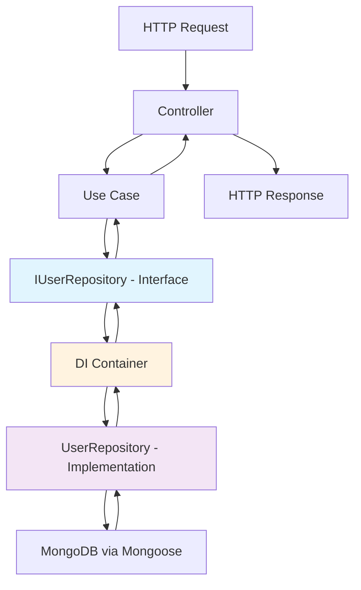

# 🏗️ FleetMan Clean Architecture - Repository Pattern & Dependency Flow

## 📋 **Índice**
- [🎯 Objetivo](#-objetivo)
- [🧹 Barrel Pattern Simplificado](#-barrel-pattern-simplificado)
- [🔄 Flujo Completo de Dependencias](#-flujo-completo-de-dependencias)
- [💡 Ejemplos Prácticos](#-ejemplos-prácticos)
- [🎯 Uso del Barrel](#-uso-del-barrel)
- [📊 Flujo Visualizado](#-flujo-visualizado)
- [✅ Beneficios de esta Arquitectura](#-beneficios-de-esta-arquitectura)

---

## 🎯 **Objetivo**

Este documento explica cómo implementamos **Clean Architecture** en FleetMan usando el **Repository Pattern** con **Dependency Injection**. El objetivo es tener una separación clara entre capas y mantener las dependencias apuntando hacia el dominio.

---

## 🧹 **Barrel Pattern Simplificado**

### ❌ **Lo que NO necesitamos:**
```typescript
// ❌ Factory pattern innecesario
export function createRepositories() {
  return {
    userRepository: new UserRepository(),
    // ...
  };
}
```

### ✅ **Lo que SÍ necesitamos:**
```typescript
// packages/persistence/src/repositories/index.ts
export { UserRepository } from './user.repository';
export { MachineRepository } from './machine.repository';
export { MachineEventRepository } from './machine-event.repository';
export { MachineEventTypeRepository } from './machine-event-type.repository';
```

**¿Por qué es mejor?**
- 🎯 **Más simple** - Solo re-exports, sin complejidad extra
- 🔧 **Más flexible** - Cada parte importa solo lo que necesita  
- 🧪 **Mejor para DI** - Los containers manejan instancias
- ✅ **Más testeable** - Fácil mockear implementaciones específicas

---

## 🔄 **Flujo Completo de Dependencias**

### **Paso 1: Domain define la INTERFACE (Contrato)**
```typescript
// packages/domain/src/ports/user.repository.ts
export interface IUserRepository {
  save(user: User): Promise<Result<void, DomainError>>;
  findById(id: UserId): Promise<Result<User, DomainError>>;
}
```

**📝 Responsabilidad:** Definir el "contrato" que debe cumplir cualquier implementación.

---

### **Paso 2: Persistence IMPLEMENTA la interface**
```typescript
// packages/persistence/src/repositories/user.repository.ts
import { IUserRepository } from '@packages/domain/ports';

export class UserRepository implements IUserRepository {
  async save(user: User): Promise<Result<void, DomainError>> {
    // Implementación con MongoDB/Mongoose
    const userData = this.entityToDocument(user);
    await UserModel.create(userData);
    return ok(undefined);
  }
  
  async findById(id: UserId): Promise<Result<User, DomainError>> {
    // Implementación con MongoDB/Mongoose
    const doc = await UserModel.findById(id.getValue());
    if (!doc) return err(DomainError.notFound('User not found'));
    
    return this.documentToEntity(doc);
  }
}
```

**📝 Responsabilidad:** Implementar el contrato usando tecnología específica (MongoDB).

---

### **Paso 3: Backend define Use Cases**
```typescript
// apps/backend/src/use-cases/create-user.use-case.ts
import { IUserRepository } from '@packages/domain/ports';  // ← Interface

export class CreateUserUseCase {
  constructor(
    private userRepo: IUserRepository  // ← Solo conoce la interface
  ) {}
  
  async execute(input: CreateUserInput): Promise<Result<User, DomainError>> {
    // Validaciones de negocio
    const userResult = User.create(input);
    if (!userResult.success) {
      return err(userResult.error);
    }
    
    // Guardar usando la interface
    const saveResult = await this.userRepo.save(userResult.data);
    if (!saveResult.success) {
      return err(saveResult.error);
    }
    
    return ok(userResult.data);
  }
}
```

**📝 Responsabilidad:** Lógica de negocio pura, sin saber cómo se persisten los datos.

---

### **Paso 4: DI Container conecta Interface ↔ Implementación**
```typescript
// apps/backend/src/container.ts
import { container } from 'tsyringe';
import { IUserRepository } from '@packages/domain/ports';      // ← Interface
import { UserRepository } from '@packages/persistence';        // ← Implementación

// 🔗 Conectar interface con implementación concreta
container.register<IUserRepository>(
  'IUserRepository',           // ← Token (identificador)
  { useClass: UserRepository } // ← Implementación concreta
);

container.register<CreateUserUseCase>(
  'CreateUserUseCase',
  { useClass: CreateUserUseCase }
);
```

**📝 Responsabilidad:** Resolver dependencias y conectar interfaces con implementaciones.

---

### **Paso 5: Controller usa el Use Case**
```typescript
// apps/backend/src/controllers/user.controller.ts
import { container } from 'tsyringe';

@controller('/users')
export class UserController {
  
  @inject('CreateUserUseCase')
  constructor(private createUserUseCase: CreateUserUseCase) {}
  
  @post('/')
  async createUser(req: Request, res: Response) {
    const result = await this.createUserUseCase.execute(req.body);
    
    if (result.success) {
      res.status(201).json({ 
        data: result.data.toPublicInterface() 
      });
    } else {
      res.status(400).json({ 
        error: result.error.message 
      });
    }
  }
}
```

**📝 Responsabilidad:** Manejar HTTP requests/responses y delegar a Use Cases.

---

## 💡 **Ejemplos Prácticos**

### **🔧 Setup de DI Completo**
```typescript
// apps/backend/src/setup/dependencies.ts
import 'reflect-metadata';
import { container } from 'tsyringe';

// Domain Ports (Interfaces)
import { 
  IUserRepository,
  IMachineRepository,
  IMachineEventRepository 
} from '@packages/domain/ports';

// Persistence Implementations
import { 
  UserRepository,
  MachineRepository, 
  MachineEventRepository
} from '@packages/persistence';

// Use Cases
import { 
  CreateUserUseCase,
  GetUserUseCase,
  CreateMachineUseCase 
} from '../use-cases';

export function setupDependencyInjection() {
  // 📦 Registrar Repositories
  container.register<IUserRepository>('IUserRepository', { useClass: UserRepository });
  container.register<IMachineRepository>('IMachineRepository', { useClass: MachineRepository });
  container.register<IMachineEventRepository>('IMachineEventRepository', { useClass: MachineEventRepository });
  
  // 🎯 Registrar Use Cases
  container.register<CreateUserUseCase>('CreateUserUseCase', { useClass: CreateUserUseCase });
  container.register<GetUserUseCase>('GetUserUseCase', { useClass: GetUserUseCase });
  container.register<CreateMachineUseCase>('CreateMachineUseCase', { useClass: CreateMachineUseCase });
}
```

### **🧪 Testing con Mocks**
```typescript
// tests/use-cases/create-user.test.ts
import { CreateUserUseCase } from '../../src/use-cases/create-user.use-case';
import { IUserRepository } from '@packages/domain/ports';

describe('CreateUserUseCase', () => {
  let useCase: CreateUserUseCase;
  let mockUserRepo: jest.Mocked<IUserRepository>;

  beforeEach(() => {
    // 🎭 Mock del repository
    mockUserRepo = {
      save: jest.fn(),
      findById: jest.fn(),
      findByEmail: jest.fn(),
      // ... otros métodos
    };
    
    useCase = new CreateUserUseCase(mockUserRepo);
  });

  it('should create user successfully', async () => {
    // Arrange
    mockUserRepo.save.mockResolvedValue(ok(undefined));
    
    // Act
    const result = await useCase.execute({
      email: 'test@example.com',
      password: 'secure123',
      // ...
    });
    
    // Assert
    expect(result.success).toBe(true);
    expect(mockUserRepo.save).toHaveBeenCalledWith(
      expect.objectContaining({
        email: expect.objectContaining({ getValue: expect.any(Function) })
      })
    );
  });
});
```

---

## 🎯 **Uso del Barrel**

### **✅ Backend importa implementaciones para DI**
```typescript
// apps/backend/src/container.ts
import { UserRepository, MachineRepository } from '@packages/persistence';
```

### **✅ Tests importan implementaciones para integration tests**
```typescript
// tests/integration/user-repository.test.ts  
import { UserRepository } from '@packages/persistence';
```

### **✅ DI setup importa todo lo necesario**
```typescript
// apps/backend/src/setup/dependencies.ts
import { 
  UserRepository, 
  MachineRepository,
  MachineEventRepository,
  MachineEventTypeRepository
} from '@packages/persistence';
```

### **❌ Lo que NO hacemos**
```typescript
// ❌ No importamos implementaciones en Use Cases
import { UserRepository } from '@packages/persistence'; // MAL

// ✅ Solo importamos interfaces en Use Cases
import { IUserRepository } from '@packages/domain/ports'; // BIEN
```

---

## 📊 **Flujo Visualizado**



### **🏗️ Capas de Arquitectura**

```
┌─────────────────────────────────────────────┐
│               🌐 HTTP/Controllers            │  ← Presentation Layer
├─────────────────────────────────────────────┤
│               🎯 Use Cases                   │  ← Application Layer  
├─────────────────────────────────────────────┤
│         📋 Domain Ports (Interfaces)        │  ← Domain Layer
├─────────────────────────────────────────────┤
│        🔌 DI Container (Wiring)             │  ← Infrastructure
├─────────────────────────────────────────────┤
│       💾 Persistence (Implementations)      │  ← Infrastructure Layer
├─────────────────────────────────────────────┤
│            🗄️ Database (MongoDB)            │  ← External Systems
└─────────────────────────────────────────────┘
```

---

## ✅ **Beneficios de esta Arquitectura**

### 🎯 **1. Separation of Concerns**
- **Domain:** Solo reglas de negocio
- **Persistence:** Solo detalles de almacenamiento  
- **Application:** Solo orquestación de casos de uso

### 🔄 **2. Dependency Inversion**
```typescript
// ✅ BIEN: Application depende de abstracción
UseCase → IRepository (interface)

// ❌ MAL: Application depende de implementación  
UseCase → MongoUserRepository (implementación concreta)
```

### 🧪 **3. Testabilidad**
- **Unit Tests:** Mock interfaces fácilmente
- **Integration Tests:** Usar implementaciones reales
- **E2E Tests:** Todo el stack funcionando

### 🔧 **4. Flexibilidad**
```typescript
// Fácil cambiar de MongoDB a PostgreSQL
container.register<IUserRepository>('IUserRepository', { 
  useClass: PostgreSQLUserRepository  // ← Solo cambiar aquí
});
```

### 🚀 **5. Escalabilidad**
- Agregar nuevos repositorios es simple
- Nuevos use cases se conectan automáticamente
- Cambios en persistencia no afectan lógica de negocio

---

## 🎊 **Conclusión**

Esta implementación de Clean Architecture nos da:

- ✅ **Código mantenible** - Cada capa tiene responsabilidades claras
- ✅ **Altamente testeable** - Mocks simples, tests rápidos
- ✅ **Flexible** - Cambiar tecnologías sin afectar negocio
- ✅ **Escalable** - Agregar features es predecible y simple

**El Repository Pattern + DI Container nos permite mantener el principio de Dependency Inversion mientras tenemos código limpio y bien organizado.** 🏆

---

> 📚 **Documento creado por:** FleetMan Development Team  
> 📅 **Fecha:** Noviembre 2025  
> 🔄 **Última actualización:** Durante la implementación de Clean Architecture con Repository Pattern