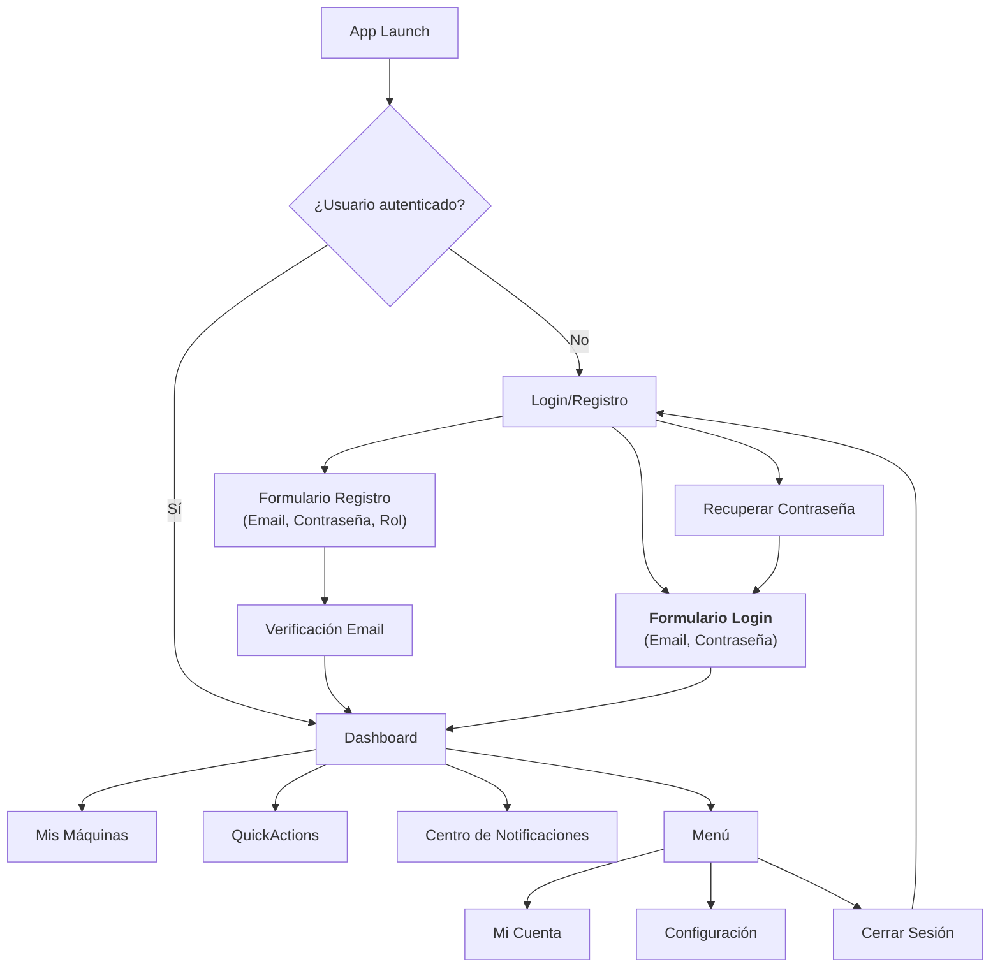
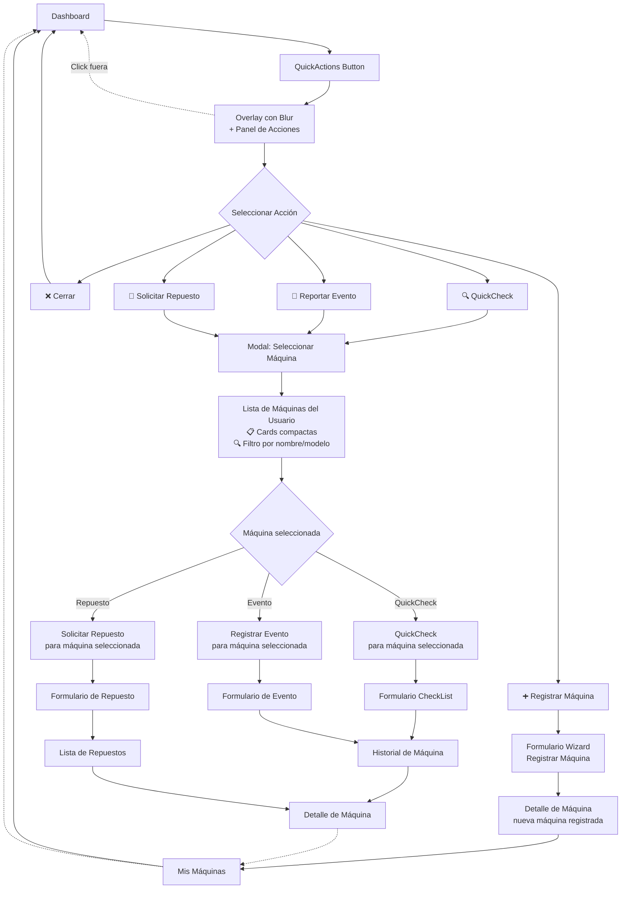
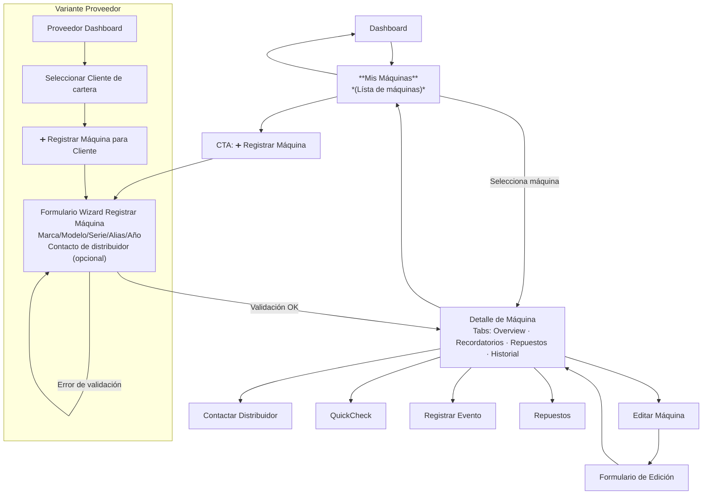
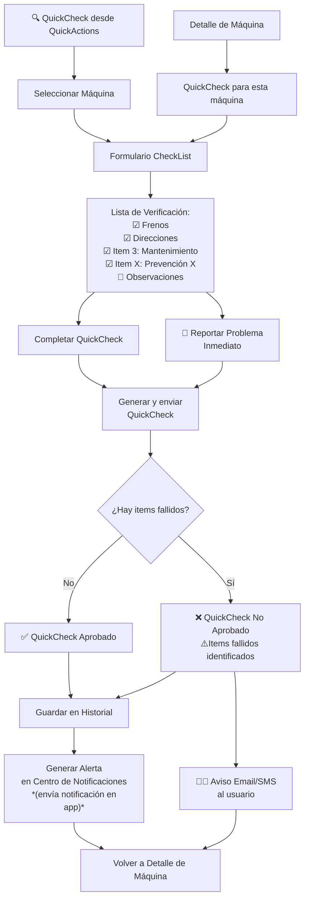
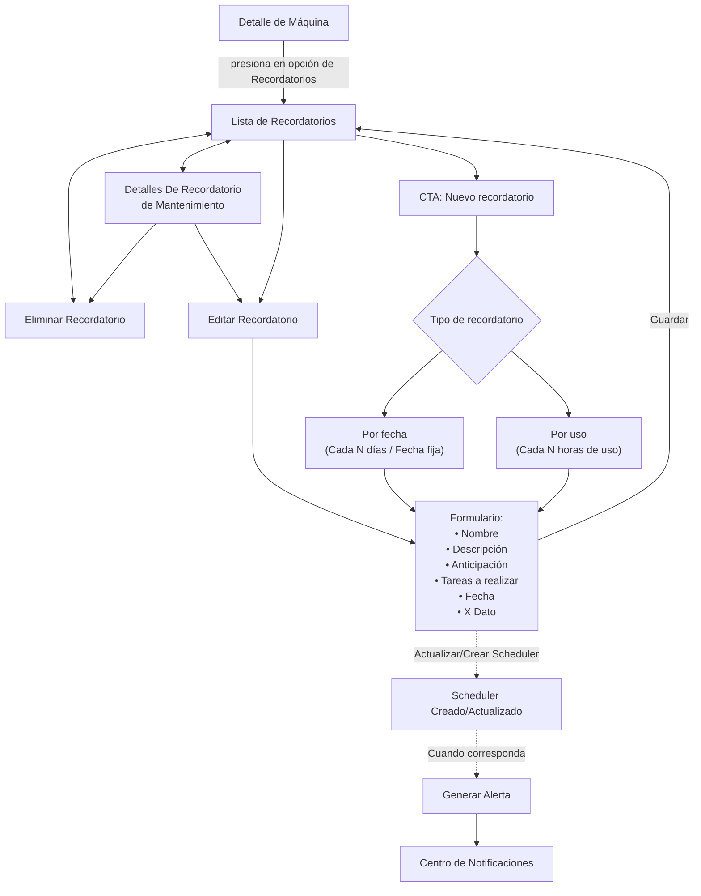
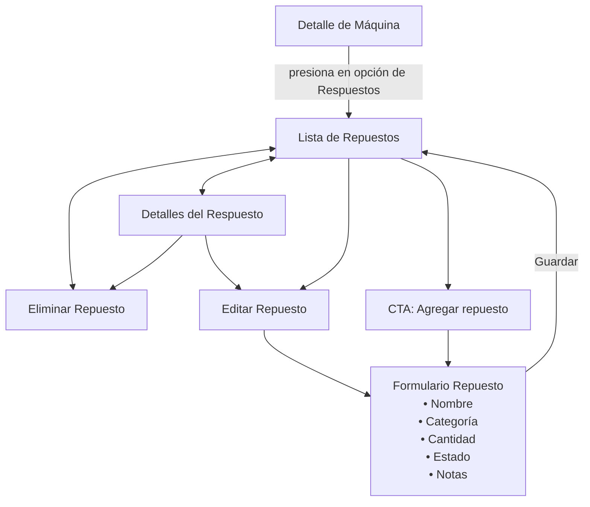
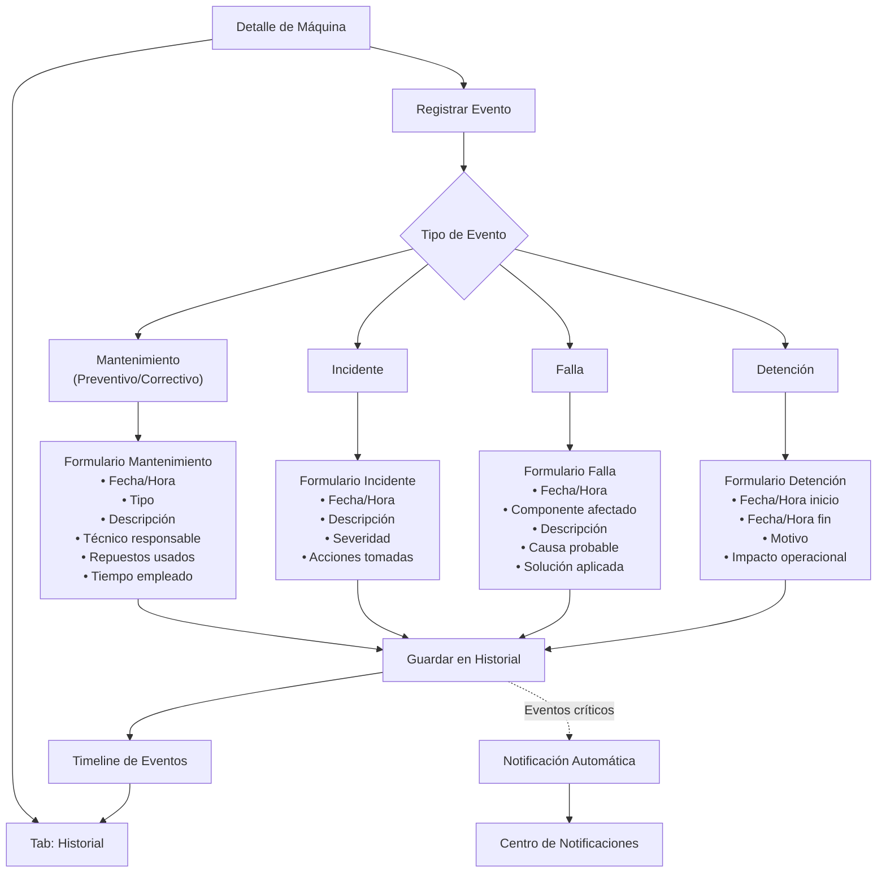
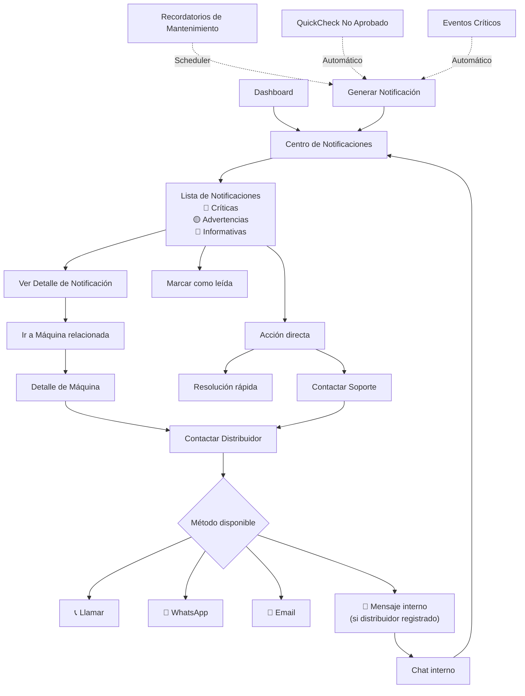
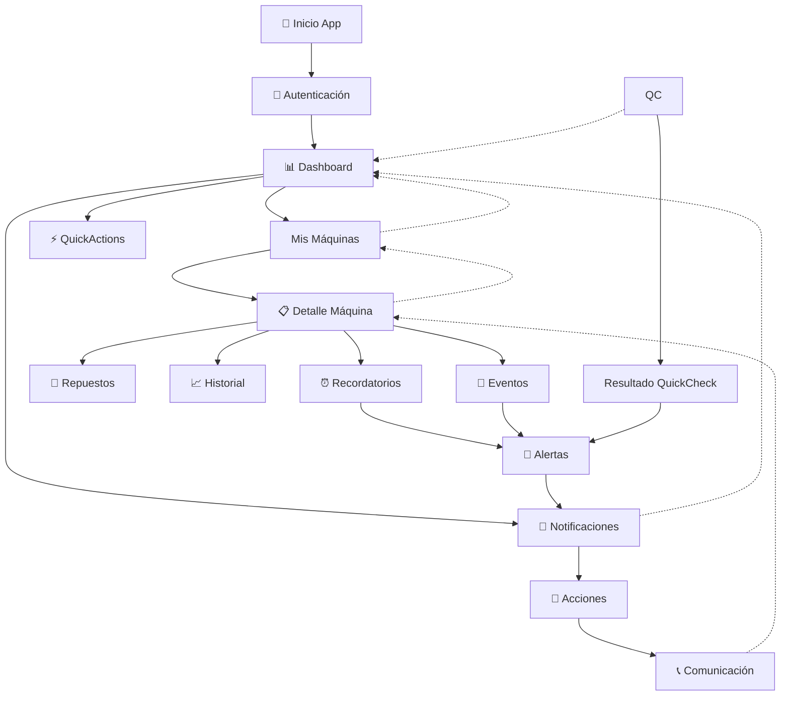

# User Journey - FleetMan

## 1. Flujo de Autenticación y Navegación Inicial

## 2. QuickActions Dashboard

## 3. Mis Máquinas

## 4. QuickCheck de Seguridad

## 5. Gestión de Recordatorios de Mantenimiento

## 6. Gestión de Repuestos

## 7. Registro de Eventos y Mantenimientos

## 8. Centro de Notificaciones y Comunicaciones

## 9. Flujo Completo Integrado - Vista de Alto Nivel

