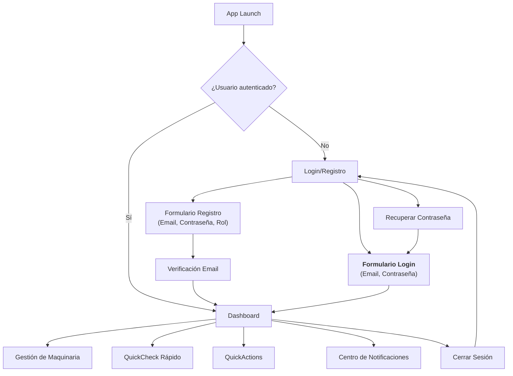
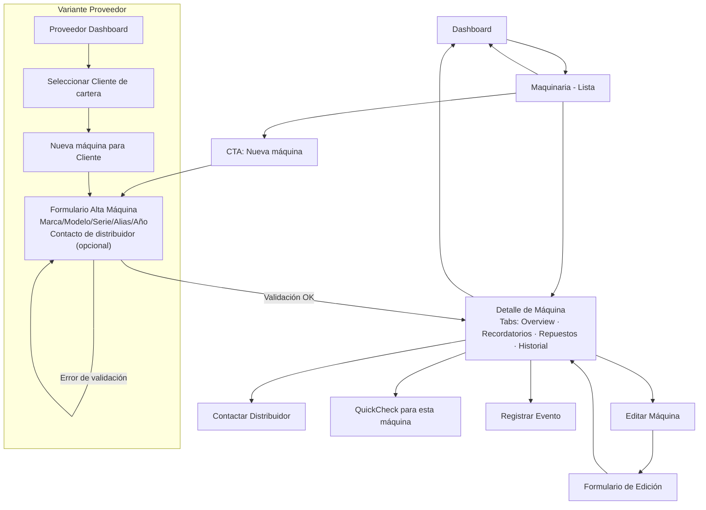
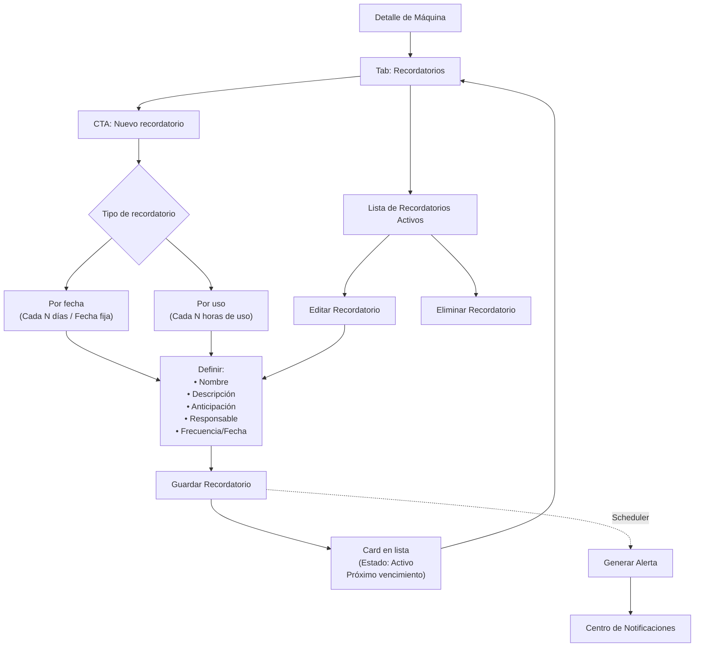
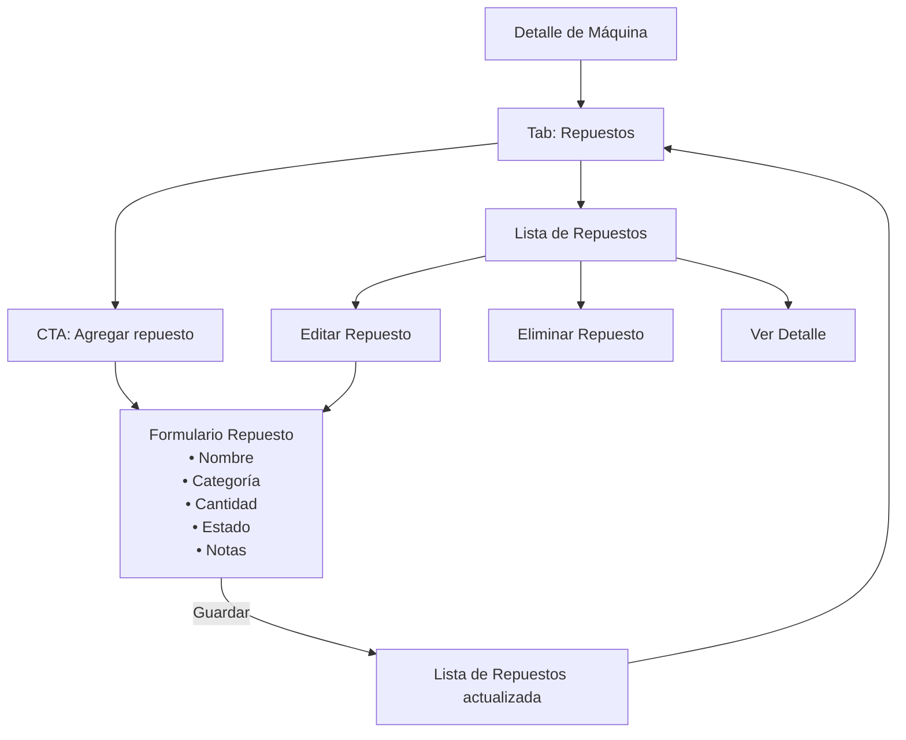
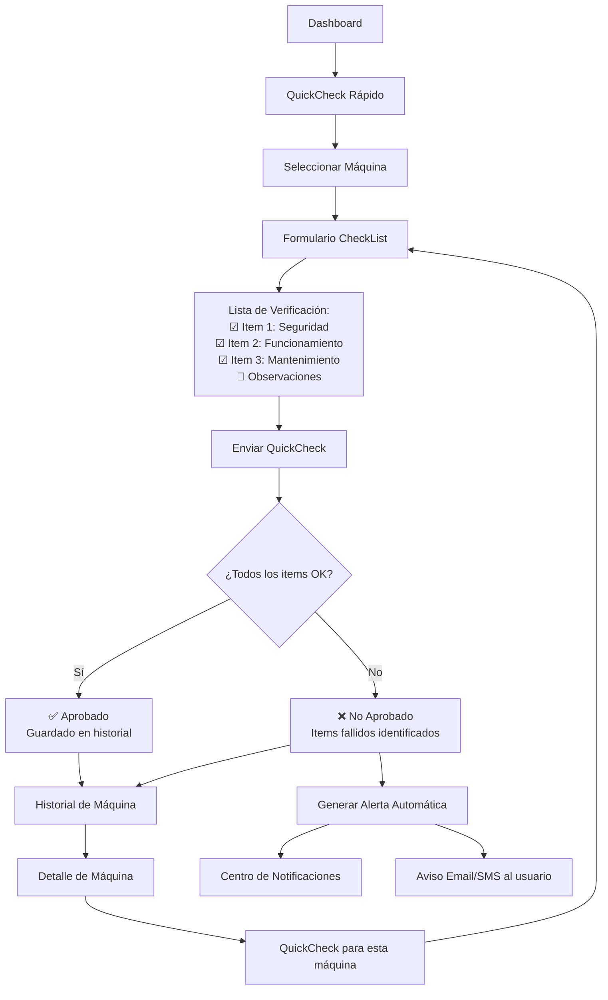
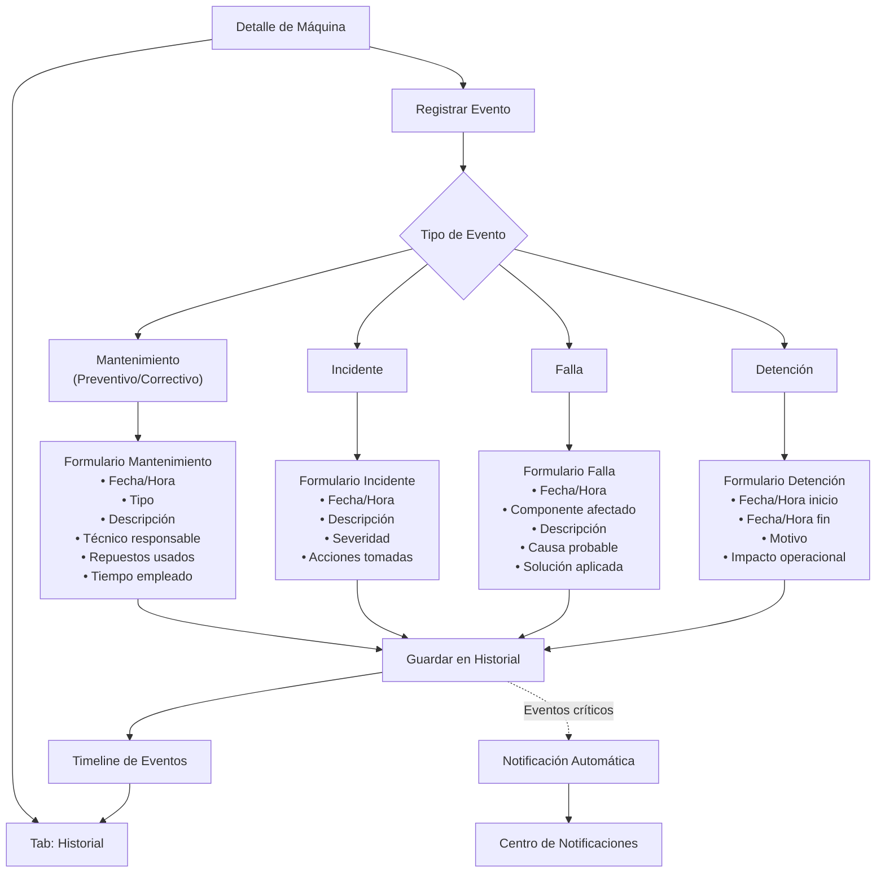
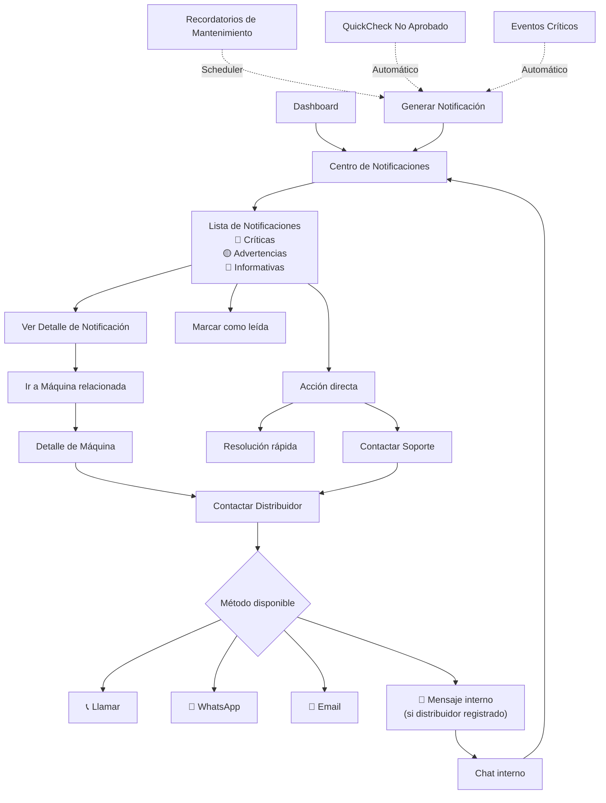
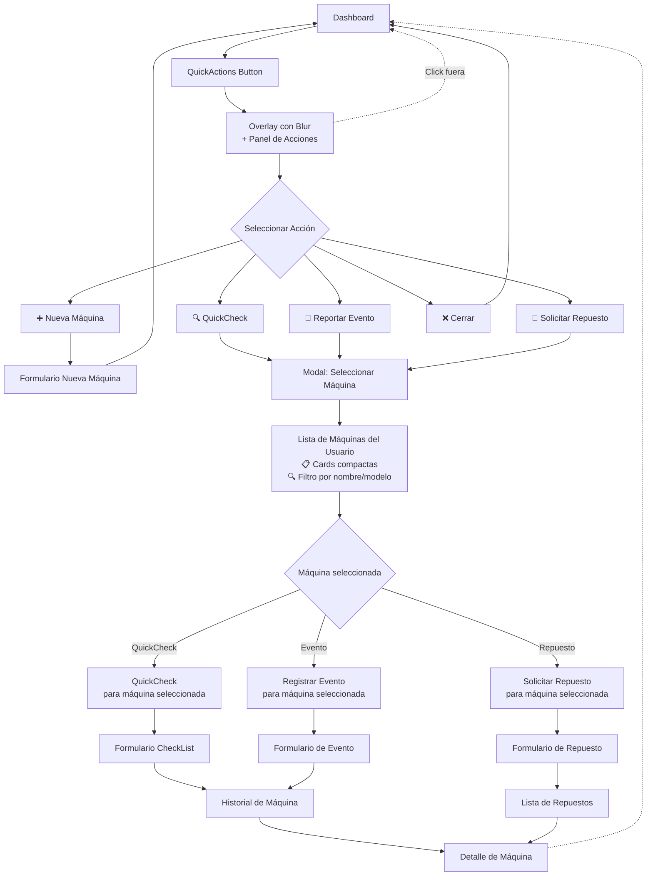
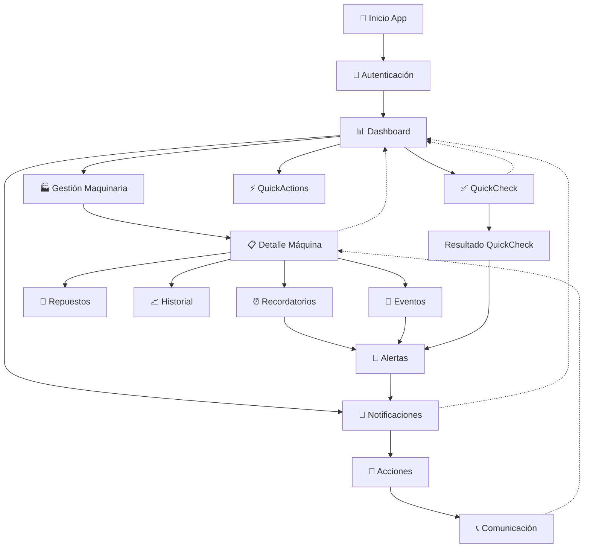

# User Journey - FleetMan

## 1. Flujo de Autenticación y Navegación Principal

## 2. Gestión de Maquinaria

## 3. Gestión de Recordatorios de Mantenimiento

## 4. Gestión de Repuestos

## 5. QuickCheck de Seguridad

## 6. Registro de Eventos y Mantenimientos

## 7. Centro de Notificaciones y Comunicaciones

## 8. QuickActions Dashboard

## 9. Flujo Completo Integrado - Vista de Alto Nivel

