# User Journey - FleetMan

## 1. Flujo de Autenticación y Navegación Principal

```mermaid
flowchart TD
    START[App Launch] --> AUTH{¿Usuario autenticado?}
    AUTH -->|No| LOGIN[Login/Registro]
    AUTH -->|Sí| DASH[Dashboard]
    LOGIN --> REGISTER[Formulario Registro<br/>#40;Email, Contraseña, Rol#41;]
    LOGIN --> SIGNIN[<b>Formulario Login</b><br/>#40;Email, Contraseña#41;]
    LOGIN --> FORGOT[Recuperar Contraseña]
	FORGOT --> SIGNIN
    
    REGISTER --> VERIFY[Verificación Email]
    VERIFY --> DASH
    SIGNIN --> DASH
    
    DASH --> MACHINES[Gestión de Maquinaria]
    DASH --> QUICKCHECK[QuickCheck Rápido]
    DASH --> QUICKACTIONS[QuickActions]
    DASH --> NOTIFICATIONS[Centro de Notificaciones]
    DASH --> LOGOUT[Cerrar Sesión]
    
    LOGOUT --> LOGIN
```

## 2. Gestión de Maquinaria

```mermaid
flowchart TD
    DASH[Dashboard] --> MACHINES[Maquinaria - Lista]
    MACHINES --> CREATE[CTA: Nueva máquina]
    MACHINES --> DETAIL["Detalle de Máquina<br/>Tabs: Overview · Recordatorios · Repuestos · Historial"]
    MACHINES --> DASH
    
    CREATE --> FORM["Formulario Alta Máquina<br/>Marca/Modelo/Serie/Alias/Año<br/>Contacto de distribuidor #40;opcional#41;"]
    FORM -->|Validación OK| DETAIL
    FORM -->|Error de validación| FORM
    
    DETAIL --> DASH
    DETAIL --> EDIT[Editar Máquina]
    DETAIL --> CONTACT[Contactar Distribuidor]
    DETAIL --> QUICKCHECK_MACHINE[QuickCheck para esta máquina]
    DETAIL --> EVENT[Registrar Evento]
    
    EDIT --> EDIT_FORM[Formulario de Edición]
    EDIT_FORM --> DETAIL
    
    %% Variante Proveedor
    subgraph "Variante Proveedor"
        PROVIDER[Proveedor Dashboard] --> SELECT_CLIENT[Seleccionar Cliente de cartera]
        SELECT_CLIENT --> CREATE_FOR_CLIENT[Nueva máquina para Cliente]
        CREATE_FOR_CLIENT --> FORM
    end
```

## 3. Gestión de Recordatorios de Mantenimiento

```mermaid
flowchart TD
    DETAIL[Detalle de Máquina] --> TAB_REM[Tab: Recordatorios]
    TAB_REM --> LIST_REM[Lista de Recordatorios Activos]
    TAB_REM --> CREATE_REM[CTA: Nuevo recordatorio]
    
    CREATE_REM --> TYPE{Tipo de recordatorio}
    TYPE --> DATE_TYPE[Por fecha<br/>#40;Cada N días / Fecha fija#41;]
    TYPE --> USAGE_TYPE[Por uso<br/>#40;Cada N horas de uso#41;]
    
    DATE_TYPE --> FORM_REM["Definir:<br/>• Nombre<br/>• Descripción<br/>• Anticipación<br/>• Responsable<br/>• Frecuencia/Fecha"]
    USAGE_TYPE --> FORM_REM
    
    FORM_REM --> SAVE_REM[Guardar Recordatorio]
    SAVE_REM --> CARD_REM["Card en lista<br/>#40;Estado: Activo<br/>Próximo vencimiento#41;"]
    CARD_REM --> TAB_REM
    
    LIST_REM --> EDIT_REM[Editar Recordatorio]
    LIST_REM --> DELETE_REM[Eliminar Recordatorio]
    EDIT_REM --> FORM_REM
    
    %% Automatización
    SAVE_REM -. Scheduler .-> ALERT[Generar Alerta]
    ALERT --> NOTIFICATION[Centro de Notificaciones]
```

## 4. Gestión de Repuestos

```mermaid
flowchart TD
    DETAIL[Detalle de Máquina] --> TAB_SPARE[Tab: Repuestos]
    TAB_SPARE --> LIST_SPARE[Lista de Repuestos]
    TAB_SPARE --> ADD_SPARE[CTA: Agregar repuesto]
    
    ADD_SPARE --> FORM_SPARE["Formulario Repuesto<br/>• Nombre<br/>• Categoría<br/>• Cantidad<br/>• Estado<br/>• Notas"]
    FORM_SPARE -->|Guardar| UPDATE_LIST[Lista de Repuestos actualizada]
    UPDATE_LIST --> TAB_SPARE
    
    LIST_SPARE --> EDIT_SPARE[Editar Repuesto]
    LIST_SPARE --> DELETE_SPARE[Eliminar Repuesto]
    LIST_SPARE --> VIEW_SPARE[Ver Detalle]
    
    EDIT_SPARE --> FORM_SPARE
```

## 5. QuickCheck de Seguridad

## 6. Registro de Eventos y Mantenimientos

```mermaid
flowchart TD
    DETAIL[Detalle de Máquina] --> EVENT[Registrar Evento]
    DETAIL --> TAB_HIST[Tab: Historial]
    
    EVENT --> EVENT_TYPE{Tipo de Evento}
    EVENT_TYPE --> MAINT[Mantenimiento<br/>#40;Preventivo/Correctivo#41;]
    EVENT_TYPE --> INCIDENT[Incidente]
    EVENT_TYPE --> FAILURE[Falla]
    EVENT_TYPE --> DOWNTIME[Detención]
    
    MAINT --> MAINT_FORM["Formulario Mantenimiento<br/>• Fecha/Hora<br/>• Tipo<br/>• Descripción<br/>• Técnico responsable<br/>• Repuestos usados<br/>• Tiempo empleado"]
    
    INCIDENT --> INCIDENT_FORM["Formulario Incidente<br/>• Fecha/Hora<br/>• Descripción<br/>• Severidad<br/>• Acciones tomadas"]
    
    FAILURE --> FAILURE_FORM["Formulario Falla<br/>• Fecha/Hora<br/>• Componente afectado<br/>• Descripción<br/>• Causa probable<br/>• Solución aplicada"]
    
    DOWNTIME --> DOWNTIME_FORM["Formulario Detención<br/>• Fecha/Hora inicio<br/>• Fecha/Hora fin<br/>• Motivo<br/>• Impacto operacional"]
    
    MAINT_FORM --> SAVE_EVENT[Guardar en Historial]
    INCIDENT_FORM --> SAVE_EVENT
    FAILURE_FORM --> SAVE_EVENT
    DOWNTIME_FORM --> SAVE_EVENT
    
    SAVE_EVENT --> TIMELINE[Timeline de Eventos]
    TIMELINE --> TAB_HIST
    
    %% Algunos eventos pueden generar notificaciones
    SAVE_EVENT -. Eventos críticos .-> AUTO_NOTIF[Notificación Automática]
    AUTO_NOTIF --> NOTIFICATION[Centro de Notificaciones]
```

## 7. Centro de Notificaciones y Comunicaciones

```mermaid
flowchart TD
    DASH[Dashboard] --> NOTIF_CENTER[Centro de Notificaciones]
    
    %% Fuentes de notificaciones
    REMINDERS[Recordatorios de Mantenimiento] -. Scheduler .-> GEN_NOTIF[Generar Notificación]
    QC_FAILED[QuickCheck No Aprobado] -. Automático .-> GEN_NOTIF
    CRITICAL_EVENTS[Eventos Críticos] -. Automático .-> GEN_NOTIF
    
    GEN_NOTIF --> NOTIF_CENTER
    
    NOTIF_CENTER --> NOTIF_LIST["Lista de Notificaciones<br/>🔴 Críticas<br/>🟡 Advertencias<br/>🔵 Informativas"]
    
    NOTIF_LIST --> NOTIF_DETAIL[Ver Detalle de Notificación]
    NOTIF_LIST --> MARK_READ[Marcar como leída]
    NOTIF_LIST --> NOTIF_ACTION[Acción directa]
    
    NOTIF_DETAIL --> MACHINE_CONTEXT[Ir a Máquina relacionada]
    NOTIF_ACTION --> QUICK_FIX[Resolución rápida]
    NOTIF_ACTION --> CONTACT_SUPPORT[Contactar Soporte]
    
    MACHINE_CONTEXT --> DETAIL[Detalle de Máquina]
    
    %% Comunicaciones
    DETAIL --> CONTACT_DIST[Contactar Distribuidor]
    CONTACT_SUPPORT --> CONTACT_DIST
    
    CONTACT_DIST --> CONTACT_METHOD{Método disponible}
    CONTACT_METHOD --> PHONE[📞 Llamar]
    CONTACT_METHOD --> WHATSAPP[💬 WhatsApp]
    CONTACT_METHOD --> EMAIL[📧 Email]
    CONTACT_METHOD --> INTERNAL[💼 Mensaje interno<br/>#40;si distribuidor registrado#41;]
    
    INTERNAL --> CHAT[Chat interno]
    CHAT --> NOTIF_CENTER
```

## 8. QuickActions Dashboard

```mermaid
flowchart TD
    DASH[Dashboard] --> QA_TRIGGER[QuickActions Button]
    QA_TRIGGER --> QA_OVERLAY[Overlay con Blur<br/>+ Panel de Acciones]
    
    QA_OVERLAY --> QA_OPTIONS{Seleccionar Acción}
    QA_OPTIONS --> QA_QUICKCHECK[🔍 QuickCheck]
    QA_OPTIONS --> QA_EVENT[📝 Reportar Evento]
    QA_OPTIONS --> QA_SPARE[🔧 Solicitar Repuesto]
    QA_OPTIONS --> QA_MACHINE[➕ Nueva Máquina]
    QA_OPTIONS --> QA_CLOSE[❌ Cerrar]
    
    %% Nueva Máquina - Redirect directo
    QA_MACHINE --> MACHINE_FORM[Formulario Nueva Máquina]
    MACHINE_FORM --> DASH
    
    %% Acciones que requieren selección de máquina
    QA_QUICKCHECK --> SELECT_MODAL[Modal: Seleccionar Máquina]
    QA_EVENT --> SELECT_MODAL
    QA_SPARE --> SELECT_MODAL
    
    SELECT_MODAL --> MACHINE_LIST["Lista de Máquinas del Usuario<br/>📋 Cards compactas<br/>🔍 Filtro por nombre/modelo"]
    MACHINE_LIST --> MACHINE_SELECTED{Máquina seleccionada}
    
    %% Redirecciones contextualizadas
    MACHINE_SELECTED -->|QuickCheck| QC_CONTEXTUAL[QuickCheck<br/>para máquina seleccionada]
    MACHINE_SELECTED -->|Evento| EVENT_CONTEXTUAL[Registrar Evento<br/>para máquina seleccionada]
    MACHINE_SELECTED -->|Repuesto| SPARE_CONTEXTUAL[Solicitar Repuesto<br/>para máquina seleccionada]
    
    %% Flujos de salida
    QC_CONTEXTUAL --> QC_FORM[Formulario CheckList]
    EVENT_CONTEXTUAL --> EVENT_FORM[Formulario de Evento]
    SPARE_CONTEXTUAL --> SPARE_FORM[Formulario de Repuesto]
    
    QC_FORM --> HISTORY[Historial de Máquina]
    EVENT_FORM --> HISTORY
    SPARE_FORM --> SPARE_LIST[Lista de Repuestos]
    
    HISTORY --> MACHINE_DETAIL[Detalle de Máquina]
    SPARE_LIST --> MACHINE_DETAIL
    
    %% Navegación de retorno
    QA_CLOSE --> DASH
    MACHINE_DETAIL -.-> DASH
    
    %% Overlay interactions
    QA_OVERLAY -.-> |Click fuera| DASH
```

## 9. Flujo Completo Integrado - Vista de Alto Nivel

```mermaid
flowchart TD
    START[🚀 Inicio App] --> AUTH[🔐 Autenticación]
    AUTH --> DASH[📊 Dashboard]
    
    DASH --> MACHINES[🏭 Gestión Maquinaria]
    DASH --> QC[✅ QuickCheck]
    DASH --> QA[⚡ QuickActions]
    DASH --> NOTIF[🔔 Notificaciones]
    
    MACHINES --> DETAIL[📋 Detalle Máquina]
    DETAIL --> REMINDERS[⏰ Recordatorios]
    DETAIL --> SPARES[🔧 Repuestos]
    DETAIL --> HISTORY[📈 Historial]
    DETAIL --> EVENTS[📝 Eventos]
    
    QC --> QC_RESULT[Resultado QuickCheck]
    REMINDERS --> ALERTS[🚨 Alertas]
    EVENTS --> ALERTS
    QC_RESULT --> ALERTS
    
    ALERTS --> NOTIF
    NOTIF --> ACTIONS[🎯 Acciones]
    ACTIONS --> CONTACT[📞 Comunicación]
    
    %% Navegación de retorno
    DETAIL -.-> DASH
    NOTIF -.-> DASH
    QC -.-> DASH
    CONTACT -.-> DETAIL
```

