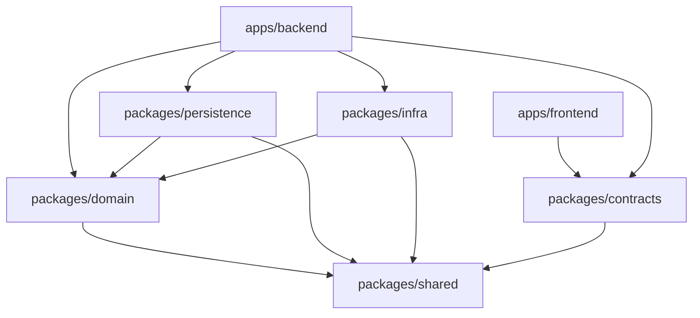

# FleetMan Packages - Arquitectura de Mono-repo

## 📋 Visión General

Este directorio contiene todos los **paquetes compartidos** del mono-repo FleetMan, organizados según los principios de **Clean Architecture** y **Domain-Driven Design**. Cada paquete tiene una responsabilidad específica y límites de dependencia bien definidos.

## 🏗 Arquitectura por Capas

```
┌─────────────────────────────────────────────────────────┐
│                    apps/frontend                        │ ← Presentación (React PWA)
├─────────────────────────────────────────────────────────┤
│                    apps/backend                         │ ← Interfaces (HTTP/Jobs)
├─────────────────────────────────────────────────────────┤
│  packages/contracts  │  Aplicación (Use Cases)          │ ← Aplicación
├─────────────────────────────────────────────────────────┤
│                  packages/domain                        │ ← Dominio (Entities/VOs/Policies)
├─────────────────────────────────────────────────────────┤
│packages/persistence │        packages/infra             │ ← Infraestructura
├─────────────────────────────────────────────────────────┤
│                  packages/shared                        │ ← Utilidades Transversales
└─────────────────────────────────────────────────────────┘
```

## 📦 Descripción de Paquetes

### 🎯 **packages/domain** - El Corazón del Sistema
- **Propósito**: Lógica de negocio pura y reglas de dominio
- **Contiene**: Entidades, Value Objects, Políticas, Servicios de Dominio, Puertos
- **Dependencies**: Solo `@packages/shared`
- **Framework**: 100% Framework-agnostic

### 📋 **packages/contracts** - Fuente Única de Verdad
- **Propósito**: Contratos tipados entre frontend y backend usando Zod
- **Contiene**: Esquemas de validación, tipos de Request/Response
- **Dependencies**: Solo `zod`
- **Beneficio**: Elimina drift entre frontend y backend

### 💾 **packages/persistence** - Capa de Datos
- **Propósito**: Implementación de repositorios con MongoDB/Mongoose
- **Contiene**: Modelos Mongoose, Mappers, Repositorios concretos
- **Dependencies**: `@packages/domain`, `@packages/shared`, `mongoose`
- **Patrón**: Repository + Mapper + Unit of Work

### 🌐 **packages/infra** - Servicios Externos
- **Propósito**: Adapters para servicios externos (no-DB)
- **Contiene**: Email, SMS, WhatsApp, Scheduler, Logger, Clock
- **Dependencies**: `@packages/domain`, `@packages/shared`
- **Patrón**: Adapter + Circuit Breaker + Retry

### 🛠 **packages/shared** - Utilidades Comunes
- **Propósito**: Helpers puros y tipos funcionales
- **Contiene**: Result/Either, errores tipados, utils, feature flags
- **Dependencies**: Ninguna
- **Filosofía**: Pure functions, zero business logic

## 🔄 Flujo de Dependencias



### Reglas de Dependencias

1. **Domain** → Solo puede depender de **Shared**
2. **Persistence/Infra** → Pueden depender de **Domain** y **Shared**
3. **Contracts** → Puede depender de **Shared** (para Result types)
4. **Apps** → Pueden depender de cualquier package
5. **Shared** → No depende de nadie

## 🚀 Comandos de Desarrollo

### Build
```bash
# Build todos los paquetes
pnpm build

# Build un paquete específico
pnpm --filter @packages/domain build
```

### Development
```bash
# Watch mode para desarrollo
pnpm dev

# Solo un paquete en watch mode
pnpm --filter @packages/contracts dev
```

### Testing
```bash
# Tests en todos los paquetes
pnpm test

# Tests en un paquete específico
pnpm --filter @packages/domain test
```

### Linting
```bash
# Lint todos los paquetes
pnpm lint

# Lint un paquete específico
pnpm --filter @packages/shared lint
```

## 🎯 Ventajas de esta Arquitectura

### 🔒 **Separación de Responsabilidades**
- Cada paquete tiene una única responsabilidad
- Límites bien definidos entre capas
- Fácil testing y mantenimiento

### 🔄 **Inversión de Dependencias**
- Domain define interfaces (puertos)
- Infra/Persistence implementan (adapters)
- Facilita testing con mocks

### 🚀 **Escalabilidad**
- Paquetes independientes
- Desarrollo en paralelo por equipos
- Deployment granular

### 🛡 **Type Safety**
- Contratos compartidos con Zod
- Validación isomórfica
- Errores en tiempo de compilación

### 🔧 **Mantenibilidad**
- Código organizado por responsabilidad
- Refactoring seguro
- Documentación por paquete

## 📚 Patterns Implementados

### Domain Layer
- **Entity Pattern**: Objetos con identidad e invariantes
- **Value Object Pattern**: Objetos inmutables sin identidad
- **Repository Pattern**: Abstracción de persistencia
- **Domain Service Pattern**: Lógica que no pertenece a entidades

### Application Layer
- **Use Case Pattern**: Orquestación de flujos de negocio
- **Command/Query Pattern**: Separación de escritura y lectura
- **Unit of Work Pattern**: Transacciones atómicas

### Infrastructure Layer
- **Adapter Pattern**: Integración con servicios externos
- **Circuit Breaker Pattern**: Resiliencia ante fallos
- **Outbox Pattern**: Entrega confiable de eventos

## 🚦 Próximos Pasos

1. **Implementar entidades del dominio** con sus invariantes
2. **Definir contratos Zod** para todas las operaciones
3. **Crear repositorios concretos** con Mongoose
4. **Implementar servicios de infraestructura**
5. **Desarrollar casos de uso** en el backend

## 📖 Referencias

- [Clean Architecture - Uncle Bob](https://blog.cleancoder.com/uncle-bob/2012/08/13/the-clean-architecture.html)
- [Domain-Driven Design - Martin Fowler](https://martinfowler.com/bliki/DomainDrivenDesign.html)
- [Hexagonal Architecture - Alistair Cockburn](https://alistair.cockburn.us/hexagonal-architecture/)
- [Monorepo Best Practices](https://monorepo.tools/)